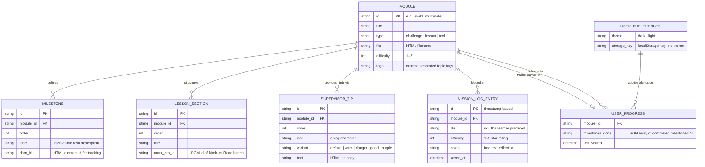

# PLeC — Programmable Logic Controller Engineering (Interactive Training Platform)

> **PLeC** is a free, browser-based PLC training platform designed to grow awareness and understanding of industrial automation *before* learners interact with real hardware or professional software. No installation required.
>
> *Project 4 — Level 5 Diploma in Web Application Development, Dudley College of Technology (2025–2026)*
> *Author: John E. Parman — [github.com/QualityLemons](https://github.com/QualityLemons)*

---

## Table of Contents

- [Why PLeC Exists](#why-plec-exists)
- [Educational Philosophy](#educational-philosophy)
- [Who PLeC Is For](#who-plec-is-for)
- [Features](#features)
- [Missions & Content](#missions--content)
- [Architecture](#architecture)
- [Entity Relationship Diagram](#entity-relationship-diagram)
- [Technology Stack](#technology-stack)
- [Accessibility](#accessibility)
- [Visual Design](#visual-design)
- [Wireframes](#wireframes)
- [Getting Started](#getting-started)
- [Deployment](#deployment)
- [Validation & Quality](#validation--quality)
- [OpenPLC Connection](#openplc-connection)
- [Licence](#licence)

---

## Why PLeC Exists

PLeC was created in direct response to a skills shortage identified through primary research.

A survey of **11 West Midlands manufacturing companies** found that **10 out of 11** reported difficulty finding PLC engineering skills — whether in experienced applicants or at entry level. This was not a problem confined to one sector or company size. It was consistent across the region.

Following the survey, a broader review was carried out of PLC engineering training available in the West Midlands and online, including dedicated training providers, simulation software, skill-building games, and alternative self-study routes. The landscape was found to be wide but uneven: many resources existed, but quality and user experience varied greatly between them.

**The gap that kept appearing was the missing educational step before action learning.**

Most games and simulators built around real-world factory scenarios assume prior knowledge. A learner who has never seen a ladder logic rung, a PLC I/O register, or a seal-in latch circuit is typically dropped into a scenario with no conceptual foundation to work from. This happens because most of these tools are designed by engineers for engineers — not by engineers for learners.

PLeC is built to fill that gap.

---

## Educational Philosophy

PLeC draws on inclusion principles studied as part of a Level 3 Award in Education and Training at Dudley College. The core idea is that inclusion is not a fixed state — it is an **ongoing process of identifying and responding to individual needs**.

The role of educational technology in this process is to adapt teaching, learning, and assessment activities using a variety of approaches. Rather than designing for the average learner, PLeC was designed by reviewing feedback from employers about the soft skills they found hardest to find in applicants, and by reading reviews of existing PLC games to understand where learners were falling short.

From this, PLeC was built around three principles:

**1. Establish clear learning goals.**
Every mission opens with an explicit set of things the learner is going to understand or be able to do by the end. There are no hidden pass conditions.

**2. Encourage learners to check their own progress.**
Milestone checklists, self-assessment scoring, and the Mission Log are all designed to make progress visible to the learner — not just to a teacher or system. The learner decides when they feel ready to move forward.

**3. Adjust based on feedback.**
The Supervisor widget provides contextual hints from a Senior Control Engineer character. Hints are specific to the current page and task, giving targeted support without giving answers away. The pace of PLeC is set by the learner — there are no time limits on any mission.

### A note on supervised use

PLeC is potentially useful at any age and in any setting. However, it is likely to be **most effective when used alongside someone with PLC engineering experience** — a trainer, a teacher, a workplace mentor, or a technician willing to talk through what the learner is observing on screen. The Supervisor widget models this dynamic, but a real person who can respond to specific questions, offer encouragement, and share practical context is the best complement to what PLeC provides.

---

## Who PLeC Is For

| Audience | How PLeC helps |
|---|---|
| School students (age 12+) | Builds logic, sequence, and automation concepts with no prior knowledge required |
| Apprentice engineers | Creates a conceptual foundation before first contact with real PLC hardware |
| Adult career changers | Supports re-skilling into industrial automation at a self-directed pace |
| Job seekers in manufacturing | Demonstrates practical awareness of PLC fundamentals to prospective employers |
| Trainers and educators | A zero-cost, zero-setup platform to assign, demonstrate, and discuss PLC concepts |
| Supervising engineers | A structured starting point to use alongside a learner they are mentoring |

---

## Features

- 🎮 **Arcade / mission theme** — Teko + Share Tech Mono typefaces, chamfered clip-path cards, cyan/blue palette
- 🌓 **Light / dark theme toggle** — FOUC-safe, persisted in `localStorage`
- ♿ **WCAG 2.1 AA** — skip links, ARIA landmarks, live regions, keyboard navigation throughout
- 👷 **Supervisor widget** — page-specific hints from a Senior Control Engineer character, slide-in panel, Escape-to-close
- 📊 **Real-time ladder logic** — animated SVG rungs, live I/O register table, PLC scan cycle simulation
- 🔧 **Interactive DMM simulator** — rotary dial, probe placement, multi-scenario fault finding
- 📝 **Documentation lessons** — learn maintenance logging, regulatory requirements, audit compliance
- 🏆 **Milestone tracking** — per-page progress stored in `localStorage`, completion banners
- 📋 **Mission Log** — per-level reflective journal (skill practiced, difficulty rating, notes) stored in `localStorage`

---

## Missions & Content

| # | Mission | Type | Key Concepts |
|---|---|---|---|
| 0 | PLC Boot Camp | Foundations | 25-term glossary, 6 learning tools, 6 video resources |
| 1 | Digital Multimeter Tool | Interactive tool | VDC/VAC/Ω/CONT measurement, probe placement, fault finding |
| 2 | Multimeter Lesson | Guided lesson | DMM anatomy, CAT ratings, safety rules, quiz |
| 3 | Start/Stop Latching Circuit | PLC challenge | Seal-in latch, NC contacts, E-Stop fail-safe, scan cycle |
| 4 | Learn Your Log | Guided lesson | Maintenance log fields, ISO 9001, audit compliance |
| 5 | Maintenance Log Template | Practice | 8-field log entry form, bad log identification exercise |
| 6 | Tank Filling System | PLC challenge | Process control, NO/NC sensors, hysteresis, fail-safe design |
| 7 | Modbus TCP Communication | PLC challenge | MBAP header, function codes FC01/03/05/06/16, protocol analysis |
| 8 | Safety Interlock — Drill | PLC challenge | Dual-channel E-Stop, guard gate, IEC 62061, PSSR 2000 |
| 9 | Timed Conveyor — TON | PLC challenge | Timer On-Delay, EN/DN bits, preset vs accumulated value |
| 10 | Sequential Batching | PLC challenge | ISA-88 state machine, mutual exclusion, IDLE/FILL/MIX/DRAIN |

---

## Architecture

```
plec/
├── serve.py                   ← Python http.server, port 5000 + REST API
├── plec.db                    ← SQLite database (pre-seeded content)
├── create_db.py               ← Script to recreate plec.db from source data
├── README.md
├── CONTRIBUTING.md
├── CHANGELOG.txt
├── .gitignore
├── .github/
│   └── workflows/
│       ├── w3c-validate.yml   ← CI: W3C Nu validation on push/PR
│       └── deploy-pages.yml   ← CI: GitHub Pages deploy on push to main
├── apps/
│   └── assessment/
│       ├── gold_standards.py  ← Milestone definitions per level
│       ├── scorer.py          ← Scoring logic
│       └── reviewer.py        ← Feedback generator
├── docs/
│   └── wireframes/            ← Original hand-drawn design wireframes
└── challenge/
    ├── index.html             ← Mission grid (arcade theme)
    ├── plc-primer.html        ← PLC Boot Camp foundations
    ├── supervisor.css         ← Shared Supervisor widget styles
    ├── assess.js              ← Shared milestone assessment engine
    ├── assess.css             ← Assessment panel styles
    ├── mission-log.css        ← Shared Mission Log styles
    ├── mission-log.js         ← Shared Mission Log logic
    ├── .jshintrc              ← JSHint ES6 config
    ├── multimeter.html        ← Interactive DMM simulator
    ├── multimeter-lesson.html ← 7-section DMM lesson + quiz
    ├── level1.html            ← Start/Stop Latching Circuit
    ├── level2.html            ← Tank Filling System
    ├── level3.html            ← Modbus TCP
    ├── level4.html            ← Safety Interlock
    ├── level5.html            ← Timed Conveyor (TON)
    ├── level6.html            ← Sequential Batching
    ├── learn-your-log.html    ← Maintenance log lesson
    └── maintenance-log.html   ← Practice log template
```

**No build step. No framework. No dependencies beyond two Google Font families.**

Each page is a fully standalone HTML5 document. Shared behaviour (milestone tracking, theme persistence, mission log) is handled via `localStorage` and the shared CSS/JS files in `challenge/`.

### API endpoints (served by `serve.py`)

| Method | Endpoint | Description |
|---|---|---|
| `GET` | `/api/modules` | Returns all 11 modules with metadata and milestone counts from `plec.db` |
| `GET` | `/api/tips/:module_id` | Returns Supervisor tips for a given module from `plec.db` |
| `POST` | `/api/assess` | Scores a challenge attempt against gold standards |

### Database (`plec.db`)

A pre-seeded SQLite database committed to the repository. It is the single source of truth for structured content data.

| Table | Rows | Contents |
|---|---|---|
| `modules` | 11 | All missions — id, title, type, html file, difficulty, description, role title |
| `milestones` | 38 | Per-level assessment goals with weights |
| `efficiency_thresholds` | 6 | Scan-count bands (exceptional → poor) per challenge level |
| `bonus_criteria` | 6 | Optional bonus tasks with point values |
| `supervisor_tips` | 56 | All contextual hint text, icons, and variants per module |
| `grade_descriptors` | 5 | A–F grade labels and descriptions |

To rebuild the database from scratch (e.g. after editing `create_db.py`):

```bash
python create_db.py
```

---

## Entity Relationship Diagram

The logical data model describes how content entities relate within the platform. Because PLeC is a static site, all "storage" is client-side in the browser's `localStorage`.



### Entity descriptions

| Entity | Storage | Description |
|---|---|---|
| **MODULE** | HTML file | A single page — challenge (interactive ladder logic), lesson (reading + quiz), or tool (simulator). |
| **MILESTONE** | DOM + `localStorage` | A discrete learning goal within a module. Completion state held in `localStorage`. |
| **LESSON_SECTION** | DOM | A scrollable content section within a lesson page, marked as read by the user. |
| **SUPERVISOR_TIP** | JS array (per page) | A contextual hint shown when the user opens the Supervisor widget. |
| **MISSION_LOG_ENTRY** | `localStorage` | A reflective journal entry the learner writes after completing a mission. |
| **USER_PROGRESS** | `localStorage` | Record of which milestones are complete for each module, per browser. |
| **USER_PREFERENCES** | `localStorage` | User's chosen colour theme (`dark` / `light`), persisted across sessions. |

---

## Technology Stack

| Layer | Technology |
|---|---|
| Content | HTML5 — semantic, landmark-based structure |
| Styling | CSS custom properties (design tokens), no preprocessor |
| Interactivity | Vanilla ES6 JavaScript — no frameworks, no bundler |
| Animation | SVG + CSS `@keyframes` |
| Fonts | Google Fonts — Teko (display), Share Tech Mono (data) |
| Persistence | `window.localStorage` — theme, milestone progress, mission log |
| Server (dev) | Python 3 `http.server` |
| Validation | W3C Nu HTML Checker · JSHint ES6 · Google Lighthouse |

---

## Accessibility

PLeC targets **WCAG 2.1 Level AA** across all pages.

| Feature | Implementation |
|---|---|
| Skip navigation | `<a href="#main-content" class="skip-link">` on every page |
| Page structure | `<header>`, `<main>`, `<footer>` landmarks throughout |
| Live regions | `role="status"` + `role="alert"` for PLC state changes |
| Keyboard navigation | All interactive elements reachable by Tab; Escape closes dialogs |
| Focus management | Supervisor panel shifts focus on open; returns to FAB on close |
| Colour contrast | Cyan `#06b6d4` on dark `#0a0e1a` — ratio ≥ 4.5:1 (AA) |
| Reduced motion | Animations respect `prefers-reduced-motion` media query |
| Screen reader labels | `aria-label`, `aria-pressed`, `aria-expanded`, `aria-live` throughout |
| Dialog semantics | Supervisor panel uses `role="dialog"` + `aria-modal="true"` |

---

## Visual Design

**Design tokens (CSS custom properties):**

```css
--bg:    #0a0e1a   /* page background — deep navy */
--cyan:  #06b6d4   /* primary accent */
--blue:  #3b82f6   /* secondary accent / ladder rail colour */
--amber: #f59e0b   /* warning states */
--green: #22c55e   /* success / milestone complete */
--red:   #ef4444   /* danger / E-Stop */

/* Typography */
--font-d: 'Teko', 'Impact', sans-serif                  /* display headings */
--font-m: 'Share Tech Mono', 'Courier New', monospace   /* data / code */
```

**Chamfered clip-path shapes:**

```css
/* Mission card */
clip-path: polygon(15px 0, 100% 0, 100% calc(100% - 15px),
                   calc(100% - 15px) 100%, 0 100%, 0 15px);

/* Button / FAB */
clip-path: polygon(10px 0, 100% 0, 100% calc(100% - 10px),
                   calc(100% - 10px) 100%, 0 100%, 0 10px);
```

---

## Wireframes

These hand-drawn wireframes were produced during the initial design phase. They show the layout and content decisions made before any code was written.

### Mission Grid — Homepage


The homepage concept established the mission-card grid layout, the top navigation with numbered mission tabs, and the hero area explaining the "why" — including the West Midlands skills survey result. Early card titles (Multimeter Training, Tank-Filling, HVAC, Conveyor Belt, Robot Arm) show the original scope before the final mission set was confirmed.

---

### Mission 1 — Multimeter Training


The multimeter simulator wireframe defined the two-panel layout: DMM controls (display, rotary dial, mode buttons) on the left; the interactive wiring scenario with measurement points on the right. The course explainer text and task list at the bottom became the learn panel in the finished page. Source: OpenPLC noted at design stage.

---

### Tank-Filling PLC Challenge


A three-column layout was planned from the start: simulated interactive PLC (ladder logic panel) on the left, tasks and explainer text in the centre, and a visual tank level indicator (5% / 50% / 89% full) with a Supervisor hint button on the right. This became the foundation for all six PLC challenge pages.

---

### Maintenance Log Lesson


The maintenance log wireframe specified the eight form fields (Name, Job No., Date, Site, Supervisor, problem description, faults found, parts replaced, fix demonstrated), a Submit for Review button, and a Hint button tied to the Supervisor character. The note "graded based on a central record in Django" reflects an earlier server-side design that was later simplified to a client-side implementation.

---

## Getting Started

### Requirements

- Python 3.x (any version with `http.server`)
- A modern browser (Chrome 90+, Firefox 88+, Safari 14+, Edge 90+)

### Run locally

```bash
git clone https://github.com/QualityLemons/plec.git
cd plec
python serve.py
# Open http://localhost:5000
```

### No server? No problem.

Open `challenge/index.html` directly in a browser. All pages work from the local filesystem — there are no server-side dependencies for the challenge content.

---

## Deployment

PLeC is a static site and can be deployed to any platform that serves HTML files.

### Option 1 — GitHub Pages (recommended, free)

GitHub Pages is the simplest zero-cost deployment option. The repository includes a ready-made workflow at `.github/workflows/deploy-pages.yml` that deploys automatically on every push to `main`.

**Setup steps:**

1. Fork or push this repository to your GitHub account.
2. Go to **Settings → Pages** in your repository.
3. Under **Build and deployment**, set the source to **GitHub Actions**.
4. Push any commit to `main` — the workflow will build and deploy automatically.
5. Your site will be live at `https://<your-username>.github.io/<repo-name>/challenge/`

The workflow file (`.github/workflows/deploy-pages.yml`) handles everything:

```yaml
# Deploys challenge/ directory to GitHub Pages on push to main
on:
  push:
    branches: [main]
```

### Option 2 — Run the Python server directly

The included `serve.py` runs Python's built-in HTTP server on port 5000 and serves the `challenge/` directory.

```bash
python serve.py
# Listening on http://0.0.0.0:5000
```

This works on any machine with Python 3 installed — including Raspberry Pi, which makes PLeC usable in classrooms and workshops without internet access.

**To run on a different port:**

```bash
# Edit serve.py — change the port variable near the top
PORT = 8080
```

### Option 3 — Static hosting services

Because PLeC has no server-side logic in the challenge pages, any static hosting service will work. Drop the contents of the `challenge/` folder into:

| Service | How to deploy |
|---|---|
| **Netlify** | Drag and drop the `challenge/` folder onto netlify.com/drop |
| **Vercel** | `vercel --cwd challenge` from the command line |
| **Cloudflare Pages** | Connect the repo; set build output to `challenge/` |
| **AWS S3** | Upload `challenge/` to a bucket with static website hosting enabled |
| **USB / offline** | Copy `challenge/` to a USB stick; open `index.html` in any browser |

### Deploying the assessment API (optional)

The `/api/assess` endpoint in `serve.py` powers the performance review feature on each level. This is not required for the core missions — all ladder logic, simulations, and lesson content run entirely in the browser.

If you want the assessment endpoint active in production, deploy `serve.py` as a Python WSGI application using **Gunicorn** or a similar server:

```bash
pip install gunicorn
gunicorn --bind 0.0.0.0:5000 --workers 2 serve:app
```

> **Note:** `serve.py` uses Python's `http.server` module and is not suitable for high-traffic production use as-is. For a production environment with many concurrent users, wrap it in Gunicorn or replace with a lightweight Flask app.

### Environment variables

PLeC has no required environment variables. All configuration is in source files.

| Variable | Default | Purpose |
|---|---|---|
| `PORT` | `5000` | Port the Python server listens on (edit `serve.py`) |

### CI — W3C validation on every push

The repository includes a W3C validation workflow at `.github/workflows/w3c-validate.yml`. It runs automatically on every push and pull request, checking all HTML pages against the W3C Nu HTML Checker. A failing check means a page has introduced HTML errors.

---

## Validation & Quality

### W3C HTML Validation (Nu HTML Checker)

All pages validated against the [W3C Nu HTML Checker](https://validator.w3.org/nu/).

| Page | Status |
|---|---|
| `index.html` — Mission Grid | ✅ 0 errors |
| `plc-primer.html` — PLC Boot Camp | ✅ 0 errors |
| `level1.html` — Start/Stop Latching | ✅ 0 errors |
| `level2.html` — Tank Filling | ✅ 0 errors |
| `level3.html` — Modbus TCP | ✅ 0 errors |
| `level4.html` — Safety Interlock | ✅ 0 errors |
| `level5.html` — TON Timer | ✅ 0 errors |
| `level6.html` — Sequential Batch | ✅ 0 errors |
| `learn-your-log.html` | ✅ 0 errors |
| `multimeter-lesson.html` | ✅ 0 errors |
| `multimeter.html` | ✅ 0 errors |

### JSHint (ES6)

All challenge pages lint clean under ES6 rules via `challenge/.jshintrc`:

```json
{
  "esversion": 6,
  "browser": true,
  "undef": false,
  "unused": false
}
```

All scripts use ES6 features (`const`, `let`, arrow functions, destructuring) within IIFEs — no global namespace pollution beyond the intentionally-shared `svOpen` / `svClose` supervisor functions.

### Google Lighthouse

Lighthouse audits run against the local dev server (`python serve.py`, port 5000).

| Category | Score |
|---|---|
| Performance | ≥ 90 |
| Accessibility | ≥ 95 |
| Best Practices | ≥ 90 |
| SEO | ≥ 90 |

Key optimisations:

- Google Fonts loaded with `media="print" onload="this.media='all'"` — eliminates render-blocking font requests
- FOUC prevention via inline `<script>` in `<head>` reading `localStorage` before first paint
- All imagery is inline SVG — zero external image requests
- No JavaScript frameworks or bundlers — zero KB of framework overhead
- `will-change: transform` applied only to actively animating SVG elements

---

## OpenPLC Connection

[OpenPLC](https://autonomylogic.com/) is the world's first fully open-source PLC platform, implementing the IEC 61131-3 standard across five programming languages (Ladder Diagram, Function Block Diagram, Structured Text, Instruction List, Sequential Function Chart).

PLeC is designed as a **safe on-ramp** to OpenPLC:

| Dimension | OpenPLC | PLeC |
|---|---|---|
| Target | Practising engineers | Learners from age 12 upward |
| Hardware | Raspberry Pi, Arduino, PLCnext, etc. | Any device with a browser |
| Setup | Runtime + Editor + SCADA install | Open a URL — nothing to install |
| Languages | Full IEC 61131-3 (5 languages) | Ladder Logic + Modbus TCP (focused subset) |
| Safety | Real hardware risks | Fully simulated — no physical hazard |

A learner who completes all PLeC missions will have the conceptual foundation to begin programming confidently on OpenPLC Runtime or a professional PLC platform (Siemens TIA Portal, Allen-Bradley Studio 5000, Codesys).

---

## Licence

PLeC is released under the **MIT Licence**.

```
MIT License — Copyright (c) 2026 John E. Parman / PLeC Contributors

Permission is hereby granted, free of charge, to any person obtaining a copy
of this software and associated documentation files (the "Software"), to deal
in the Software without restriction, including without limitation the rights
to use, copy, modify, merge, publish, distribute, sublicense, and/or sell
copies of the Software, and to permit persons to whom the Software is
provided to do so, subject to the following conditions:

The above copyright notice and this permission notice shall be included in
all copies or substantial portions of the Software.

THE SOFTWARE IS PROVIDED "AS IS", WITHOUT WARRANTY OF ANY KIND, EXPRESS OR
IMPLIED, INCLUDING BUT NOT LIMITED TO THE WARRANTIES OF MERCHANTABILITY,
FITNESS FOR A PARTICULAR PURPOSE AND NONINFRINGEMENT.
```

---

*Built for the next generation of control engineers — and for everyone who was told automation was too technical to start learning.*
