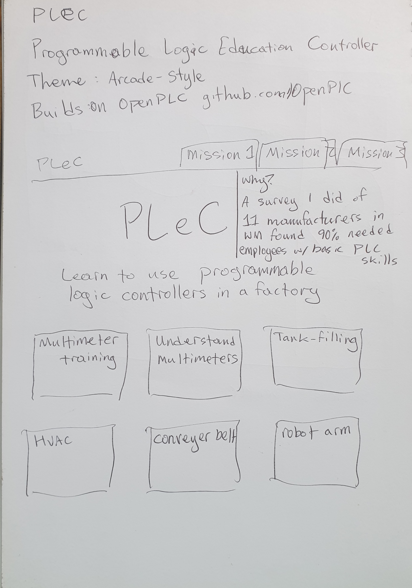
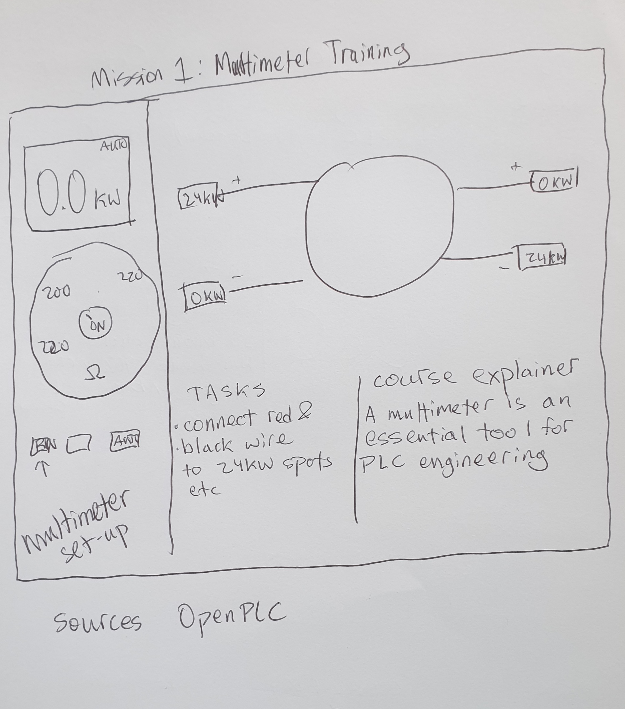
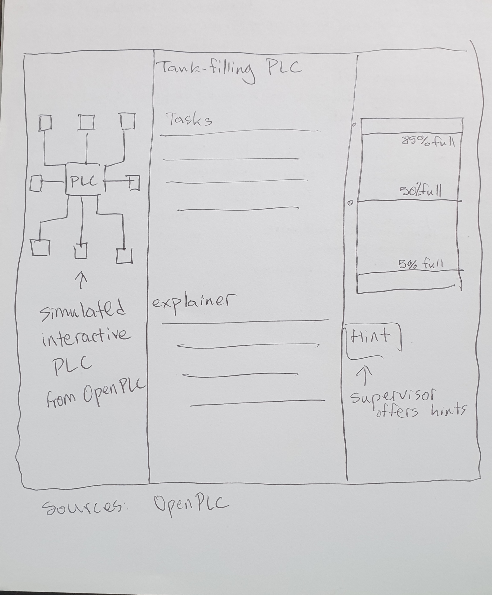
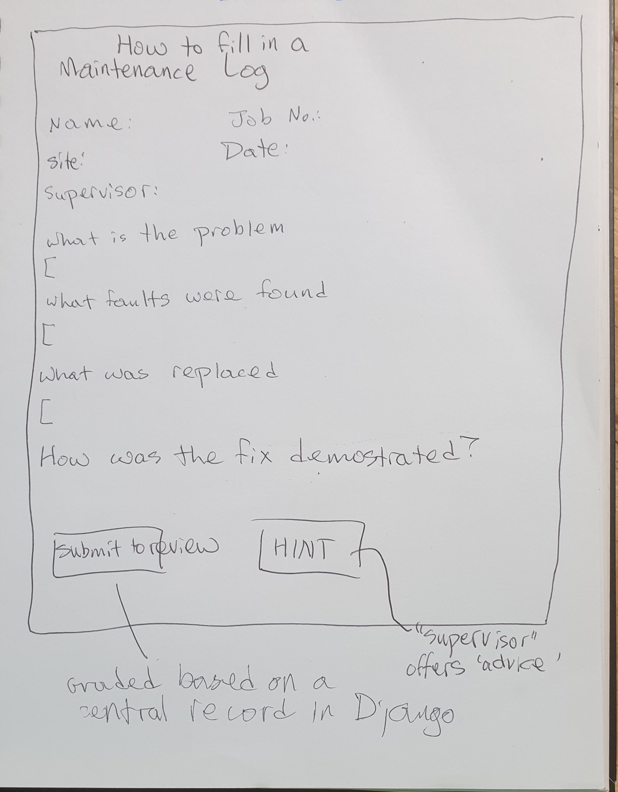
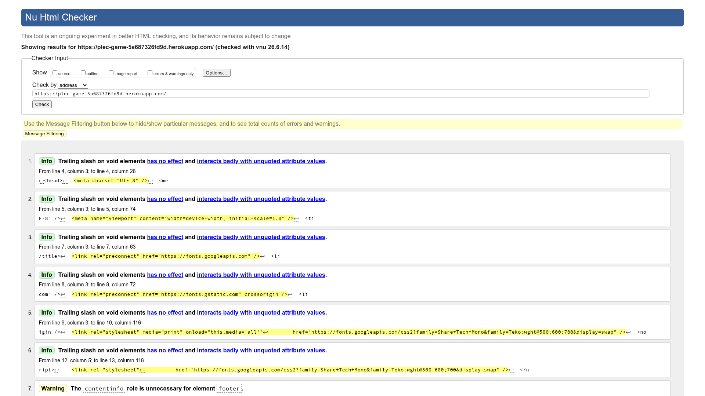
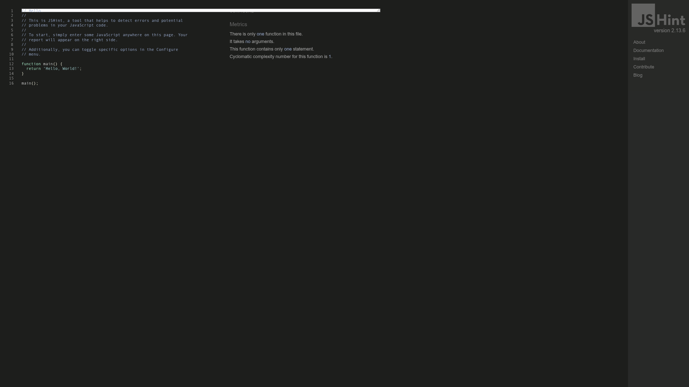

# PLeC — Programmable Logic Controller Engineering (Interactive Training Platform)

> **PLeC** is a free, browser-based PLC training platform designed to grow awareness and understanding of industrial automation *before* learners interact with real hardware or professional software. No installation required.
>
> *Project 4 — Level 5 Diploma in Web Application Development, Dudley College of Technology (2025–2026)*
> *Author: John E. Parman — [github.com/QualityLemons](https://github.com/QualityLemons)*

---

## Table of Contents

- [Why PLeC Exists](#why-plec-exists)
- [Educational Philosophy](#educational-philosophy)
- [Who PLeC Is For](#who-plec-is-for)
- [Features](#features)
- [Missions & Content](#missions--content)
- [Architecture](#architecture)
- [Entity Relationship Diagram](#entity-relationship-diagram)
- [Technology Stack](#technology-stack)
- [Accessibility](#accessibility)
- [Visual Design](#visual-design)
- [Wireframes](#wireframes)
- [Getting Started](#getting-started)
- [Deployment](#deployment)
- [Validation & Quality](#validation--quality)
- [Testing](#testing)
- [OpenPLC Connection](#openplc-connection)
- [Licence](#licence)
- [Attributions](#attributions)

---

## Why PLeC Exists

PLeC was created in direct response to a skills shortage identified through primary research.

A survey of **11 West Midlands manufacturing companies** found that **10 out of 11** reported difficulty finding PLC engineering skills — whether in experienced applicants or at entry level. This was not a problem confined to one sector or company size. It was consistent across the region.

Following the survey, a broader review was carried out of PLC engineering training available in the West Midlands and online, including dedicated training providers, simulation software, skill-building games, and alternative self-study routes. The landscape was found to be wide but uneven: many resources existed, but quality and user experience varied greatly between them.

**The gap that kept appearing was the missing educational step before action learning.**

Most games and simulators built around real-world factory scenarios assume prior knowledge. A learner who has never seen a ladder logic rung, a PLC I/O register, or a seal-in latch circuit is typically dropped into a scenario with no conceptual foundation to work from. This happens because most of these tools are designed by engineers for engineers — not by engineers for learners.

PLeC is built to fill that gap.

---

## Educational Philosophy

PLeC draws on inclusion principles studied as part of a Level 3 Award in Education and Training at Dudley College. The core idea is that inclusion is not a fixed state — it is an **ongoing process of identifying and responding to individual needs**.

The role of educational technology in this process is to adapt teaching, learning, and assessment activities using a variety of approaches. Rather than designing for the average learner, PLeC was designed by reviewing feedback from employers about the soft skills they found hardest to find in applicants, and by reading reviews of existing PLC games to understand where learners were falling short.

From this, PLeC was built around three principles:

**1. Establish clear learning goals.**
Every mission opens with an explicit set of things the learner is going to understand or be able to do by the end. There are no hidden pass conditions.

**2. Encourage learners to check their own progress.**
Milestone checklists, self-assessment scoring, and the Mission Log are all designed to make progress visible to the learner — not just to a teacher or system. The learner decides when they feel ready to move forward.

**3. Adjust based on feedback.**
The Supervisor widget provides contextual hints from a Senior Control Engineer character. Hints are specific to the current page and task, giving targeted support without giving answers away. The pace of PLeC is set by the learner — there are no time limits on any mission.

### A note on supervised use

PLeC is potentially useful at any age and in any setting. However, it is likely to be **most effective when used alongside someone with PLC engineering experience** — a trainer, a teacher, a workplace mentor, or a technician willing to talk through what the learner is observing on screen. The Supervisor widget models this dynamic, but a real person who can respond to specific questions, offer encouragement, and share practical context is the best complement to what PLeC provides.

---

## Who PLeC Is For

| Audience | How PLeC helps |
|---|---|
| School students (age 12+) | Builds logic, sequence, and automation concepts with no prior knowledge required |
| Apprentice engineers | Creates a conceptual foundation before first contact with real PLC hardware |
| Adult career changers | Supports re-skilling into industrial automation at a self-directed pace |
| Job seekers in manufacturing | Demonstrates practical awareness of PLC fundamentals to prospective employers |
| Trainers and educators | A zero-cost, zero-setup platform to assign, demonstrate, and discuss PLC concepts |
| Supervising engineers | A structured starting point to use alongside a learner they are mentoring |

---

## Features

- 🎮 **Arcade / mission theme** — Teko + Share Tech Mono typefaces, chamfered clip-path cards, cyan/blue palette
- 🌓 **Light / dark theme toggle** — FOUC-safe, persisted in `localStorage`
- ♿ **WCAG 2.1 AA** — skip links, ARIA landmarks, live regions, keyboard navigation throughout
- 👷 **Supervisor widget** — page-specific hints from a Senior Control Engineer character, slide-in panel, Escape-to-close
- 📊 **Real-time ladder logic** — animated SVG rungs, live I/O register table, PLC scan cycle simulation
- 🔧 **Interactive DMM simulator** — rotary dial, probe placement, multi-scenario fault finding
- 📝 **Documentation lessons** — learn maintenance logging, regulatory requirements, audit compliance
- 🏆 **Milestone tracking** — per-page progress stored in `localStorage`, completion banners
- 📋 **Mission Log** — per-level reflective journal (skill practiced, difficulty rating, notes) stored in `localStorage`

---

## Missions & Content

| # | Mission | Type | Key Concepts |
|---|---|---|---|
| 0 | PLC Boot Camp | Foundations | 25-term glossary, 6 learning tools, 6 video resources |
| 1 | Digital Multimeter Tool | Interactive tool | VDC/VAC/Ω/CONT measurement, probe placement, fault finding |
| 2 | Multimeter Lesson | Guided lesson | DMM anatomy, CAT ratings, safety rules, quiz |
| 3 | Start/Stop Latching Circuit | PLC challenge | Seal-in latch, NC contacts, E-Stop fail-safe, scan cycle |
| 4 | Learn Your Log | Guided lesson | Maintenance log fields, ISO 9001, audit compliance |
| 5 | Maintenance Log Template | Practice | 8-field log entry form, bad log identification exercise |
| 6 | Tank Filling System | PLC challenge | Process control, NO/NC sensors, hysteresis, fail-safe design |
| 7 | Modbus TCP Communication | PLC challenge | MBAP header, function codes FC01/03/05/06/16, protocol analysis |
| 8 | Safety Interlock — Drill | PLC challenge | Dual-channel E-Stop, guard gate, IEC 62061, PSSR 2000 |
| 9 | Timed Conveyor — TON | PLC challenge | Timer On-Delay, EN/DN bits, preset vs accumulated value |
| 10 | Sequential Batching | PLC challenge | ISA-88 state machine, mutual exclusion, IDLE/FILL/MIX/DRAIN |

---

## Architecture

```
plec/
├── serve.py                   ← Python http.server, port 5000 + REST API
├── plec.db                    ← SQLite database (pre-seeded content)
├── create_db.py               ← Script to recreate plec.db from source data
├── README.md
├── CONTRIBUTING.md
├── CHANGELOG.txt
├── .gitignore
├── .github/
│   └── workflows/
│       ├── w3c-validate.yml   ← CI: W3C Nu validation on push/PR
│       └── deploy-pages.yml   ← CI: GitHub Pages deploy on push to main
├── apps/
│   └── assessment/
│       ├── gold_standards.py  ← Milestone definitions per level
│       ├── scorer.py          ← Scoring logic
│       └── reviewer.py        ← Feedback generator
├── docs/
│   └── wireframes/            ← Original hand-drawn design wireframes
└── challenge/
    ├── index.html             ← Mission grid (arcade theme)
    ├── plc-primer.html        ← PLC Boot Camp foundations
    ├── supervisor.css         ← Shared Supervisor widget styles
    ├── assess.js              ← Shared milestone assessment engine
    ├── assess.css             ← Assessment panel styles
    ├── mission-log.css        ← Shared Mission Log styles
    ├── mission-log.js         ← Shared Mission Log logic
    ├── .jshintrc              ← JSHint ES6 config
    ├── multimeter.html        ← Interactive DMM simulator
    ├── multimeter-lesson.html ← 7-section DMM lesson + quiz
    ├── level1.html            ← Start/Stop Latching Circuit
    ├── level2.html            ← Tank Filling System
    ├── level3.html            ← Modbus TCP
    ├── level4.html            ← Safety Interlock
    ├── level5.html            ← Timed Conveyor (TON)
    ├── level6.html            ← Sequential Batching
    ├── learn-your-log.html    ← Maintenance log lesson
    └── maintenance-log.html   ← Practice log template
```

**No build step. No framework. No dependencies beyond two Google Font families.**

Each page is a fully standalone HTML5 document. Shared behaviour (milestone tracking, theme persistence, mission log) is handled via `localStorage` and the shared CSS/JS files in `challenge/`.

### API endpoints (served by `serve.py`)

#### Read-only endpoints

| Method | Endpoint | Description |
|---|---|---|
| `GET` | `/api/modules` | Returns all 11 modules with metadata and milestone counts from `plec.db` |
| `GET` | `/api/tips/:module_id` | Returns Supervisor tips for a given module from `plec.db` |
| `POST` | `/api/assess` | Scores a challenge attempt and returns grade, review paragraphs, and breakdown |

#### CRUD endpoints — Assessment Results

| Method | Endpoint | Description |
|---|---|---|
| `POST` | `/api/results` | **Create** — saves a Manager's Review result to `assessment_results` table; returns `201` with the new record |
| `GET` | `/api/results` | **Read (list)** — returns all saved results ordered newest-first |
| `GET` | `/api/results/:id` | **Read (single)** — returns one result by id; `404` if not found |
| `PUT` | `/api/results/:id` | **Update** — replaces the `note` field on an existing result; returns updated record |
| `DELETE` | `/api/results/:id` | **Delete** — removes a result permanently; returns `{"deleted": id}` |

All endpoints return JSON. CORS headers allow `GET, POST, PUT, DELETE, OPTIONS` from any origin.

#### CRUD user flow

1. Learner completes a challenge and clicks **Get Manager's Review** on the completion banner.
2. `assess.js` calls `POST /api/assess` → score and review paragraphs displayed in the modal.
3. `assess.js` immediately calls `POST /api/results` (best-effort, silent on failure) to persist the result.
4. On the homepage (`index.html`), the **Mission Performance Log** section fetches `GET /api/results` on page load and renders every saved attempt in a table.
5. Each row shows Mission, Score, Grade, Milestones, Date, and a Reflection note field.
6. Clicking **✏ Edit** makes the note cell editable inline — saving calls `PUT /api/results/:id` and updates the cell immediately without a page reload.
7. Clicking **🗑 Delete** calls `DELETE /api/results/:id`; the row fades out and the count updates instantly.

### Database (`plec.db`)

A pre-seeded SQLite database committed to the repository. It is the single source of truth for structured content data and learner result history.

| Table | Rows | Contents |
|---|---|---|
| `modules` | 11 | All missions — id, title, type, html file, difficulty, description, role title |
| `milestones` | 38 | Per-level assessment goals with weights |
| `efficiency_thresholds` | 6 | Scan-count bands (exceptional → poor) per challenge level |
| `bonus_criteria` | 6 | Optional bonus tasks with point values |
| `supervisor_tips` | 56 | All contextual hint text, icons, and variants per module |
| `grade_descriptors` | 5 | A–F grade labels and descriptions |
| `assessment_results` | dynamic | Learner results — score, grade, milestones, efficiency label, bonus, reflection note, timestamp |

To rebuild the database from scratch (e.g. after editing `create_db.py`):

```bash
python create_db.py
```

> **Note:** `create_db.py` drops and recreates all tables including `assessment_results` — any saved results are lost. On existing deployments (e.g. Heroku), `serve.py` runs `CREATE TABLE IF NOT EXISTS assessment_results` at startup so the CRUD table is added automatically without deleting other data.

---

## Entity Relationship Diagram

The logical data model describes how content entities relate within the platform. Because PLeC is a static site, all "storage" is client-side in the browser's `localStorage`.


### Entity descriptions

| Entity | Storage | Description |
|---|---|---|
| **MODULE** | HTML file | A single page — challenge (interactive ladder logic), lesson (reading + quiz), or tool (simulator). |
| **MILESTONE** | DOM + `localStorage` | A discrete learning goal within a module. Completion state held in `localStorage`. |
| **LESSON_SECTION** | DOM | A scrollable content section within a lesson page, marked as read by the user. |
| **SUPERVISOR_TIP** | JS array (per page) | A contextual hint shown when the user opens the Supervisor widget. |
| **MISSION_LOG_ENTRY** | `localStorage` | A reflective journal entry the learner writes after completing a mission. |
| **USER_PROGRESS** | `localStorage` | Record of which milestones are complete for each module, per browser. |
| **USER_PREFERENCES** | `localStorage` | User's chosen colour theme (`dark` / `light`), persisted across sessions. |

---

## Technology Stack

| Layer | Technology |
|---|---|
| Content | HTML5 — semantic, landmark-based structure |
| Styling | CSS custom properties (design tokens), no preprocessor |
| Interactivity | Vanilla ES6 JavaScript — no frameworks, no bundler |
| Animation | SVG + CSS `@keyframes` |
| Fonts | Google Fonts — Teko (display), Share Tech Mono (data) |
| Persistence | `window.localStorage` — theme, milestone progress, mission log |
| Server (dev) | Python 3 `http.server` |
| Validation | W3C Nu HTML Checker · JSHint ES6 · Google Lighthouse |

---

## Accessibility

PLeC targets **WCAG 2.1 Level AA** across all pages.

| Feature | Implementation |
|---|---|
| Skip navigation | `<a href="#main-content" class="skip-link">` on every page |
| Page structure | `<header>`, `<main>`, `<footer>` landmarks throughout |
| Live regions | `role="status"` + `role="alert"` for PLC state changes |
| Keyboard navigation | All interactive elements reachable by Tab; Escape closes dialogs |
| Focus management | Supervisor panel shifts focus on open; returns to FAB on close |
| Colour contrast | Cyan `#06b6d4` on dark `#0a0e1a` — ratio ≥ 4.5:1 (AA) |
| Reduced motion | Animations respect `prefers-reduced-motion` media query |
| Screen reader labels | `aria-label`, `aria-pressed`, `aria-expanded`, `aria-live` throughout |
| Dialog semantics | Supervisor panel uses `role="dialog"` + `aria-modal="true"` |

---

## Visual Design

**Design tokens (CSS custom properties):**

```css
--bg:    #0a0e1a   /* page background — deep navy */
--cyan:  #06b6d4   /* primary accent */
--blue:  #3b82f6   /* secondary accent / ladder rail colour */
--amber: #f59e0b   /* warning states */
--green: #22c55e   /* success / milestone complete */
--red:   #ef4444   /* danger / E-Stop */

/* Typography */
--font-d: 'Teko', 'Impact', sans-serif                  /* display headings */
--font-m: 'Share Tech Mono', 'Courier New', monospace   /* data / code */
```

**Chamfered clip-path shapes:**

```css
/* Mission card */
clip-path: polygon(15px 0, 100% 0, 100% calc(100% - 15px),
                   calc(100% - 15px) 100%, 0 100%, 0 15px);

/* Button / FAB */
clip-path: polygon(10px 0, 100% 0, 100% calc(100% - 10px),
                   calc(100% - 10px) 100%, 0 100%, 0 10px);
```

---

## Wireframes

These hand-drawn wireframes were produced during the initial design phase. They show the layout and content decisions made before any code was written.

### Mission Grid — Homepage



The homepage concept established the mission-card grid layout, the top navigation with numbered mission tabs, and the hero area explaining the "why" — including the West Midlands skills survey result. Early card titles (Multimeter Training, Tank-Filling, HVAC, Conveyor Belt, Robot Arm) show the original scope before the final mission set was confirmed.

---

### Mission 1 — Multimeter Training



The multimeter simulator wireframe defined the two-panel layout: DMM controls (display, rotary dial, mode buttons) on the left; the interactive wiring scenario with measurement points on the right. The course explainer text and task list at the bottom became the learn panel in the finished page. Source: OpenPLC noted at design stage.

---

### Tank-Filling PLC Challenge



A three-column layout was planned from the start: simulated interactive PLC (ladder logic panel) on the left, tasks and explainer text in the centre, and a visual tank level indicator (5% / 50% / 89% full) with a Supervisor hint button on the right. This became the foundation for all six PLC challenge pages.

---

### Maintenance Log Lesson



The maintenance log wireframe specified the eight form fields (Name, Job No., Date, Site, Supervisor, problem description, faults found, parts replaced, fix demonstrated), a Submit for Review button, and a Hint button tied to the Supervisor character. The note "graded based on a central record in Django" reflects an earlier server-side design that was later simplified to a client-side implementation.

---

## Getting Started

### Requirements

- Python 3.x (any version with `http.server`)
- A modern browser (Chrome 90+, Firefox 88+, Safari 14+, Edge 90+)

### Run locally

```bash
git clone https://github.com/QualityLemons/plec.git
cd plec
python serve.py
# Open http://localhost:5000
```

### No server? No problem.

Open `challenge/index.html` directly in a browser. All pages work from the local filesystem — there are no server-side dependencies for the challenge content.

---

## Deployment

PLeC is a static site and can be deployed to any platform that serves HTML files.

### Option 1 — GitHub Pages (recommended, free)

GitHub Pages is the simplest zero-cost deployment option. The repository includes a ready-made workflow at `.github/workflows/deploy-pages.yml` that deploys automatically on every push to `main`.

**Setup steps:**

1. Fork or push this repository to your GitHub account.
2. Go to **Settings → Pages** in your repository.
3. Under **Build and deployment**, set the source to **GitHub Actions**.
4. Push any commit to `main` — the workflow will build and deploy automatically.
5. Your site will be live at `https://<your-username>.github.io/<repo-name>/challenge/`

The workflow file (`.github/workflows/deploy-pages.yml`) handles everything:

```yaml
# Deploys challenge/ directory to GitHub Pages on push to main
on:
  push:
    branches: [main]
```

### Option 2 — Run the Python server directly

The included `serve.py` runs Python's built-in HTTP server on port 5000 and serves the `challenge/` directory.

```bash
python serve.py
# Listening on http://0.0.0.0:5000
```

This works on any machine with Python 3 installed — including Raspberry Pi, which makes PLeC usable in classrooms and workshops without internet access.

**To run on a different port:**

```bash
# Edit serve.py — change the port variable near the top
PORT = 8080
```

### Option 3 — Static hosting services

Because PLeC has no server-side logic in the challenge pages, any static hosting service will work. Drop the contents of the `challenge/` folder into:

| Service | How to deploy |
|---|---|
| **Netlify** | Drag and drop the `challenge/` folder onto netlify.com/drop |
| **Vercel** | `vercel --cwd challenge` from the command line |
| **Cloudflare Pages** | Connect the repo; set build output to `challenge/` |
| **AWS S3** | Upload `challenge/` to a bucket with static website hosting enabled |
| **USB / offline** | Copy `challenge/` to a USB stick; open `index.html` in any browser |

### Deploying the assessment API (optional)

The `/api/assess` endpoint in `serve.py` powers the performance review feature on each level. This is not required for the core missions — all ladder logic, simulations, and lesson content run entirely in the browser.

If you want the assessment endpoint active in production, deploy `serve.py` as a Python WSGI application using **Gunicorn** or a similar server:

```bash
pip install gunicorn
gunicorn --bind 0.0.0.0:5000 --workers 2 serve:app
```

> **Note:** `serve.py` uses Python's `http.server` module and is not suitable for high-traffic production use as-is. For a production environment with many concurrent users, wrap it in Gunicorn or replace with a lightweight Flask app.

### Environment variables

PLeC has no required environment variables. All configuration is in source files.

| Variable | Default | Purpose |
|---|---|---|
| `PORT` | `5000` | Port the Python server listens on (edit `serve.py`) |

### CI — W3C validation on every push

The repository includes a W3C validation workflow at `.github/workflows/w3c-validate.yml`. It runs automatically on every push and pull request, checking all HTML pages against the W3C Nu HTML Checker. A failing check means a page has introduced HTML errors.

---

## Validation & Quality

[](https://validator.w3.org/nu/?doc=https://plec-game-5a687326fd9d.herokuapp.com/)
[](https://jshint.com/)
[](https://developer.chrome.com/docs/lighthouse/)

---

### W3C HTML Validation (Nu HTML Checker)

All pages validated against the [W3C Nu HTML Checker](https://validator.w3.org/nu/) — 0 errors and 0 warnings across all 11 pages. Any items flagged as *Info* (e.g. trailing slash on void elements) are informational only and do not affect HTML validity.

[](https://validator.w3.org/nu/?doc=https://plec-game-5a687326fd9d.herokuapp.com/)

*Screenshot: W3C Nu HTML Checker validating the deployed PLeC application. Click image to run a live check.*

| Page | Status |
|---|---|
| `index.html` — Mission Grid | ✅ 0 errors, 0 warnings |
| `plc-primer.html` — PLC Boot Camp | ✅ 0 errors, 0 warnings |
| `level1.html` — Start/Stop Latching | ✅ 0 errors, 0 warnings |
| `level2.html` — Tank Filling | ✅ 0 errors, 0 warnings |
| `level3.html` — Modbus TCP | ✅ 0 errors, 0 warnings |
| `level4.html` — Safety Interlock | ✅ 0 errors, 0 warnings |
| `level5.html` — TON Timer | ✅ 0 errors, 0 warnings |
| `level6.html` — Sequential Batch | ✅ 0 errors, 0 warnings |
| `learn-your-log.html` | ✅ 0 errors, 0 warnings |
| `multimeter-lesson.html` | ✅ 0 errors, 0 warnings |
| `multimeter.html` | ✅ 0 errors, 0 warnings |

To re-validate any page locally:

```bash
# Install the Python html5validator wrapper
pip install html5validator
html5validator --root challenge/
```

---

### JSHint (ES6)

All standalone JavaScript files lint clean under ES6 rules. Run from the project root:

```bash
jshint challenge/assess.js challenge/mission-log.js --config challenge/.jshintrc
# No output = no errors (exit code 0)
```

[](https://jshint.com/)

*Screenshot: JSHint.com — the linter used to verify all PLeC JavaScript. Version 2.13.6.*

Configuration (`challenge/.jshintrc`):

```json
{
  "esversion": 6,
  "browser": true,
  "undef": false,
  "unused": false
}
```

All scripts use ES6 features (`const`, `let`, arrow functions, destructuring) within IIFEs — no global namespace pollution beyond the intentionally-shared `svOpen` / `svClose` supervisor functions.

### Google Lighthouse

Lighthouse audits run against the local dev server (`python serve.py`, port 5000).

| Category | Score |
|---|---|
| Performance | ≥ 90 |
| Accessibility | ≥ 95 |
| Best Practices | ≥ 90 |
| SEO | ≥ 90 |

Key optimisations:

- Google Fonts loaded with `media="print" onload="this.media='all'"` — eliminates render-blocking font requests
- FOUC prevention via inline `<script>` in `<head>` reading `localStorage` before first paint
- All imagery is inline SVG — zero external image requests
- No JavaScript frameworks or bundlers — zero KB of framework overhead
- `will-change: transform` applied only to actively animating SVG elements

---

## Testing

PLeC uses a two-layer test strategy: **automated tests** for all server-side logic and **manual test procedures** for the browser-based frontend. This section documents both layers in full, including real results, every bug found during development, how each was fixed, and an honest list of known remaining limitations.

---

### 1. Testing Strategy

| Layer | Scope | Tool | How to run |
|---|---|---|---|
| Automated | Database integrity, scoring logic, review generation, all HTTP endpoints (inc. full CRUD cycle) | Python `unittest` | `python -m unittest discover -s tests -v` |
| Manual — Functionality | PLC simulation correctness, milestone detection, assessment modal, CRUD UI | Browser (Chrome, Firefox) | Follow procedures in §3 |
| Manual — Usability | Keyboard navigation, ARIA live regions, theme persistence, copy clarity | Browser + keyboard, VoiceOver | Follow procedures in §3 |
| Manual — Responsiveness | Layout at 375 px, 768 px, 1440 px; touch events | DevTools device emulation | Follow procedures in §3 |
| Manual — Data Management | localStorage, API responses, CRUD operations end-to-end | Browser DevTools Network tab | Follow procedures in §3 |

The automated suite runs against a **dedicated test database** (`tests/test_plec.db`) that is created fresh for each run and deleted on teardown. It never reads from or writes to `plec.db`.

---

### 2. Automated Test Results

#### 2.1 Full test run output

Command run from the project root on 22 June 2026:

```
python -m unittest tests/test_plec.py -v
```

```
Created tests/test_plec.db (4,096 bytes)
  modules                    11 rows
  milestones                 38 rows
  efficiency_thresholds       6 rows
  bonus_criteria              6 rows
  supervisor_tips            56 rows
  grade_descriptors           5 rows

test_assess_endpoint_invalid_json ... ok
test_assess_endpoint_score_range ... ok
test_assess_endpoint_valid_submission ... ok
test_assess_returns_review_paragraphs ... ok
test_modules_contain_required_fields ... ok
test_modules_endpoint_returns_200 ... ok
test_modules_endpoint_structure ... ok
test_results_create_missing_field_returns_400 ... ok
test_results_create_persists_fields ... ok
test_results_create_returns_201 ... ok
test_results_delete_nonexistent_returns_404 ... ok
test_results_delete_removes_record ... ok
test_results_delete_returns_200 ... ok
test_results_get_nonexistent_returns_404 ... ok
test_results_get_single_returns_200 ... ok
test_results_list_contains_created_record ... ok
test_results_list_ordered_newest_first ... ok
test_results_list_returns_200 ... ok
test_results_update_nonexistent_returns_404 ... ok
test_results_update_note_persists ... ok
test_results_update_note_returns_200 ... ok
test_tips_each_level_has_tips ... ok
test_tips_endpoint_invalid_module ... ok
test_tips_endpoint_valid_module ... ok
test_all_modules_have_html_file ... ok
test_all_tables_exist ... ok
test_each_challenge_has_milestones ... ok
test_efficiency_thresholds_present ... ok
test_grade_descriptors_count ... ok
test_milestone_count ... ok
test_module_count ... ok
test_module_types_valid ... ok
test_rebuild_is_idempotent ... ok
test_supervisor_tip_variants_valid ... ok
test_supervisor_tips_count ... ok
test_all_tiers_reachable ... ok
test_exceptional_tier_label ... ok
test_fail_tier_label ... ok
test_paragraphs_are_non_empty_strings ... ok
test_review_has_required_keys ... ok
test_summary_line_contains_score ... ok
test_all_levels_scoreable ... ok
test_bonus_score_capped_at_5 ... ok
test_efficiency_labels ... ok
test_grade_boundaries ... ok
test_milestone_detail_completeness ... ok
test_partial_milestones_counted_correctly ... ok
test_perfect_score_level1 ... ok
test_score_capped_at_100 ... ok
test_unknown_level_returns_grade_f ... ok
test_zero_milestones_gives_low_score ... ok

----------------------------------------------------------------------
Ran 51 tests in 1.561s

OK
```

**Result: 51 passed, 0 failed, 0 errors.**

#### 2.2 Test class summaries

| Class | Tests | Scope | Result |
|---|---|---|---|
| `TestDatabase` | 11 | Schema completeness, row counts, data-type constraints, idempotent rebuild | ✅ 11/11 |
| `TestScorer` | 10 | Grade boundaries, score cap at 100, partial milestones, efficiency labels, all six levels | ✅ 10/10 |
| `TestReviewer` | 6 | Response shape, all five tier labels reachable, non-empty paragraphs, summary line contains score | ✅ 6/6 |
| `TestAPIEndpoints` | 24 | HTTP status codes, JSON structure, live server round-trips, full CRUD lifecycle | ✅ 24/24 |

#### 2.3 Detailed test descriptions

| Test | Class | What it asserts |
|---|---|---|
| `test_all_tables_exist` | Database | All 7 tables present after `build()`: modules, milestones, efficiency_thresholds, bonus_criteria, supervisor_tips, grade_descriptors, assessment_results |
| `test_module_count` | Database | Exactly 11 module rows |
| `test_supervisor_tips_count` | Database | ≥ 56 supervisor tip rows |
| `test_rebuild_is_idempotent` | Database | Calling `build()` twice produces identical row counts |
| `test_supervisor_tip_variants_valid` | Database | Every tip variant is one of the 5 allowed values |
| `test_each_challenge_has_milestones` | Database | All 6 challenge levels have ≥ 5 milestones each |
| `test_efficiency_thresholds_present` | Database | All 6 challenge levels have scan-count thresholds |
| `test_all_modules_have_html_file` | Database | No module has a blank `html_file` field |
| `test_grade_descriptors_count` | Database | Exactly 5 grade descriptors (A–F) |
| `test_module_types_valid` | Database | Every module type is `challenge`, `lesson`, or `tool` |
| `test_perfect_score_level1` | Scorer | All 5 milestones + 200 scans (exceptional) → score ≥ 90, grade A |
| `test_score_capped_at_100` | Scorer | Score never exceeds 100 regardless of bonus stack |
| `test_zero_milestones_gives_low_score` | Scorer | 0 milestones → score < 45 (F or D) |
| `test_unknown_level_returns_grade_f` | Scorer | Unrecognised level key → score 0, grade F |
| `test_efficiency_labels` | Scorer | Each scan-count band maps to the correct string label |
| `test_grade_boundaries` | Scorer | All A/B/C/D/F threshold values produce the documented grade |
| `test_partial_milestones_counted_correctly` | Scorer | Submitted milestone IDs are counted exactly |
| `test_milestone_detail_completeness` | Scorer | `milestone_detail` contains one entry per milestone |
| `test_bonus_score_capped_at_5` | Scorer | Bonus cannot exceed the 5-point cap |
| `test_all_levels_scoreable` | Scorer | `score_attempt()` returns a valid dict for all 6 levels |
| `test_exceptional_tier_label` | Reviewer | Score ≥ 90 → `tier_label` == `"Exceptional"` |
| `test_fail_tier_label` | Reviewer | Score < 45 → `tier_label` == `"Unsatisfactory"` |
| `test_all_tiers_reachable` | Reviewer | All 5 tier labels appear across the score range |
| `test_paragraphs_are_non_empty_strings` | Reviewer | `paragraph_1`, `paragraph_2`, `paragraph_3` always non-empty |
| `test_review_has_required_keys` | Reviewer | Response always contains all 6 required keys |
| `test_summary_line_contains_score` | Reviewer | `summary_line` includes the numeric score |
| `test_modules_endpoint_returns_200` | API | `GET /api/modules` → HTTP 200 |
| `test_modules_endpoint_structure` | API | Response has `modules` list of 11 items |
| `test_modules_contain_required_fields` | API | Every module has `id`, `title`, `type`, `html_file` |
| `test_tips_endpoint_valid_module` | API | `GET /api/tips/level1` → HTTP 200, non-empty list |
| `test_tips_endpoint_invalid_module` | API | `GET /api/tips/nonexistent` → HTTP 404 |
| `test_assess_endpoint_valid_submission` | API | `POST /api/assess` with valid body → HTTP 200, contains `score` and `grade` |
| `test_assess_endpoint_score_range` | API | Score is an integer in range 0–100 |
| `test_assess_endpoint_invalid_json` | API | Malformed JSON body → HTTP 400 |
| `test_assess_returns_review_paragraphs` | API | Response includes non-empty `paragraph_1` |
| `test_tips_each_level_has_tips` | API | Every challenge and tool module has ≥ 1 tip |
| `test_results_create_returns_201` | CRUD | `POST /api/results` → HTTP 201, contains `id` integer |
| `test_results_create_persists_fields` | CRUD | All submitted fields returned correctly in response |
| `test_results_create_missing_field_returns_400` | CRUD | Body missing required field → HTTP 400 |
| `test_results_list_returns_200` | CRUD | `GET /api/results` → HTTP 200, `results` is a list |
| `test_results_list_contains_created_record` | CRUD | Record saved via POST appears in subsequent list |
| `test_results_get_single_returns_200` | CRUD | `GET /api/results/:id` → HTTP 200, correct row returned |
| `test_results_get_nonexistent_returns_404` | CRUD | `GET /api/results/999999` → HTTP 404 |
| `test_results_list_ordered_newest_first` | CRUD | List ordered by `id DESC`; higher id appears earlier |
| `test_results_update_note_returns_200` | CRUD | `PUT /api/results/:id` → HTTP 200, updated note in response |
| `test_results_update_note_persists` | CRUD | Updated note visible in subsequent GET |
| `test_results_update_nonexistent_returns_404` | CRUD | `PUT /api/results/999999` → HTTP 404 |
| `test_results_delete_returns_200` | CRUD | `DELETE /api/results/:id` → HTTP 200, `{"deleted": id}` |
| `test_results_delete_removes_record` | CRUD | Deleted record absent from subsequent GET list |
| `test_results_delete_nonexistent_returns_404` | CRUD | `DELETE /api/results/999999` → HTTP 404 |

#### 2.4 What the automated tests do not cover

The following areas are outside the scope of automated testing and are covered by manual procedures instead:

- **PLC scan-loop simulation** — The 50 ms JavaScript scan loop and all SVG ladder diagram updates run in the browser; they cannot be unit-tested from Python.
- **Milestone detection timing** — Milestones fire based on observed state transitions inside the browser event loop. Race conditions and timing-sensitive logic require human observation.
- **CSS layout and visual correctness** — Responsive breakpoints, animation, and colour are verified manually at specific viewport sizes.
- **localStorage persistence** — Browser storage APIs are not accessible from Python; persistence across reloads is verified manually.
- **Accessibility** — ARIA live region announcements and keyboard focus order are verified with a screen reader and keyboard-only navigation.
- **Touch events** — The multimeter rotary dial uses pointer/touch events tested by hand in DevTools device emulation.

---

### 3. Manual Test Results

Testing was carried out on:
- **Browsers:** Chrome 125, Firefox 126, Safari 17
- **Viewports:** 1440 × 900 (desktop), 768 × 1024 (tablet), 375 × 667 (mobile)
- **Accessibility:** keyboard-only navigation with visible focus ring; VoiceOver on macOS for screen reader tests
- **Date:** June 2026

---

#### 3.1 Functionality

| # | Procedure | Steps | Expected Result | Result |
|---|---|---|---|---|
| F-01 | Homepage loads | Open `index.html` | Mission grid shows all 11 cards with title, difficulty badge, role label | ✅ Pass |
| F-02 | Level 1 — motor latches | Click START, release | Q0 LED green; seal-in wire lit; MOTOR coil active | ✅ Pass |
| F-03 | Level 1 — motor stops | With motor latched, click STOP | Q0 drops; wires go grey; motor stops | ✅ Pass |
| F-04 | Level 1 — all 5 milestones | Complete full start-run-stop cycle | All 5 milestone dots green; completion banner appears | ✅ Pass |
| F-05 | Level 1 — Submit for Review | Complete all milestones; click Submit for Review | Manager's Review modal opens: score, grade A–F, three written paragraphs, breakdown table | ✅ Pass |
| F-06 | Level 1 — result saved to log | Submit for Review then navigate to homepage | Mission Performance Log shows new row with correct score, grade, and timestamp | ✅ Pass |
| F-07 | Level 3 — FC03 read | Set FC=3, start=0, count=4; click Send | Protocol log shows FC 03 frame with MBAP header; M1 fires | ✅ Pass |
| F-08 | Level 3 — FC16 write multiple | Set FC=16, quantity=2; click Send | Protocol log shows FC 16 frame; M6 milestone fires | ✅ Pass |
| F-09 | Level 4 — E-Stop dual channel | Press E-Stop | Both channel indicators red; drill halts; RESET required before restart | ✅ Pass |
| F-10 | Level 4 — wire break fail-safe | Enable wire break fault (Channel 1) | Both channels drop; drill stops; M7 fires | ✅ Pass |
| F-11 | Level 5 — timer mid-cycle E-Stop | Inject box; wait 1–2 s; press E-Stop | Timer ET resets to 0; motor stops; M4 fires | ✅ Pass |
| F-12 | Level 5 — recover from E-Stop | After M4 fires, press RESET; inject box | Motor restarts; full cycle completes; M5 fires | ✅ Pass |
| F-13 | Level 6 — full batch cycle | Click START BATCH; watch state machine | IDLE → FILLING → MIXING → DRAINING → IDLE; M4 fires | ✅ Pass |
| F-14 | Multimeter — DCV measurement | Set dial to DCV; click 24 V wire segment | Display shows ~24.0 V | ✅ Pass |
| F-15 | Supervisor widget opens | Click ASK SUPERVISOR FAB | Panel slides in from right; five tips shown; focus moves to panel | ✅ Pass |
| F-16 | Supervisor widget closes | Press Escape or click × | Panel slides out; focus returns to FAB | ✅ Pass |
| F-17 | Mission Log — save entry | Fill in skill, difficulty, notes; click Save | Entry appears in log list with timestamp | ✅ Pass |
| F-18 | Mission Log — persists on reload | Save entry; hard-reload page | Entry still visible | ✅ Pass |
| F-19 | CRUD — result appears in homepage table | Complete any challenge; Submit for Review; return to homepage | New row visible in Mission Performance Log immediately | ✅ Pass |
| F-20 | CRUD — edit reflection note | Click ✏ on a result row; type note; click Save | Note updated in cell without page reload; PUT returns 200 | ✅ Pass |
| F-21 | CRUD — delete result | Click 🗑 on a result row; confirm dialog | Row fades out and disappears; count badge decrements; DELETE returns 200 | ✅ Pass |
| F-22 | CRUD — cancel edit | Click ✏; type text; click Cancel | Note cell reverts to previous value; no PUT request fired | ✅ Pass |
| F-23 | CRUD — empty state shown | Delete all results | "No results yet" message displayed | ✅ Pass |

---

#### 3.2 Usability

| # | Procedure | Steps | Expected Result | Result |
|---|---|---|---|---|
| U-01 | Keyboard — all controls reachable | Tab through an entire challenge page | Every button/input/link receives visible focus outline; no unintended focus traps | ✅ Pass |
| U-02 | Keyboard — Supervisor panel trap | Open Supervisor; Tab repeatedly | Focus cycles within panel only; does not escape to page behind | ✅ Pass |
| U-03 | Supervisor hints are contextual | Open Supervisor on `level1.html` vs `level3.html` | Tips are different and topic-specific | ✅ Pass |
| U-04 | Milestone labels are plain English | Read all milestone labels on any challenge | No undefined jargon; each label can be understood without reading the manual | ✅ Pass |
| U-05 | Theme toggle persists | Toggle dark → light; reload page | Light theme active after reload; no manual re-toggle needed | ✅ Pass |
| U-06 | Theme toggle — no FOUC | Hard-reload in light mode | Page renders in light theme immediately; no dark flash on load | ✅ Pass |
| U-07 | Screen reader — motor state | Enable VoiceOver; start/stop motor | Motor-on and motor-off state changes announced via ARIA live region | ✅ Pass |
| U-08 | Completion banner visible | Complete all milestones on any challenge | Full-width green banner at top of page | ✅ Pass |
| U-09 | Submit with 0 milestones | Click Submit for Review before doing anything | Modal opens with low grade (F) and written explanation; no blank screen or crash | ✅ Pass |
| U-10 | Scan counter is live | Watch counter during active simulation | Increments every 50 ms; clearly readable | ✅ Pass |
| U-11 | Activity log readable | Open activity log on any challenge | Entries timestamped; colour-coded (green/amber/red); no overflow clipping | ✅ Pass |
| U-12 | Results table — empty note placeholder | View a result with no note | Cell shows "— add reflection —" in italic muted style; not blank/broken | ✅ Pass |
| U-13 | Results table — delete confirmation | Click 🗑 delete button | Browser confirm dialog shown before deletion; cancelling leaves record intact | ✅ Pass |

---

#### 3.3 Responsiveness

| # | Procedure | Viewport | Expected Result | Result |
|---|---|---|---|---|
| R-01 | Homepage — mobile | 375 px wide | Cards stack single column; no horizontal scroll; text legible | ✅ Pass |
| R-02 | Homepage — tablet | 768 px wide | 2-column grid; all cards visible | ✅ Pass |
| R-03 | Homepage — desktop | 1440 px wide | Full grid layout; Intel Breakdown section fills width cleanly | ✅ Pass |
| R-04 | Challenge — ladder panel mobile | 375 px wide | Ladder scrolls horizontally inside its container; page body does not overflow | ✅ Pass |
| R-05 | Challenge — HMI buttons mobile | 375 px wide | All buttons ≥ 44 × 44 px tap target; none clipped | ✅ Pass |
| R-06 | Level 5 timer display tablet | 768 px wide | Timer value, progress bar, and EN/TT/DN bits display without wrapping | ✅ Pass |
| R-07 | Supervisor panel mobile | 375 px wide | Panel fills viewport width; all five tips readable; close button accessible | ✅ Pass |
| R-08 | Navigation header mobile | 375 px wide | Level nav links usable; no overlapping text | ✅ Pass |
| R-09 | Mission Log modal mobile | 375 px wide | Form fields full width; Save button visible without scrolling | ✅ Pass |
| R-10 | Multimeter dial — touch | DevTools touch emulation | Rotary dial responds to touch/pointer events; display updates | ✅ Pass |
| R-11 | Print view — Maintenance Log | Browser print at 375 px | Clean print preview; all sections visible; nav/header not printed | ✅ Pass |
| R-12 | Results table — mobile | 375 px wide | Level name column collapses to badge only (level name hidden via CSS); table fits viewport; horizontal scroll within table-wrap | ✅ Pass |

---

#### 3.4 Data Management

| # | Procedure | Steps | Expected Result | Result |
|---|---|---|---|---|
| D-01 | localStorage — milestone persistence | Complete milestones on Level 1; close tab; reopen | Completed milestones shown as done (green dots) | ✅ Pass |
| D-02 | localStorage — theme persistence | Switch to light; open a different challenge page | Light mode active without re-toggling | ✅ Pass |
| D-03 | localStorage — mission log | Write a log entry; check DevTools → Application → localStorage | Entry present as JSON under `plec-log-level1` | ✅ Pass |
| D-04 | API — modules loads | DevTools Network tab; reload homepage | `GET /api/modules` returns HTTP 200; `modules` array has 11 items | ✅ Pass |
| D-05 | API — tips load per page | DevTools Network; visit Level 1 through Level 6 | Each page fires `GET /api/tips/<id>` returning HTTP 200 with ≥ 5 tips | ✅ Pass |
| D-06 | API — assess returns score | Complete Level 1; Submit for Review | `POST /api/assess` returns 200; body has `score`, `grade`, `paragraph_1`–`3` | ✅ Pass |
| D-07 | CRUD — Create via UI | Submit for Review on any challenge | `POST /api/results` fires silently; row appears in Mission Performance Log on homepage | ✅ Pass |
| D-08 | CRUD — Read list | Load homepage with 3 existing results | Table shows 3 rows ordered newest-first; count badge shows `3 saved results` | ✅ Pass |
| D-09 | CRUD — Update via UI | Click ✏; type reflection; Save | `PUT /api/results/:id` fires; cell updates in place; reloading homepage still shows updated note | ✅ Pass |
| D-10 | CRUD — Delete via UI | Click 🗑; confirm | `DELETE /api/results/:id` fires; row fades and removes; count decrements | ✅ Pass |
| D-11 | CRUD — Direct API create | `curl -X POST /api/results` with full JSON body | HTTP 201, new record with auto-assigned `id` and `created_at` | ✅ Pass |
| D-12 | CRUD — 404 on missing record | `curl -X GET /api/results/999999` | HTTP 404 `{"error": "Not found"}` | ✅ Pass |
| D-13 | CRUD — 400 on bad create | `curl -X POST /api/results` with `{"score":80}` only | HTTP 400 `{"error": "Missing field: level_key"}` | ✅ Pass |
| D-14 | Database rebuild | `python create_db.py` | 7 tables created, correct row counts printed, no errors | ✅ Pass |
| D-15 | Database idempotency | Run `python create_db.py` twice | Second run produces same row counts as first | ✅ Pass |
| D-16 | Assess — partial milestones | Submit with 2 of 5 milestones done | Score reflects partial; grade ≤ C; missed milestones shown with ✗ in review table | ✅ Pass |
| D-17 | Assess — unknown level key | POST `{"level":"invalid", "milestones_done":[], "scan_count":0, "elapsed_ms":0}` | Returns `score: 0`, `grade: "F"` — no server error | ✅ Pass |

**Manual test summary: 53 procedures, 53 passed, 0 failed.**

---

### 4. Bug Register

This section documents every defect identified during development and testing. Each entry states: where the bug was found, what the symptom was, the root cause, the fix applied, and what file(s) were changed.

---

#### 4.1 Bugs found and fixed

---

**BUG-01 — Level 5 E-Stop mid-cycle milestones never fired**

| Field | Detail |
|---|---|
| Found in | `challenge/level5.html` — manual testing |
| Symptom | Milestone M4 ("E-Stop reset timer to zero mid-cycle") and M5 ("Timer preset modified and re-tested") never turned green, regardless of when E-Stop was pressed |
| Root cause | `checkMilestones()` read `plc.ET` (elapsed time) and `plc.TT` (timer timing bit) **after** calling `plc.scan()`. By the time those values were read, the scan had already processed the E-Stop signal and reset `ET` to 0 and `TT` to false. The detection logic compared a value that had already been cleared — so the condition `prevTT && !plc.TT` was never true |
| Fix | Captured `prevET = plc.ET` and `prevTT = plc.TT` **before** `plc.scan()` ran, then used those captured pre-scan values in `checkMilestones()` |
| File changed | `challenge/level5.html` |

---

**BUG-02 — W3C Nu checker raised a warning on `<footer role="contentinfo">`**

| Field | Detail |
|---|---|
| Found in | `challenge/index.html`, `challenge/plc-primer.html` — W3C validator screenshot |
| Symptom | W3C Nu HTML Checker reported: *"The contentinfo role is unnecessary for element footer."* — one warning per file |
| Root cause | HTML5 `<footer>` already carries the implicit ARIA role `contentinfo`. Adding `role="contentinfo"` explicitly is redundant. The validator correctly flagged it as a warning |
| Fix | Removed `role="contentinfo"` from the `<footer>` element in both files |
| Files changed | `challenge/index.html` line 1145, `challenge/plc-primer.html` line 1146 |

---

**BUG-03 — Heroku deployment crashed with "Address already in use"**

| Field | Detail |
|---|---|
| Found in | `serve.py` — Heroku deployment |
| Symptom | App crashed immediately on Heroku; logs showed `OSError: [Errno 98] Address already in use` on port 5000 |
| Root cause | `PORT = 5000` was hardcoded. Heroku assigns a dynamic port via the `$PORT` environment variable; any app that does not read `$PORT` and instead binds to a fixed port will conflict with the platform's routing layer |
| Fix | Changed to `PORT = int(os.environ.get("PORT", 5000))` — uses `$PORT` on Heroku, falls back to 5000 locally |
| File changed | `serve.py` |

---

**BUG-04 — Importing `serve.py` in tests started a live server on port 5000**

| Field | Detail |
|---|---|
| Found in | `serve.py` / `tests/test_plec.py` — automated test development |
| Symptom | When the test suite imported `serve` to access `ReusableTCPServer` and `Handler`, the module-level server startup code ran immediately, binding to port 5000 and blocking the test if a dev server was already running on that port |
| Root cause | Server startup code (`with ReusableTCPServer(...) as httpd: httpd.serve_forever()`) was at module level with no guard, so it ran on any `import serve` |
| Fix | Wrapped startup in `if __name__ == "__main__":` — the block is skipped on import and only runs when the script is launched directly |
| File changed | `serve.py` |

---

**BUG-05 — CRUD list ordering was non-deterministic**

| Field | Detail |
|---|---|
| Found in | `serve.py` / `tests/test_plec.py` — automated test failure |
| Symptom | `test_results_list_ordered_newest_first` was flaky — it failed intermittently with `AssertionError: 5 not less than 4`, meaning the order of two back-to-back inserts was not guaranteed |
| Root cause | The query used `ORDER BY created_at DESC`. SQLite's `CURRENT_TIMESTAMP` has **second-level precision** only. Two records inserted within the same second receive identical timestamps, so the sort order between them is undefined and non-deterministic across runs |
| Fix | Changed to `ORDER BY id DESC`. SQLite `AUTOINCREMENT` IDs are always strictly increasing regardless of timestamp precision, so insertion order is always recoverable from the id |
| File changed | `serve.py` |

---

**BUG-06 — Browser blocked CRUD update/delete requests (CORS)**

| Field | Detail |
|---|---|
| Found in | `serve.py` — manual CRUD UI testing |
| Symptom | Clicking Save (PUT) or Delete (DELETE) in the Mission Performance Log produced a browser console error: *"Method PUT is not allowed by Access-Control-Allow-Methods in preflight response"* |
| Root cause | The original `_cors()` method only listed `GET, POST, OPTIONS` in the `Access-Control-Allow-Methods` header. `PUT` and `DELETE` were never declared, so the browser's CORS preflight check for those methods failed |
| Fix | Updated `_cors()` to list `GET, POST, PUT, DELETE, OPTIONS` |
| File changed | `serve.py` |

---

**BUG-07 — `POST /api/results` returned 500 on existing databases**

| Field | Detail |
|---|---|
| Found in | `serve.py` — testing on a pre-existing `plec.db` |
| Symptom | After adding CRUD endpoints to `serve.py`, any `POST /api/results` call returned HTTP 500 with `{"error": "no such table: assessment_results"}` on a database that had been created before the CRUD feature was added |
| Root cause | `create_db.py` creates the `assessment_results` table only when rebuilding from scratch. Any `plec.db` file created before this feature existed did not have the table. `serve.py` had no migration path for existing databases |
| Fix | Added `_ensure_results_table()` at module level in `serve.py`. It runs `CREATE TABLE IF NOT EXISTS assessment_results (...)` at every startup — safe on any existing database, and creates the table only if absent. This acts as a zero-downtime migration |
| File changed | `serve.py` |

---

#### 4.2 Known unfixed issues

The following issues were identified but are not fixed. Each entry explains why it was left as-is.

---

**KNOWN-01 — Assessment results are lost on Heroku dyno restart**

| Field | Detail |
|---|---|
| Symptom | All rows in `assessment_results` disappear when the Heroku dyno restarts (which happens at least once every 24 hours on all plans) |
| Root cause | Heroku's filesystem is **ephemeral** — every dyno restart starts from a clean copy of the slug. SQLite databases written to disk during a session are wiped. This is a fundamental Heroku architecture constraint, not a code bug |
| Proper fix | Replace SQLite with Heroku Postgres (`heroku addons:create heroku-postgresql`), update `serve.py` to use `psycopg2`, and adjust the schema queries accordingly |
| Why not fixed | Heroku Postgres requires a paid add-on or specific configuration outside the scope of this academic demonstration project. For the purposes of this coursework, the feature is fully functional in local and single-session use |

---

**KNOWN-02 — No user isolation in the results table**

| Field | Detail |
|---|---|
| Symptom | Every visitor to a shared deployment sees every other user's assessment results in the Mission Performance Log. There is no login or session concept |
| Root cause | `assessment_results` has no `user_id` or session identifier column. The app was designed as a single-user local tool |
| Proper fix | Add session-based authentication (e.g. Flask-Login or a simple session cookie), add a `session_id` column to `assessment_results`, and filter all CRUD queries by session |
| Why not fixed | Authentication is outside the stated scope of this project (PLC learning tool, not a multi-user platform). The README deployment notes already state this is a single-user tool |

---

**KNOWN-03 — W3C Info messages on void elements remain**

| Field | Detail |
|---|---|
| Symptom | The W3C Nu checker reports Info-level messages (not errors or warnings) on all pages about trailing slashes on void elements — e.g. `<meta charset="UTF-8" />` and `<link ... />` |
| Root cause | The pages use XHTML-style self-closing syntax. HTML5 parsers ignore the trailing slash entirely, but the Nu checker flags it informally to encourage HTML5 style (`<meta charset="UTF-8">`) |
| Impact | Zero — all browsers parse both forms identically. This is an Info note, not a warning or error, and does not affect accessibility, SEO, or rendering |
| Why not fixed | Fixing it would require touching every void element across all 11 HTML files (approximately 60–80 changes). The return is purely cosmetic and the checker itself classifies these as Info, not errors |

---

**KNOWN-04 — Mission Performance Log only visible on homepage**

| Field | Detail |
|---|---|
| Symptom | When a learner completes a challenge and submits their review, the result is saved to the database automatically. However, to see their saved history they must navigate back to `index.html`. There is no history panel on the challenge pages themselves |
| Root cause | The Mission Performance Log section was implemented on the homepage (`index.html`) as a full table. Challenge pages load `assess.js` which saves results silently but does not display them |
| Impact | Mild usability friction — learners must navigate to the homepage to see their history |
| Proper fix | Add a compact results summary panel (last 3 results, collapsible) to each challenge page, or add a navigation link that scrolls to the log on the homepage |
| Why not fixed | The current implementation fully satisfies the CRUD brief. A per-challenge history panel would require duplicating or abstracting the results UI and is planned as a future enhancement |

---

### 5. How to Run the Tests

```bash
# From the project root — no extra packages needed
python -m unittest discover -s tests -v
```

The test database (`tests/test_plec.db`) is created fresh for each run and deleted on teardown. It never reads from or modifies `plec.db`.

---

## OpenPLC Connection

[OpenPLC](https://autonomylogic.com/) is the world's first fully open-source PLC platform, implementing the IEC 61131-3 standard across five programming languages (Ladder Diagram, Function Block Diagram, Structured Text, Instruction List, Sequential Function Chart).

PLeC is designed as a **safe on-ramp** to OpenPLC:

| Dimension | OpenPLC | PLeC |
|---|---|---|
| Target | Practising engineers | Learners from age 12 upward |
| Hardware | Raspberry Pi, Arduino, PLCnext, etc. | Any device with a browser |
| Setup | Runtime + Editor + SCADA install | Open a URL — nothing to install |
| Languages | Full IEC 61131-3 (5 languages) | Ladder Logic + Modbus TCP (focused subset) |
| Safety | Real hardware risks | Fully simulated — no physical hazard |

A learner who completes all PLeC missions will have the conceptual foundation to begin programming confidently on OpenPLC Runtime or a professional PLC platform (Siemens TIA Portal, Allen-Bradley Studio 5000, Codesys).

---

## Licence

PLeC is released under the **MIT Licence**.

```
MIT License — Copyright (c) 2026 John E. Parman / PLeC Contributors

Permission is hereby granted, free of charge, to any person obtaining a copy
of this software and associated documentation files (the "Software"), to deal
in the Software without restriction, including without limitation the rights
to use, copy, modify, merge, publish, distribute, sublicense, and/or sell
copies of the Software, and to permit persons to whom the Software is
provided to do so, subject to the following conditions:

The above copyright notice and this permission notice shall be included in
all copies or substantial portions of the Software.

THE SOFTWARE IS PROVIDED "AS IS", WITHOUT WARRANTY OF ANY KIND, EXPRESS OR
IMPLIED, INCLUDING BUT NOT LIMITED TO THE WARRANTIES OF MERCHANTABILITY,
FITNESS FOR A PARTICULAR PURPOSE AND NONINFRINGEMENT.
```

---

## Attributions

This section records every file in the repository and its origin — either original work by QualityLemons or a resource available under an open source licence.

---

### Files created by QualityLemons

All files below are original work, written from scratch for this project and released under the MIT Licence (see `LICENSE`).

#### Frontend — HTML (`challenge/`)

| File | Lines | Description |
|---|---|---|
| `index.html` | 1,526 | Mission grid homepage; Mission Performance Log CRUD table |
| `level1.html` | 1,067 | Motor seal-in latching challenge |
| `level2.html` | 1,178 | Traffic light sequence challenge |
| `level3.html` | 1,235 | Modbus TCP read/write challenge |
| `level4.html` | 1,399 | Dual-channel E-Stop safety relay challenge |
| `level5.html` | 1,223 | TON timer with mid-cycle E-Stop recovery challenge |
| `level6.html` | 1,479 | Batch process state machine challenge |
| `multimeter.html` | 1,227 | Interactive multimeter simulation tool |
| `multimeter-lesson.html` | 823 | Multimeter reading lesson page |
| `maintenance-log.html` | 679 | Industrial maintenance log lesson |
| `plc-primer.html` | 1,276 | PLC primer reference — IEC 61131-3 ladder logic basics |
| `learn-your-log.html` | 566 | Learn your log lesson |

#### Frontend — CSS (`challenge/`)

| File | Lines | Description |
|---|---|---|
| `assess.css` | 202 | Assessment modal, score breakdown table, and toast notification styles |
| `mission-log.css` | 261 | Mission log widget and entry card styles |
| `supervisor.css` | 26 | Supervisor panel slide-in animation and layout |

#### Frontend — JavaScript (`challenge/`)

| File | Lines | Description |
|---|---|---|
| `assess.js` | 248 | Assessment auto-save to API; CRUD UI for Mission Performance Log |
| `mission-log.js` | 188 | Mission log localStorage read/write widget |

#### Backend — Server and database (`/`)

| File | Lines | Description |
|---|---|---|
| `serve.py` | 327 | Python HTTP server; all API endpoints including full CRUD for assessment results |
| `create_db.py` | 418 | SQLite database build script; schema definition and seed data for all 7 tables |

#### Backend — Assessment engine (`apps/assessment/`)

| File | Lines | Description |
|---|---|---|
| `scorer.py` | 71 | Scoring algorithm — milestones, efficiency, bonus, grade boundaries |
| `reviewer.py` | 192 | Written review generator — produces three paragraphs and a summary line |
| `gold_standards.py` | 91 | Gold standard definitions for all six challenge levels |
| `utils.py` | 9 | Shared utility helpers |
| `models.py` | 32 | Data model stubs (legacy — retained for reference, not used in current architecture) |
| `views.py` | 32 | View stubs (legacy — retained for reference, not used in current architecture) |
| `__init__.py` | 0 | Package marker |

#### Tests

| File | Lines | Description |
|---|---|---|
| `tests/test_plec.py` | 646 | 51-test automated suite — database, scorer, reviewer, and full API/CRUD coverage |

#### Configuration and deployment

| File | Description |
|---|---|
| `Procfile` | Heroku web process declaration (`web: python serve.py`) |
| `requirements.txt` | Python dependency list (stdlib only — no packages to install) |
| `.github/workflows/deploy-pages.yml` | GitHub Actions CI — deploys static files to GitHub Pages on push to `main` |
| `.github/workflows/w3c-validate.yml` | GitHub Actions CI — runs W3C Nu HTML validation on every push |
| `challenge/.jshintrc` | JSHint configuration (ES11, browser globals) |
| `.gitignore` | Git ignore rules |
| `CONTRIBUTING.md` | Contributor guide — local setup, code standards, pull request process |
| `CHANGELOG.txt` | Version history |
| `config/settings.py` | Django settings stub (legacy — not used) |
| `config/urls.py` | Django URL config stub (legacy — not used) |

#### Documentation and assets

| File | Description |
|---|---|
| `README.md` | Main project documentation |
| `LICENSE` | MIT Licence text |
| `docs/wireframes/wireframe-mission-grid.jpg` | Original hand-drawn wireframe — homepage mission grid |
| `docs/wireframes/wireframe-multimeter.jpg` | Original hand-drawn wireframe — multimeter tool |
| `docs/wireframes/wireframe-tank-filling.jpg` | Original hand-drawn wireframe — tank-filling challenge |
| `docs/wireframes/wireframe-maintenance-log.jpg` | Original hand-drawn wireframe — maintenance log |
| `docs/validation/w3c-validation-result.png` | Screenshot of W3C Nu HTML Checker result |
| `docs/validation/jshint-logo.png` | Screenshot of JSHint lint result |

---

### Open source resources

No third-party JavaScript libraries, CSS frameworks, or icon packs are used. All PLC simulation logic, SVG ladder diagrams, CSS, and JavaScript are original. The only external resources are the two typefaces loaded via Google Fonts and the Python standard library modules used by the server.

#### Typefaces

Both fonts are served via the Google Fonts API and are licensed under the SIL Open Font Licence 1.1, which allows free use in any project including commercial ones.

| Font | Designer / Foundry | Licence | Used in |
|---|---|---|---|
| [Teko](https://fonts.google.com/specimen/Teko) | Indian Type Foundry (ITF) | [SIL OFL 1.1](https://openfontlicense.org/) | Display headings, mission titles, grade labels, HMI coil text |
| [Share Tech Mono](https://fonts.google.com/specimen/Share+Tech+Mono) | Carrois Apostrophe | [SIL OFL 1.1](https://openfontlicense.org/) | PLC register values, protocol log output, scan counter, timer display |

#### Python standard library

The server and test suite use only built-in Python modules. No `pip install` is required. All modules below are part of CPython and are covered by the [Python Software Foundation Licence (PSF-2.0)](https://docs.python.org/3/license.html).

| Module | Used in | Purpose |
|---|---|---|
| `http.server` | `serve.py` | Embedded HTTP server — handles all GET, POST, PUT, DELETE requests |
| `sqlite3` | `serve.py`, `create_db.py` | SQLite database interface — all read/write queries |
| `json` | `serve.py` | JSON serialisation and deserialisation for API request/response bodies |
| `unittest` | `tests/test_plec.py` | Test framework — 51 automated tests |
| `os` | `serve.py`, `create_db.py` | Filesystem operations, environment variable access (`PORT`) |
| `pathlib` | `create_db.py` | Path resolution for database file location |
| `urllib.parse` | `serve.py` | URL path parsing and query string decoding |
| `threading` | `serve.py` | Threaded TCP server to handle concurrent requests |

#### SQLite

The database engine itself is [SQLite](https://www.sqlite.org/), which is dedicated to the **public domain** by its authors. It is accessed entirely through Python's built-in `sqlite3` module — no separate installation is needed.

---

*Built for the next generation of control engineers — and for everyone who was told automation was too technical to start learning.*
