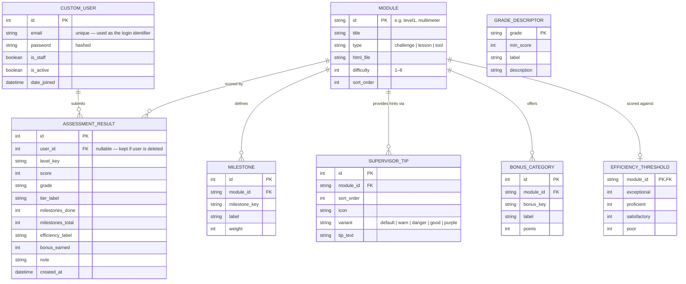

# PLeC — Programmable Logic Controller Engineering (Interactive Training Platform)

> **PLeC** is a browser-based PLC training platform designed to grow awareness and understanding of industrial automation *before* learners interact with real hardware or professional software. Learners create their own free account and progress at their own pace.
>
> *Project 4 — Level 5 Diploma in Web Application Development, Dudley College of Technology (2025–2026)*
> *Author: John E. Parman — [github.com/QualityLemons](https://github.com/QualityLemons)*

---

## Table of Contents

- [Why PLeC Exists](#why-plec-exists)
- [Educational Philosophy](#educational-philosophy)
- [Who PLeC Is For](#who-plec-is-for)
- [Features](#features)
- [Missions & Content](#missions--content)
- [Architecture](#architecture)
- [Accounts & Authentication](#accounts--authentication)
- [Entity Relationship Diagram](#entity-relationship-diagram)
- [Technology Stack](#technology-stack)
- [Accessibility](#accessibility)
- [Visual Design](#visual-design)
- [Wireframes](#wireframes)
- [Getting Started](#getting-started)
- [Deployment](#deployment)
- [Testing](#testing)
- [OpenPLC Connection](#openplc-connection)
- [Licence](#licence)
- [Attributions](#attributions)

---

## Why PLeC Exists

PLeC was created in direct response to a skills shortage identified through primary research.

A survey of **11 West Midlands manufacturing companies** found that **10 out of 11** reported difficulty finding PLC engineering skills — whether in experienced applicants or at entry level. This was not a problem confined to one sector or company size. It was consistent across the region.

Following the survey, a broader review was carried out of PLC engineering training available in the West Midlands and online, including dedicated training providers, simulation software, skill-building games, and alternative self-study routes. The landscape was found to be wide but uneven: many resources existed, but quality and user experience varied greatly between them.

**The gap that kept appearing was the missing educational step before action learning.**

Most games and simulators built around real-world factory scenarios assume prior knowledge. A learner who has never seen a ladder logic rung, a PLC I/O register, or a seal-in latch circuit is typically dropped into a scenario with no conceptual foundation to work from. This happens because most of these tools are designed by engineers for engineers — not by engineers for learners.

PLeC is built to fill that gap.

---

## Educational Philosophy

PLeC draws on inclusion principles studied as part of a Level 3 Award in Education and Training at Dudley College. The core idea is that inclusion is not a fixed state — it is an **ongoing process of identifying and responding to individual needs**.

The role of educational technology in this process is to adapt teaching, learning, and assessment activities using a variety of approaches. Rather than designing for the average learner, PLeC was designed by reviewing feedback from employers about the soft skills they found hardest to find in applicants, and by reading reviews of existing PLC games to understand where learners were falling short.

From this, PLeC was built around three principles:

**1. Establish clear learning goals.**
Every mission opens with an explicit set of things the learner is going to understand or be able to do by the end. There are no hidden pass conditions.

**2. Encourage learners to check their own progress.**
Milestone checklists, self-assessment scoring, and a personal Mission Performance Log are all designed to make progress visible to the learner — not just to a teacher or system. The learner decides when they feel ready to move forward.

**3. Adjust based on feedback.**
The Supervisor widget provides contextual hints from a Senior Control Engineer character. Hints are specific to the current page and task, giving targeted support without giving answers away. The pace of PLeC is set by the learner — there are no time limits on any mission.

### A note on supervised use

PLeC is potentially useful at any age and in any setting. However, it is likely to be **most effective when used alongside someone with PLC engineering experience** — a trainer, a teacher, a workplace mentor, or a technician willing to talk through what the learner is observing on screen. The Supervisor widget models this dynamic, but a real person who can respond to specific questions, offer encouragement, and share practical context is the best complement to what PLeC provides.

---

## Who PLeC Is For

| Audience | How PLeC helps |
|---|---|
| School students (age 12+) | Builds logic, sequence, and automation concepts with no prior knowledge required |
| Apprentice engineers | Creates a conceptual foundation before first contact with real PLC hardware |
| Adult career changers | Supports re-skilling into industrial automation at a self-directed pace |
| Job seekers in manufacturing | Demonstrates practical awareness of PLC fundamentals to prospective employers |
| Trainers and educators | A zero-cost platform to assign, demonstrate, and discuss PLC concepts, with an admin panel to oversee learner activity |
| Supervising engineers | A structured starting point to use alongside a learner they are mentoring |

---

## Features

- 🎮 **Arcade / mission theme** — Teko + Share Tech Mono typefaces, chamfered clip-path cards, cyan/blue palette
- 🌓 **Light / dark theme toggle** — FOUC-safe, persisted in `localStorage`
- ♿ **WCAG 2.1 AA** — skip links, ARIA landmarks, live regions, keyboard navigation throughout
- 🔐 **Self-service accounts** — anyone can register with an email and password; no admin involvement required
- 🛡️ **Brute-force protection** — django-axes locks an account after 5 failed login attempts, with a live countdown page
- 👷 **Supervisor widget** — page-specific hints from a Senior Control Engineer character, slide-in panel, Escape-to-close
- 📊 **Real-time ladder logic** — animated SVG rungs, live I/O register table, PLC scan cycle simulation
- 🔧 **Interactive DMM simulator** — rotary dial, probe placement, multi-scenario fault finding
- 📝 **Documentation lessons** — learn maintenance logging, regulatory requirements, audit compliance
- 🏆 **Milestone tracking** — per-page progress stored in `localStorage`, completion banners
- 📋 **Personal submission history** — every "Manager's Review" a learner submits is saved to their account and viewable on their `/profile/` page
- 🛠️ **Admin panel** — Django admin lets staff manage learner accounts, reset passwords, and review submitted assessment results

---

## Missions & Content

| # | Mission | Type | Key Concepts |
|---|---|---|---|
| 0 | PLC Boot Camp | Foundations | 25-term glossary, 6 learning tools, 6 video resources |
| 1 | Digital Multimeter Tool | Interactive tool | VDC/VAC/Ω/CONT measurement, probe placement, fault finding |
| 2 | Multimeter Lesson | Guided lesson | DMM anatomy, CAT ratings, safety rules, quiz |
| 3 | Start/Stop Latching Circuit | PLC challenge | Seal-in latch, NC contacts, E-Stop fail-safe, scan cycle |
| 4 | Learn Your Log | Guided lesson | Maintenance log fields, ISO 9001, audit compliance |
| 5 | Maintenance Log Template | Practice | 8-field log entry form, bad log identification exercise |
| 6 | Tank Filling System | PLC challenge | Process control, NO/NC sensors, hysteresis, fail-safe design |
| 7 | Modbus TCP Communication | PLC challenge | MBAP header, function codes FC01/03/05/06/16, protocol analysis |
| 8 | Safety Interlock — Drill | PLC challenge | Dual-channel E-Stop, guard gate, IEC 62061, PSSR 2000 |
| 9 | Timed Conveyor — TON | PLC challenge | Timer On-Delay, EN/DN bits, preset vs accumulated value |
| 10 | Sequential Batching | PLC challenge | ISA-88 state machine, mutual exclusion, IDLE/FILL/MIX/DRAIN |

---

## Architecture

PLeC is a **Django 5.2 application**. The interactive challenge pages remain plain, dependency-free HTML/CSS/JS files, but they are now served, authenticated, and backed by a real database through Django rather than a hand-rolled Python HTTP server.

```
plec/
├── manage.py                  ← Django management entry point
├── plec.db                    ← SQLite database (local dev fallback only; created automatically if DATABASE_URL is unset — not committed to git)
├── create_db.py                ← Legacy, dev-only script — builds a standalone local SQLite file, unrelated to production Postgres
├── requirements.txt
├── Procfile                    ← Heroku processes: release-phase migrations + gunicorn web server
├── .python-version              ← Pins Python 3.11 for the Heroku buildpack
├── scripts/
│   └── post-merge.sh           ← Runs on every merge: pip install, migrate, collectstatic
├── plec_project/                ← Django project package
│   ├── settings.py              ← Installed apps, axes config, static files, email, ADMINS
│   ├── urls.py                  ← Root URL routing (auth, admin, API, challenge pages)
│   ├── wsgi.py / asgi.py
├── apps/
│   ├── accounts/                ← Custom email-based user model & authentication
│   │   ├── models.py             ← CustomUser (email as username field)
│   │   ├── forms.py               ← RegistrationForm
│   │   ├── views.py                ← LoginView, RegisterView, LockoutView, LogoutView
│   │   ├── signals.py               ← Emails admins when an account is locked out
│   │   ├── admin.py                  ← Custom admin with in-panel password change
│   │   └── tests.py                   ← Automated tests for lockout & cooldown behaviour
│   └── assessment/               ← Challenge scoring engine + learner result history
│       ├── models.py              ← Module, Milestone, SupervisorTip, AssessmentResult, etc.
│       ├── scorer.py               ← Scoring algorithm (milestones, efficiency, bonus, grade)
│       ├── reviewer.py              ← Written "Manager's Review" paragraph generator
│       ├── api_views.py              ← JSON API — modules, tips, assess, results CRUD
│       ├── views.py                   ← ResultHistoryView (`/profile/`)
│       └── admin.py                    ← Admin views onto seeded content and saved results
├── templates/
│   ├── accounts/                 ← Login, register, lockout, password-change pages
│   ├── registration/               ← Django's built-in password-reset flow templates
│   └── assessment/                  ← Learner submission history page
└── challenge/                    ← Static challenge pages (unchanged philosophy: no build step)
    ├── index.html                 ← Mission grid (arcade theme)
    ├── plc-primer.html             ← PLC Boot Camp foundations
    ├── level1.html … level6.html    ← The six PLC challenges
    ├── multimeter.html / multimeter-lesson.html
    ├── learn-your-log.html / maintenance-log.html
    ├── supervisor.css / assess.js / assess.css / mission-log.css / mission-log.js
    └── .jshintrc
```

**No build step for the challenge pages.** Each mission is still a self-contained HTML5 document using vanilla CSS/JS — the only thing that changed is *how* the page is served and *where* a learner's results are stored.

### How a page is served

| Environment | Behaviour |
|---|---|
| Development (`DJANGO_DEBUG=True`) | Django's `serve` view reads directly from the `challenge/` folder on every request — instant reflection of file edits |
| Production (`DJANGO_DEBUG=False`) | Pages are collected by `collectstatic` into `staticfiles/` and served by **WhiteNoise** with cache-busting manifest hashes |

### API endpoints (`apps/assessment/api_views.py`, mounted at `/api/`)

#### Public / read-only

| Method | Endpoint | Description |
|---|---|---|
| `GET` | `/api/me` | Returns the current session's auth state (`{authenticated, email, is_staff}`) — used by the static challenge pages to swap the header between Sign In/Register and email + Sign Out |
| `GET` | `/api/modules` | Returns all 11 modules with metadata and milestone counts |
| `GET` | `/api/tips/:module_id` | Returns Supervisor tips for a given module |
| `POST` | `/api/assess` | Scores a challenge attempt and returns grade, review paragraphs, and breakdown |

#### Authenticated — Learner Assessment Results

Every result endpoint below requires a logged-in session and is automatically scoped to `request.user` — one learner can never see or modify another learner's results.

| Method | Endpoint | Description |
|---|---|---|
| `POST` | `/api/results` | **Create** — saves a Manager's Review result against the current user; `401` if not logged in |
| `GET` | `/api/results` | **Read (list)** — returns the current user's saved results, newest-first |
| `GET` | `/api/results/:id` | **Read (single)** — `404` if the result does not exist or belongs to someone else |
| `PUT` | `/api/results/:id` | **Update** — replaces the `note` field on the current user's own result |
| `DELETE` | `/api/results/:id` | **Delete** — removes a result permanently, only if it belongs to the current user |

#### CRUD user flow

1. Learner completes a challenge and clicks **Get Manager's Review** on the completion banner.
2. `assess.js` calls `POST /api/assess` → score and review paragraphs displayed in the modal.
3. If the learner is logged in, `assess.js` calls `POST /api/results` (silent on failure) to persist the result against their account.
4. On `/profile/`, the **Result History** page lists every attempt the logged-in learner has saved.
5. Learners can edit their reflection note or delete a past result — always scoped to their own account.

---

## Accounts & Authentication

PLeC accounts are backed by a **custom email-based user model** (`apps.accounts.CustomUser`) rather than Django's default username field.

| Capability | URL | Notes |
|---|---|---|
| Self-registration | `/register/` | Anyone can create an account with an email + password. Every valid submission redirects to the login page without establishing a session (deliberate — prevents account-existence probing) |
| Sign in | `/login/` | Staff are sent to `/admin/`; regular learners are sent to the challenge homepage |
| Sign out | `/logout/` (POST) | The challenge homepage header shows the signed-in email and a Sign Out button (backed by `/api/me`) |
| Forgot password | `/password-reset/` | Standard Django email-based reset flow |
| Change password | `/password-change/` | For logged-in users |
| Learner result history | `/profile/` | Shows the current user's saved assessment results |
| Admin panel | `/admin/` | Staff/superuser only — manage accounts, reset passwords in-panel, review any learner's saved results |

### Brute-force protection

Login attempts are protected by **django-axes**:

- 5 failed attempts on the same email locks that account for 1 hour (`AXES_FAILURE_LIMIT` / `AXES_COOLOFF_TIME` in `plec_project/settings.py`)
- Lockout is scoped **per username**, not per IP — rotating IP addresses does not reset the counter, and one user's lockout never affects another account
- A locked-out visitor is shown a dedicated countdown page (`/lockout/`) rather than a generic error
- The lockout page deliberately shows the same duration for a genuinely-locked account and an unknown email, so an attacker cannot use response differences to enumerate valid accounts
- A successful login resets the failure counter
- Admins configured via the `DJANGO_ADMINS` environment variable receive an email whenever an account is locked out (`apps/accounts/signals.py`)

### Registration safeguards

`RegistrationForm` (`apps/accounts/forms.py`) rejects duplicate emails and runs Django's standard password validators (minimum length, not entirely numeric, not a common password, not too similar to the email).

---

## Entity Relationship Diagram


```mermaid
erDiagram

    CUSTOM_USER {
        int      id           PK
        string   email        "unique — used as the login identifier"
        string   password     "hashed"
        boolean  is_staff
        boolean  is_active
        datetime date_joined
    }

    MODULE {
        string id         PK "e.g. level1, multimeter"
        string title
        string type       "challenge | lesson | tool"
        string html_file
        int    difficulty "1–6"
        int    sort_order
    }

    MILESTONE {
        int    id            PK
        string module_id     FK
        string milestone_key
        string label
        int    weight
    }

    SUPERVISOR_TIP {
        int    id          PK
        string module_id   FK
        int    sort_order
        string icon
        string variant     "default | warn | danger | good | purple"
        string tip_text
    }

    EFFICIENCY_THRESHOLD {
        string module_id  PK, FK
        int    exceptional
        int    proficient
        int    satisfactory
        int    poor
    }

    BONUS_CATEGORY {
        int    id         PK
        string module_id  FK
        string bonus_key
        string label
        int    points
    }

    GRADE_DESCRIPTOR {
        string grade      PK
        int    min_score
        string label
        string description
    }

    ASSESSMENT_RESULT {
        int      id                PK
        int      user_id           FK "nullable — kept if user is deleted"
        string   level_key
        int      score
        string   grade
        string   tier_label
        int      milestones_done
        int      milestones_total
        string   efficiency_label
        int      bonus_earned
        string   note
        datetime created_at
    }

    CUSTOM_USER      ||--o{ ASSESSMENT_RESULT    : "submits"
    MODULE           ||--o{ MILESTONE            : "defines"
    MODULE           ||--o{ SUPERVISOR_TIP       : "provides hints via"
    MODULE           ||--o{ BONUS_CATEGORY       : "offers"
    MODULE           ||--o| EFFICIENCY_THRESHOLD : "scored against"
    MODULE           ||--o{ ASSESSMENT_RESULT    : "scored by"
```

Client-side state that never touches the server — the theme choice, per-page milestone checkboxes, and the free-text Mission Log reflection widget — still lives in `localStorage`, exactly as before. Only submitted **Manager's Review results** are persisted server-side, per-account.

---

## Technology Stack

| Layer | Technology |
|---|---|
| Backend framework | Django 5.2 |
| Authentication | Django sessions + custom `CustomUser` (email login) + django-axes 8.x brute-force protection |
| Database | PostgreSQL via Django ORM (`dj-database-url` + `psycopg2`), with SQLite (`plec.db`) as a local-only fallback when `DATABASE_URL` is unset |
| Static file serving | WhiteNoise (`CompressedManifestStaticFilesStorage`) |
| Content | HTML5 — semantic, landmark-based structure |
| Styling | CSS custom properties (design tokens), no preprocessor |
| Interactivity | Vanilla ES6 JavaScript — no frameworks, no bundler |
| Animation | SVG + CSS `@keyframes` |
| Fonts | Google Fonts — Teko (display), Share Tech Mono (data) |
| Client persistence | `window.localStorage` — theme, milestone progress, mission log |
| Server-side persistence | Django ORM / PostgreSQL — user accounts, sessions, saved assessment results |
| Validation | W3C Nu HTML Checker · JSHint ES6 · Google Lighthouse |

---

## Accessibility

PLeC targets **WCAG 2.1 Level AA** across all pages.

| Feature | Implementation |
|---|---|
| Skip navigation | `<a href="#main-content" class="skip-link">` on every page |
| Page structure | `<header>`, `<main>`, `<footer>` landmarks throughout |
| Live regions | `role="status"` + `role="alert"` for PLC state changes |
| Keyboard navigation | All interactive elements reachable by Tab; Escape closes dialogs |
| Focus management | Supervisor panel shifts focus on open; returns to FAB on close |
| Colour contrast | Cyan `#06b6d4` on dark `#0a0e1a` — ratio ≥ 4.5:1 (AA) |
| Reduced motion | Animations respect `prefers-reduced-motion` media query |
| Screen reader labels | `aria-label`, `aria-pressed`, `aria-expanded`, `aria-live` throughout |
| Dialog semantics | Supervisor panel uses `role="dialog"` + `aria-modal="true"` |

---

## Visual Design

**Design tokens (CSS custom properties):**

```css
--bg:    #0a0e1a   /* page background — deep navy */
--cyan:  #06b6d4   /* primary accent */
--blue:  #3b82f6   /* secondary accent / ladder rail colour */
--amber: #f59e0b   /* warning states / auth call-to-actions */
--green: #22c55e   /* success / milestone complete */
--red:   #ef4444   /* danger / E-Stop */

/* Typography */
--font-d: 'Teko', 'Impact', sans-serif                  /* display headings */
--font-m: 'Share Tech Mono', 'Courier New', monospace   /* data / code */
```

**Chamfered clip-path shapes:**

```css
/* Mission card */
clip-path: polygon(15px 0, 100% 0, 100% calc(100% - 15px),
                   calc(100% - 15px) 100%, 0 100%, 0 15px);

/* Button / FAB */
clip-path: polygon(10px 0, 100% 0, 100% calc(100% - 10px),
                   calc(100% - 10px) 100%, 0 100%, 0 10px);
```

Amber (`#f59e0b`) is used consistently across the app as the "authentication" colour — the Sign In and Register links on every challenge page share this styling so the entry point to an account is instantly recognisable.

---

## Wireframes

These hand-drawn wireframes were produced during the initial design phase. They show the layout and content decisions made before any code was written.

### Mission Grid — Homepage


The homepage concept established the mission-card grid layout, the top navigation with numbered mission tabs, and the hero area explaining the "why" — including the West Midlands skills survey result. Early card titles (Multimeter Training, Tank-Filling, HVAC, Conveyor Belt, Robot Arm) show the original scope before the final mission set was confirmed.

---

### Mission 1 — Multimeter Training


The multimeter simulator wireframe defined the two-panel layout: DMM controls (display, rotary dial, mode buttons) on the left; the interactive wiring scenario with measurement points on the right. The course explainer text and task list at the bottom became the learn panel in the finished page. Source: OpenPLC noted at design stage.

---

### Tank-Filling PLC Challenge


A three-column layout was planned from the start: simulated interactive PLC (ladder logic panel) on the left, tasks and explainer text in the centre, and a visual tank level indicator (5% / 50% / 89% full) with a Supervisor hint button on the right. This became the foundation for all six PLC challenge pages.

---

### Maintenance Log Lesson


The maintenance log wireframe specified the eight form fields (Name, Job No., Date, Site, Supervisor, problem description, faults found, parts replaced, fix demonstrated), a Submit for Review button, and a Hint button tied to the Supervisor character. The note "graded based on a central record in Django" reflects the server-side design the project has since implemented in full.

---

## Getting Started

### Requirements

- Python 3.11+
- A modern browser (Chrome 90+, Firefox 88+, Safari 14+, Edge 90+)

### Environment variables

PLeC requires a `DJANGO_SECRET_KEY` to start. All other variables have safe defaults for local development.

| Variable | Required | Default | Purpose |
|---|---|---|---|
| `DJANGO_SECRET_KEY` | ✅ | — | Django cryptographic signing key; the app refuses to start without it |
| `DJANGO_DEBUG` | | `False` | `True` enables live-reload serving of `challenge/` and Django's debug pages |
| `DATABASE_URL` | prod | *(unset)* | PostgreSQL connection URL. If unset, the app also checks Heroku's `HEROKU_POSTGRESQL_*_URL` attachment variables; in local development (`DJANGO_DEBUG=True`) it falls back to SQLite |
| `ALLOWED_HOSTS` | | *(empty)* | Comma-separated list of allowed hostnames in production |
| `CSRF_TRUSTED_ORIGINS` | prod | *(empty)* | Comma-separated origins allowed to POST forms, e.g. `https://your-app.herokuapp.com` |
| `DJANGO_ADMINS` | | *(empty)* | Comma-separated `Name:email@example.com` list — receives lockout alert emails |
| `EMAIL_BACKEND` / `EMAIL_HOST` / `EMAIL_PORT` / `EMAIL_HOST_USER` / `EMAIL_HOST_PASSWORD` / `EMAIL_USE_TLS` | | console backend | SMTP settings for password-reset and admin-alert emails |
| `DEFAULT_FROM_EMAIL` | | `noreply@plec.local` | From-address on outgoing email |

### Run locally

```bash
git clone https://github.com/QualityLemons/plec.git
cd plec
pip install -r requirements.txt
export DJANGO_SECRET_KEY="a-long-random-string"
export DJANGO_DEBUG=True
python manage.py migrate
python manage.py runserver 0.0.0.0:5000
# Open http://localhost:5000
```

Create an admin account for the Django admin panel:

```bash
python manage.py createsuperuser
```

Ordinary learner accounts do **not** need this step — anyone can create one at `/register/`.

---

## Deployment

PLeC is a Django application and needs a Python host capable of running `manage.py`/WSGI — plain static hosting (GitHub Pages, Netlify, S3, etc.) is no longer sufficient on its own, because authentication, the admin panel, and the assessment API all require a running Django process.

### Heroku (or any Python buildpack host)

The included `Procfile` runs migrations in Heroku's release phase and serves the app with gunicorn:

```
release: python manage.py migrate --noinput
web: gunicorn plec_project.wsgi --bind 0.0.0.0:$PORT --workers 2 --timeout 60
```

`.python-version` pins Python 3.11 for the buildpack, and `requirements.txt` already includes gunicorn.

Static files are collected automatically during Heroku's **build** phase (do **not** set `DISABLE_COLLECTSTATIC` — release-phase dynos have a throwaway filesystem, so files collected there never reach the web dyno). `settings.py` is written so `collectstatic` works without a database connection, which is exactly the situation during a Heroku build.

### Required production configuration

1. Attach a PostgreSQL database. On Heroku, add the **Heroku Postgres** add-on (Resources tab) — it sets `DATABASE_URL` automatically. The app also accepts Heroku's colored attachment variables (e.g. `HEROKU_POSTGRESQL_SILVER_URL`) when `DATABASE_URL` is missing, refuses to guess if several are present, and rejects non-PostgreSQL databases in production. The release log prints which variable it connected from.
2. Set `DJANGO_SECRET_KEY` to a long random string (never reuse the development value).
3. Set `DJANGO_DEBUG=False` (or leave unset — `False` is the default).
4. Set `ALLOWED_HOSTS` to your production domain(s), e.g. `your-app.herokuapp.com`.
5. Set `CSRF_TRUSTED_ORIGINS` to the full origin(s), e.g. `https://your-app.herokuapp.com`.
6. Configure SMTP `EMAIL_*` variables so password-reset links and admin lockout alerts are actually delivered (the default console backend only prints emails to the server log).
7. Optionally set `DJANGO_ADMINS` so staff are notified by email when an account is locked out.
8. One-time, after the first deploy (Heroku dashboard → More → Run console):
   ```bash
   python manage.py load_seed_data     # modules, milestones, supervisor tips
   python manage.py createsuperuser    # your admin account
   ```

> **Reverse-proxy SSL:** Heroku terminates HTTPS at its router and forwards plain HTTP to the dyno. `settings.py` sets `SECURE_PROXY_SSL_HEADER` so Django trusts `X-Forwarded-Proto`, preventing redirect loops with `SECURE_SSL_REDIRECT`.

> **Database:** The app uses PostgreSQL in production, configured entirely through the `DATABASE_URL` environment variable (parsed via `dj-database-url`). This is required on any host with an ephemeral filesystem (e.g. container restarts, redeploys) — a file-based SQLite database would silently lose all user accounts and saved results on every restart, and cannot safely handle concurrent writes. The SQLite fallback (`plec.db`) only activates in local development with `DJANGO_DEBUG=True`; in production, a missing database is caught at first use (build steps like `collectstatic` still work), and the release-phase `migrate` fails loudly rather than silently writing to an ephemeral file.

### CI — W3C validation on every push

The repository includes a W3C validation workflow at `.github/workflows/w3c-validate.yml`. It runs automatically on every push and pull request, checking the challenge pages against the W3C Nu HTML Checker.

---

## Testing

PLeC uses a two-layer test strategy: **automated Django tests** for authentication and server-side logic, plus a **legacy automated suite** covering the original scoring/content-seeding logic, and **manual test procedures** for the browser-based frontend.

### Automated — Django (`apps/accounts/tests.py`)

Run with:

```bash
python manage.py test apps.accounts
```

This suite (39 tests) exercises the authentication and lockout system end-to-end using Django's test client — not just unit-level helpers:

- Lockout engages after exactly 5 failed attempts, and stays locked even against the correct password
- Lockout is scoped per-username — rotating IP addresses does not reset the counter, and locking one account never affects another
- A successful login resets the failure counter
- The `/lockout/` countdown page renders the correct duration for every supported `AXES_COOLOFF_TIME` shape (int, `timedelta`, or callable)
- The lockout page intentionally shows the *same* duration for a genuinely-locked account and a completely unknown email, so a probing attacker cannot use timing differences to enumerate valid accounts
- `_cooldown_remaining()` always reads `attempt_time` fresh from the database rather than caching it, so the countdown is accurate even across a server restart mid-cooldown

### Automated — legacy content/scoring suite (`tests/test_plec.py`)

```bash
python -m unittest discover -s tests -v
```

This suite predates the Django migration and still passes — it covers `create_db.py`'s seed-data build (module/milestone/tip counts), the scoring algorithm (`apps/assessment/scorer.py`), and the review-paragraph generator (`apps/assessment/reviewer.py`) in isolation from the web layer. It only ever builds and inspects a throwaway local SQLite file (`tests/test_plec.db`, cleaned up automatically after the run, including its `-shm`/`-wal` sidecar files) and is completely disconnected from the production PostgreSQL database. It does **not** exercise the Django views, authentication, or the per-user `/api/results` endpoints — those are covered by `apps/accounts/tests.py` and by the manual procedures below.

### What's not yet covered by automated tests

- The `/register/` endpoint and `RegistrationForm` (duplicate-email rejection, password validators) — currently verified manually
- The `/api/results` CRUD endpoints' per-user ownership scoping — currently verified manually
- All in-browser PLC simulation logic, milestone detection timing, and `localStorage` persistence — these run entirely client-side and are verified through the manual procedures below

### Manual test coverage

Manual testing covers functionality (each PLC challenge's ladder logic and milestone detection), usability (keyboard navigation, screen reader announcements, theme persistence), responsiveness (375px/768px/1440px viewports), and the full authentication flow (register → login → lockout → password reset → profile history) across Chrome, Firefox, and Safari.

---

## OpenPLC Connection

[OpenPLC](https://autonomylogic.com/) is the world's first fully open-source PLC platform, implementing the IEC 61131-3 standard across five programming languages (Ladder Diagram, Function Block Diagram, Structured Text, Instruction List, Sequential Function Chart).

PLeC is designed as a **safe on-ramp** to OpenPLC:

| Dimension | OpenPLC | PLeC |
|---|---|---|
| Target | Practising engineers | Learners from age 12 upward |
| Hardware | Raspberry Pi, Arduino, PLCnext, etc. | Any device with a browser |
| Setup | Runtime + Editor + SCADA install | Create a free account — nothing to install |
| Languages | Full IEC 61131-3 (5 languages) | Ladder Logic + Modbus TCP (focused subset) |
| Safety | Real hardware risks | Fully simulated — no physical hazard |

A learner who completes all PLeC missions will have the conceptual foundation to begin programming confidently on OpenPLC Runtime or a professional PLC platform (Siemens TIA Portal, Allen-Bradley Studio 5000, Codesys).

---

## Licence

PLeC is released under the **MIT Licence**.

```
MIT License — Copyright (c) 2026 John E. Parman / PLeC Contributors

Permission is hereby granted, free of charge, to any person obtaining a copy
of this software and associated documentation files (the "Software"), to deal
in the Software without restriction, including without limitation the rights
to use, copy, modify, merge, publish, distribute, sublicense, and/or sell
copies of the Software, and to permit persons to whom the Software is
provided to do so, subject to the following conditions:

The above copyright notice and this permission notice shall be included in
all copies or substantial portions of the Software.

THE SOFTWARE IS PROVIDED "AS IS", WITHOUT WARRANTY OF ANY KIND, EXPRESS OR
IMPLIED, INCLUDING BUT NOT LIMITED TO THE WARRANTIES OF MERCHANTABILITY,
FITNESS FOR A PARTICULAR PURPOSE AND NONINFRINGEMENT.
```

---

## Attributions

This section records the origin of every meaningful part of the repository — either original work by QualityLemons or a resource available under an open source licence.

### Files created by QualityLemons

All files below are original work, written from scratch for this project and released under the MIT Licence (see `LICENSE`).

#### Frontend — challenge pages (`challenge/`)

Twelve self-contained HTML5 pages (mission grid homepage, PLC primer, six PLC challenges, two multimeter pages, two maintenance-log pages) plus shared `supervisor.css`, `assess.css`, `mission-log.css`, `assess.js`, and `mission-log.js`.

#### Backend — Django project (`plec_project/`, `apps/`)

| Area | Description |
|---|---|
| `plec_project/` | Django project settings, root URL configuration, WSGI/ASGI entry points |
| `apps/accounts/` | Custom email-based user model, registration, login, lockout, admin, and their automated tests |
| `apps/assessment/` | Content models, scoring engine, review generator, JSON API, and learner result-history view |
| `templates/` | Authentication and result-history page templates |

#### Legacy backend (retained for reference)

| File | Description |
|---|---|
| `create_db.py` | Original SQLite schema/seed-data build script (dev-only, standalone local file, unrelated to production Postgres); the Django/Postgres-native equivalent is `python manage.py load_seed_data` |
| `serve.py` | Original hand-rolled `http.server`-based backend, superseded by the Django project but retained for historical reference; also standalone SQLite, disconnected from production Postgres |
| `tests/test_plec.py` | Original automated test suite for the pre-Django scoring/content pipeline |
| `config/` | Early Django scaffolding stub, superseded by `plec_project/` |

#### Configuration and deployment

| File | Description |
|---|---|
| `Procfile` | Process declaration for Heroku/buildpack deployment |
| `requirements.txt` | Python dependency list — Django, WhiteNoise, django-axes |
| `scripts/post-merge.sh` | Runs `pip install`, `migrate`, and `collectstatic` after every merge |
| `.github/workflows/deploy-pages.yml` | GitHub Actions CI — static-file deploy workflow (legacy, predates Django migration) |
| `.github/workflows/w3c-validate.yml` | GitHub Actions CI — runs W3C Nu HTML validation on every push |
| `challenge/.jshintrc` | JSHint configuration (ES6, browser globals) |
| `threat_model.md` | Security threat model — trust boundaries, assets, and required guarantees |
| `.gitignore` | Git ignore rules |
| `CONTRIBUTING.md` | Contributor guide — local setup, code standards, pull request process |
| `CHANGELOG.txt` | Version history |

#### Documentation and assets

| File | Description |
|---|---|
| `README.md` | Main project documentation |
| `LICENSE` | MIT Licence text |
| `docs/wireframes/*.jpg` | Original hand-drawn wireframes for homepage, multimeter tool, tank-filling challenge, and maintenance log |
| `docs/validation/*.png` | Screenshots of W3C and JSHint validation results |

---

### Open source resources

No third-party JavaScript libraries or CSS frameworks are used in the challenge pages — all PLC simulation logic, SVG ladder diagrams, CSS, and JavaScript are original. The backend uses a small set of well-established Django packages.

#### Typefaces

Both fonts are served via the Google Fonts API and are licensed under the SIL Open Font Licence 1.1, which allows free use in any project including commercial ones.

| Font | Designer / Foundry | Licence | Used in |
|---|---|---|---|
| [Teko](https://fonts.google.com/specimen/Teko) | Indian Type Foundry (ITF) | [SIL OFL 1.1](https://openfontlicense.org/) | Display headings, mission titles, grade labels, HMI coil text |
| [Share Tech Mono](https://fonts.google.com/specimen/Share+Tech+Mono) | Carrois Apostrophe | [SIL OFL 1.1](https://openfontlicense.org/) | PLC register values, protocol log output, scan counter, timer display |

#### Python / Django packages

| Package | Licence | Purpose |
|---|---|---|
| [Django](https://www.djangoproject.com/) | BSD-3-Clause | Web framework — ORM, auth, admin, templating, migrations |
| [django-axes](https://github.com/jazzband/django-axes) | MIT | Brute-force login protection and lockout |
| [WhiteNoise](https://whitenoise.readthedocs.io/) | MIT | Serves static/challenge files directly from the Django app in production |
| [dj-database-url](https://github.com/jazzband/dj-database-url) | BSD | Parses `DATABASE_URL` into Django's `DATABASES` setting |
| [psycopg2-binary](https://www.psycopg.org/) | LGPL | PostgreSQL database driver |

#### Database engine

Production uses [PostgreSQL](https://www.postgresql.org/) (PostgreSQL Licence, an OSI-approved permissive licence), accessed entirely through Django's ORM via `DATABASE_URL`. [SQLite](https://www.sqlite.org/), dedicated to the **public domain**, remains available only as a local-development fallback when `DATABASE_URL` is unset.

---

*Built for the next generation of control engineers — and for everyone who was told automation was too technical to start learning.*
