# PLeC — Programmable Logic Controller Engineering (Interactive Training Platform)

> **PLeC** is a browser-based PLC training platform designed to grow awareness and understanding of industrial automation *before* learners interact with real hardware or professional software. Learners create their own free account and progress at their own pace.
>
> *Project 4 — Level 5 Diploma in Web Application Development, Dudley College of Technology (2025–2026)*
> *Author: John E. Parman — [github.com/QualityLemons](https://github.com/QualityLemons)*

---

## Table of Contents

- [Why PLeC Exists](#why-plec-exists)
- [Educational Philosophy](#educational-philosophy)
- [Who PLeC Is For](#who-plec-is-for)
- [User Stories](#user-stories)
- [Features](#features)
- [Missions & Content](#missions--content)
- [Architecture](#architecture)
- [Accounts & Authentication](#accounts--authentication)
- [Entity Relationship Diagram](#entity-relationship-diagram)
- [Technology Stack](#technology-stack)
- [Accessibility](#accessibility)
- [Visual Design](#visual-design)
- [Wireframes](#wireframes)
- [Getting Started](#getting-started)
- [Deployment](#deployment)
- [Testing](#testing)
- [OpenPLC Connection](#openplc-connection)
- [Licence](#licence)
- [Attributions](#attributions)

---

## Why PLeC Exists

PLeC was created in direct response to a skills shortage identified through primary research.

A survey of **11 West Midlands manufacturing companies** found that **10 out of 11** reported difficulty finding PLC engineering skills — whether in experienced applicants or at entry level. This was not a problem confined to one sector or company size. It was consistent across the region.

Following the survey, a broader review was carried out of PLC engineering training available in the West Midlands and online, including dedicated training providers, simulation software, skill-building games, and alternative self-study routes. The landscape was found to be wide but uneven: many resources existed, but quality and user experience varied greatly between them.

**The gap that kept appearing was the missing educational step before action learning.**

Most games and simulators built around real-world factory scenarios assume prior knowledge. A learner who has never seen a ladder logic rung, a PLC I/O register, or a seal-in latch circuit is typically dropped into a scenario with no conceptual foundation to work from. This happens because most of these tools are designed by engineers for engineers — not by engineers for learners.

PLeC is built to fill that gap.

---

## Educational Philosophy

PLeC draws on inclusion principles studied as part of a Level 3 Award in Education and Training at Dudley College. The core idea is that inclusion is not a fixed state — it is an **ongoing process of identifying and responding to individual needs**.

The role of educational technology in this process is to adapt teaching, learning, and assessment activities using a variety of approaches. Rather than designing for the average learner, PLeC was designed by reviewing feedback from employers about the soft skills they found hardest to find in applicants, and by reading reviews of existing PLC games to understand where learners were falling short.

From this, PLeC was built around three principles:

**1. Establish clear learning goals.**
Every mission opens with an explicit set of things the learner is going to understand or be able to do by the end. There are no hidden pass conditions.

**2. Encourage learners to check their own progress.**
Milestone checklists, self-assessment scoring, and a personal Mission Performance Log are all designed to make progress visible to the learner — not just to a teacher or system. The learner decides when they feel ready to move forward.

**3. Adjust based on feedback.**
The Supervisor widget provides contextual hints from a Senior Control Engineer character. Hints are specific to the current page and task, giving targeted support without giving answers away. The pace of PLeC is set by the learner — there are no time limits on any mission.

### A note on supervised use

PLeC is potentially useful at any age and in any setting. However, it is likely to be **most effective when used alongside someone with PLC engineering experience** — a trainer, a teacher, a workplace mentor, or a technician willing to talk through what the learner is observing on screen. The Supervisor widget models this dynamic, but a real person who can respond to specific questions, offer encouragement, and share practical context is the best complement to what PLeC provides.

---

## Who PLeC Is For

| Audience | How PLeC helps |
|---|---|
| School students (age 12+) | Builds logic, sequence, and automation concepts with no prior knowledge required |
| Apprentice engineers | Creates a conceptual foundation before first contact with real PLC hardware |
| Adult career changers | Supports re-skilling into industrial automation at a self-directed pace |
| Job seekers in manufacturing | Demonstrates practical awareness of PLC fundamentals to prospective employers |
| Trainers and educators | A zero-cost platform to assign, demonstrate, and discuss PLC concepts, with an admin panel to oversee learner activity |
| Supervising engineers | A structured starting point to use alongside a learner they are mentoring |

---

## User Stories

User stories were used throughout development to keep every feature grounded in real learner and admin needs. Each story follows the standard format: *As a [role], I can [action], so that [benefit].*

### Learner

| # | Story |
|---|---|
| L1 | As a **learner**, I can register for a free account using my email address and a password, so that I can save my progress and access all missions |
| L2 | As a **learner**, I can sign in and out from any page, so that my session is under my control |
| L3 | As a **learner**, I can reset my forgotten password via an email link, so that I can regain access to my account without contacting an admin |
| L4 | As a **learner**, I can complete interactive PLC challenges and receive an instant scored Manager's Review, so that I know exactly how well I understand each topic |
| L5 | As a **learner**, I can view my full submission history on my profile page in reverse-chronological order, so that I can track my improvement across multiple attempts |
| L6 | As a **learner**, I can see my personal best grade and score for each of the 6 levels in a summary table, so that I know where I've achieved my strongest performance at a glance |
| L7 | As a **learner**, I can see a "YOUR PROGRESS X / 6" counter on the home page after signing in, so that I know how many levels I have attempted without navigating away |
| L8 | As a **learner**, I can write a reflection on what I learned after completing a mission — choosing the level, skill area, and a 1–5 confidence rating — so that I have a structured personal development record |
| L9 | As a **learner**, I can edit a reflection I previously wrote, so that I can correct mistakes or add detail as my understanding grows |
| L10 | As a **learner**, I can delete a reflection entry I no longer want, with a confirmation step that shows me a preview of the entry before it is removed permanently, so that I cannot accidentally delete the wrong entry |
| L11 | As a **learner**, I can only see and modify my own reflections and submitted results — never another learner's — so that my data is private |
| L12 | As a **learner**, I can update my first name, last name, and email address from my profile page, so that my account details stay accurate |
| L13 | As a **learner**, I can change my password while logged in, so that I can keep my account secure |

### Supervisor / Trainer

| # | Story |
|---|---|
| S1 | As a **supervisor**, I can access the Django admin panel to view all learner accounts and submitted results, so that I can monitor learner progress across the cohort |
| S2 | As a **supervisor**, I can reset a learner's password from the admin panel, so that I can help a learner who has been locked out or forgotten their credentials |
| S3 | As a **supervisor**, I can view an audit log of all admin password changes — showing the acting admin, the target account, and the timestamp — so that I have a record of administrative activity |
| S4 | As a **supervisor**, I receive an email alert whenever a learner's account is locked out after repeated failed login attempts, so that I am aware of potential access problems or security incidents |

### Security

| # | Story |
|---|---|
| SC1 | As a **learner**, my account is locked for 1 hour after 5 failed login attempts, with a visible countdown, so that my account is protected from brute-force password attacks |
| SC2 | As a **learner**, I cannot be enumerated through the registration or password-reset flows — the platform gives no indication of whether a given email address is registered, so that my account existence is not exposed |
| SC3 | As a **platform**, all CSRF tokens, session cookies, and password-reset links are signed with a strong secret key, so that they cannot be forged or replayed |

---

## Features

- 🎮 **Arcade / mission theme** — Teko + Share Tech Mono typefaces, chamfered clip-path cards, cyan/blue palette
- 🌓 **Light / dark theme toggle** — FOUC-safe, persisted in `localStorage`
- ♿ **WCAG 2.1 AA** — skip links, ARIA landmarks, live regions, keyboard navigation throughout
- 🔐 **Self-service accounts** — anyone can register with an email and password; no admin involvement required
- 🛡️ **Brute-force protection** — django-axes locks an account after 5 failed login attempts, with a live countdown page
- 🔒 **Rate-limited password reset** — reset emails are throttled to 3 requests per hour per address, preventing abuse
- 👷 **Supervisor widget** — page-specific hints from a Senior Control Engineer character, slide-in panel, Escape-to-close
- 📊 **Real-time ladder logic** — animated SVG rungs, live I/O register table, PLC scan cycle simulation
- 🔧 **Interactive DMM simulator** — rotary dial, probe placement, multi-scenario fault finding
- 📝 **Documentation lessons** — learn maintenance logging, regulatory requirements, audit compliance
- 🏆 **Milestone tracking** — per-page progress stored in `localStorage`, completion banners
- 📋 **Personal submission history** — every "Manager's Review" a learner submits is saved to their account and viewable on their `/profile/` page
- 🥇 **Best scores by level** — the profile page shows each learner's personal best grade and score across all attempts at each level, sortable by level or grade
- 📈 **Course progress bar** — the home page shows how many of the 6 levels the learner has attempted ("YOUR PROGRESS 3/6"), calculated server-side on every login
- 📓 **Reflection log** — full CRUD: learners can create, edit, and delete personal written reflections per level and skill area; 30–1,000 character notes with a 1–5 confidence rating; paginated list with creation timestamps
- ✏️ **Edit profile** — learners can update their display name and email address from any authenticated page via the main nav
- 🛠️ **Admin panel** — Django admin lets staff manage learner accounts, reset passwords, and review submitted assessment results
- 📒 **Admin audit log** — every admin password change is recorded with the acting admin's name, target account, and timestamp; viewable from the admin panel

---

## Missions & Content

| # | Mission | Type | Key Concepts |
|---|---|---|---|
| 0 | PLC Boot Camp | Foundations | 25-term glossary, 6 learning tools, 6 video resources |
| 1 | Digital Multimeter Tool | Interactive tool | VDC/VAC/Ω/CONT measurement, probe placement, fault finding |
| 2 | Multimeter Lesson | Guided lesson | DMM anatomy, CAT ratings, safety rules, quiz |
| 3 | Start/Stop Latching Circuit | PLC challenge | Seal-in latch, NC contacts, E-Stop fail-safe, scan cycle |
| 4 | Learn Your Log | Guided lesson | Maintenance log fields, ISO 9001, audit compliance |
| 5 | Maintenance Log Template | Practice | 8-field log entry form, bad log identification exercise |
| 6 | Tank Filling System | PLC challenge | Process control, NO/NC sensors, hysteresis, fail-safe design |
| 7 | Modbus TCP Communication | PLC challenge | MBAP header, function codes FC01/03/05/06/16, protocol analysis |
| 8 | Safety Interlock — Drill | PLC challenge | Dual-channel E-Stop, guard gate, IEC 62061, PSSR 2000 |
| 9 | Timed Conveyor — TON | PLC challenge | Timer On-Delay, EN/DN bits, preset vs accumulated value |
| 10 | Sequential Batching | PLC challenge | ISA-88 state machine, mutual exclusion, IDLE/FILL/MIX/DRAIN |

---

## Architecture

PLeC is a **Django 5.2 application**. The interactive challenge pages remain plain, dependency-free HTML/CSS/JS files, but they are now served, authenticated, and backed by a real database through Django rather than a hand-rolled Python HTTP server.

```
plec/
├── manage.py                  ← Django management entry point
├── plec.db                    ← SQLite database (local dev fallback only; created automatically if DATABASE_URL is unset — not committed to git)
├── create_db.py                ← Legacy, dev-only script — builds a standalone local SQLite file, unrelated to production Postgres
├── requirements.txt
├── Procfile                    ← Heroku processes: release-phase migrations + gunicorn web server
├── .python-version              ← Pins Python 3.11 for the Heroku buildpack
├── scripts/
│   └── post-merge.sh           ← Runs on every merge: pip install, migrate, collectstatic
├── plec_project/                ← Django project package
│   ├── settings.py              ← Installed apps, axes config, static files, email, ADMINS
│   ├── urls.py                  ← Root URL routing (auth, admin, API, challenge pages)
│   ├── wsgi.py / asgi.py
├── apps/
│   ├── accounts/                ← Custom email-based user model & authentication
│   │   ├── models.py             ← CustomUser (email as username field)
│   │   ├── forms.py               ← RegistrationForm, EditProfileForm
│   │   ├── views.py                ← LoginView, RegisterView, LockoutView, LogoutView, EditProfileView
│   │   ├── signals.py               ← Emails admins when an account is locked out
│   │   ├── admin.py                  ← Custom admin with in-panel password change + audit log
│   │   └── tests.py                   ← Automated tests for lockout, cooldown & audit log behaviour
│   └── assessment/               ← Challenge scoring engine, learner history & reflection log
│       ├── models.py              ← Module, Milestone, SupervisorTip, AssessmentResult, Reflection
│       ├── forms.py               ← ReflectionForm (level, skill, notes min-30, confidence 1–5)
│       ├── scorer.py               ← Scoring algorithm (milestones, efficiency, bonus, grade)
│       ├── reviewer.py              ← Written "Manager's Review" paragraph generator
│       ├── api_views.py              ← JSON API — modules, tips, assess, results CRUD
│       ├── views.py                   ← ResultHistoryView, ReflectionCreateView, ReflectionListView, ReflectionUpdateView, ReflectionDeleteView
│       └── admin.py                    ← Admin views onto seeded content, saved results and reflections
├── templates/
│   ├── accounts/                 ← Login, register, lockout, password-change, edit-profile pages
│   ├── registration/               ← Django's built-in password-reset flow templates
│   └── assessment/                  ← Learner submission history, reflection log (create/edit/delete)
└── challenge/                    ← Static challenge pages (unchanged philosophy: no build step)
    ├── index.html                 ← Mission grid (arcade theme)
    ├── plc-primer.html             ← PLC Boot Camp foundations
    ├── level1.html … level6.html    ← The six PLC challenges
    ├── multimeter.html / multimeter-lesson.html
    ├── learn-your-log.html / maintenance-log.html
    ├── supervisor.css / assess.js / assess.css / mission-log.css / mission-log.js
    └── .jshintrc
```

**No build step for the challenge pages.** Each mission is still a self-contained HTML5 document using vanilla CSS/JS — the only thing that changed is *how* the page is served and *where* a learner's results are stored.

### How a page is served

| Environment | Behaviour |
|---|---|
| Development (`DJANGO_DEBUG=True`) | Django's `serve` view reads directly from the `challenge/` folder on every request — instant reflection of file edits |
| Production (`DJANGO_DEBUG=False`) | Pages are collected by `collectstatic` into `staticfiles/` and served by **WhiteNoise** with cache-busting manifest hashes |

### API endpoints (`apps/assessment/api_views.py`, mounted at `/api/`)

#### Public / read-only

| Method | Endpoint | Description |
|---|---|---|
| `GET` | `/api/me` | Returns the current session's auth state (`{authenticated, email, is_staff}`) — used by the static challenge pages to swap the header between Sign In/Register and email + Sign Out |
| `GET` | `/api/modules` | Returns all 11 modules with metadata and milestone counts |
| `GET` | `/api/tips/:module_id` | Returns Supervisor tips for a given module |
| `POST` | `/api/assess` | Scores a challenge attempt and returns grade, review paragraphs, and breakdown |

#### Authenticated — Learner Assessment Results

Every result endpoint below requires a logged-in session and is automatically scoped to `request.user` — one learner can never see or modify another learner's results.

| Method | Endpoint | Description |
|---|---|---|
| `POST` | `/api/results` | **Create** — saves a Manager's Review result against the current user; `401` if not logged in |
| `GET` | `/api/results` | **Read (list)** — returns the current user's saved results, newest-first |
| `GET` | `/api/results/:id` | **Read (single)** — `404` if the result does not exist or belongs to someone else |
| `PUT` | `/api/results/:id` | **Update** — replaces the `note` field on the current user's own result |
| `DELETE` | `/api/results/:id` | **Delete** — removes a result permanently, only if it belongs to the current user |

#### CRUD user flow

1. Learner completes a challenge and clicks **Get Manager's Review** on the completion banner.
2. `assess.js` calls `POST /api/assess` → score and review paragraphs displayed in the modal.
3. If the learner is logged in, `assess.js` calls `POST /api/results` (silent on failure) to persist the result against their account.
4. On `/profile/`, the **Result History** page lists every attempt the logged-in learner has saved.
5. Learners can edit their reflection note or delete a past result — always scoped to their own account.

---

## Accounts & Authentication

PLeC accounts are backed by a **custom email-based user model** (`apps.accounts.CustomUser`) rather than Django's default username field.

| Capability | URL | Notes |
|---|---|---|
| Self-registration | `/register/` | Anyone can create an account with an email + password. Every valid submission redirects to the login page without establishing a session (deliberate — prevents account-existence probing) |
| Sign in | `/login/` | Staff are sent to `/admin/`; regular learners are sent to the challenge homepage |
| Sign out | `/logout/` (POST) | The challenge homepage header shows the signed-in email and a Sign Out button (backed by `/api/me`) |
| Forgot password | `/password-reset/` | Standard Django email-based reset flow; throttled to 3 reset emails per hour per address |
| Change password | `/password-change/` | For logged-in users |
| Edit profile | `/profile/edit/` | Learners can update first name, last name, and email address; email uniqueness is enforced |
| Learner result history | `/profile/` | Shows the current user's personal best scores by level and full submission history |
| Reflection log | `/reflect/` | Learners create and manage personal written reflections per level and skill area |
| Admin panel | `/admin/` | Staff/superuser only — manage accounts, reset passwords in-panel, review any learner's saved results |
| Admin audit log | `/admin/accounts/adminauditlog/` | Records every admin password-change with actor, target, and timestamp |

### Brute-force protection

Login attempts are protected by **django-axes**:

- 5 failed attempts on the same email locks that account for 1 hour (`AXES_FAILURE_LIMIT` / `AXES_COOLOFF_TIME` in `plec_project/settings.py`)
- Lockout is scoped **per username**, not per IP — rotating IP addresses does not reset the counter, and one user's lockout never affects another account
- A locked-out visitor is shown a dedicated countdown page (`/lockout/`) rather than a generic error
- The lockout page deliberately shows the same duration for a genuinely-locked account and an unknown email, so an attacker cannot use response differences to enumerate valid accounts
- A successful login resets the failure counter
- Admins configured via the `DJANGO_ADMINS` environment variable receive an email whenever an account is locked out (`apps/accounts/signals.py`)

### Registration safeguards

`RegistrationForm` (`apps/accounts/forms.py`) rejects duplicate emails and runs Django's standard password validators (minimum length, not entirely numeric, not a common password, not too similar to the email).

---

## Entity Relationship Diagram


```mermaid
erDiagram

    CUSTOM_USER {
        int      id           PK
        string   email        "unique — used as the login identifier"
        string   password     "hashed"
        boolean  is_staff
        boolean  is_active
        datetime date_joined
    }

    MODULE {
        string id         PK "e.g. level1, multimeter"
        string title
        string type       "challenge | lesson | tool"
        string html_file
        int    difficulty "1–6"
        int    sort_order
    }

    MILESTONE {
        int    id            PK
        string module_id     FK
        string milestone_key
        string label
        int    weight
    }

    SUPERVISOR_TIP {
        int    id          PK
        string module_id   FK
        int    sort_order
        string icon
        string variant     "default | warn | danger | good | purple"
        string tip_text
    }

    EFFICIENCY_THRESHOLD {
        string module_id  PK, FK
        int    exceptional
        int    proficient
        int    satisfactory
        int    poor
    }

    BONUS_CATEGORY {
        int    id         PK
        string module_id  FK
        string bonus_key
        string label
        int    points
    }

    GRADE_DESCRIPTOR {
        string grade      PK
        int    min_score
        string label
        string description
    }

    ASSESSMENT_RESULT {
        int      id                PK
        int      user_id           FK "nullable — kept if user is deleted"
        string   level_key
        int      score
        string   grade
        string   tier_label
        int      milestones_done
        int      milestones_total
        string   efficiency_label
        int      bonus_earned
        string   note
        datetime created_at
    }

    REFLECTION {
        int      id            PK
        int      user_id       FK "scoped to owner — other users cannot read or write"
        string   level_key     "e.g. level1, multimeter"
        string   skill_area    "e.g. Ladder Logic & Circuit Behaviour"
        text     notes         "30–1000 characters"
        int      confidence    "1–5 self-rating"
        datetime created_at
        datetime updated_at
    }

    ADMIN_AUDIT_LOG {
        int      id            PK
        int      admin_id      FK "the staff member who performed the action"
        string   action        "e.g. password_change"
        string   target_email  "the account that was modified"
        datetime performed_at
    }

    CUSTOM_USER      ||--o{ ASSESSMENT_RESULT    : "submits"
    CUSTOM_USER      ||--o{ REFLECTION           : "writes"
    CUSTOM_USER      ||--o{ ADMIN_AUDIT_LOG      : "recorded as actor in"
    MODULE           ||--o{ MILESTONE            : "defines"
    MODULE           ||--o{ SUPERVISOR_TIP       : "provides hints via"
    MODULE           ||--o{ BONUS_CATEGORY       : "offers"
    MODULE           ||--o| EFFICIENCY_THRESHOLD : "scored against"
    MODULE           ||--o{ ASSESSMENT_RESULT    : "scored by"
```

Client-side state that never touches the server — the theme choice, per-page milestone checkboxes, and the free-text Mission Log widget — still lives in `localStorage`, exactly as before. **Manager's Review results**, **reflection log entries**, and **admin audit log entries** are all persisted server-side, per-account.

---

## Technology Stack

| Layer | Technology |
|---|---|
| Backend framework | Django 5.2 |
| Authentication | Django sessions + custom `CustomUser` (email login) + django-axes 8.x brute-force protection |
| Database | PostgreSQL via Django ORM (`dj-database-url` + `psycopg2`), with SQLite (`plec.db`) as a local-only fallback when `DATABASE_URL` is unset |
| Static file serving | WhiteNoise (`CompressedManifestStaticFilesStorage`) |
| Content | HTML5 — semantic, landmark-based structure |
| Styling | CSS custom properties (design tokens), no preprocessor |
| Interactivity | Vanilla ES6 JavaScript — no frameworks, no bundler |
| Animation | SVG + CSS `@keyframes` |
| Fonts | Google Fonts — Teko (display), Share Tech Mono (data) |
| Client persistence | `window.localStorage` — theme, milestone progress, mission log |
| Server-side persistence | Django ORM / PostgreSQL — user accounts, sessions, saved assessment results |
| Validation | W3C Nu HTML Checker · JSHint ES6 · Google Lighthouse |

---

## Accessibility

PLeC targets **WCAG 2.1 Level AA** across all pages.

| Feature | Implementation |
|---|---|
| Skip navigation | `<a href="#main-content" class="skip-link">` on every page |
| Page structure | `<header>`, `<main>`, `<footer>` landmarks throughout |
| Live regions | `role="status"` + `role="alert"` for PLC state changes |
| Keyboard navigation | All interactive elements reachable by Tab; Escape closes dialogs |
| Focus management | Supervisor panel shifts focus on open; returns to FAB on close |
| Colour contrast | Cyan `#06b6d4` on dark `#0a0e1a` — ratio ≥ 4.5:1 (AA) |
| Reduced motion | Animations respect `prefers-reduced-motion` media query |
| Screen reader labels | `aria-label`, `aria-pressed`, `aria-expanded`, `aria-live` throughout |
| Dialog semantics | Supervisor panel uses `role="dialog"` + `aria-modal="true"` |

---

## Visual Design

**Design tokens (CSS custom properties):**

```css
--bg:    #0a0e1a   /* page background — deep navy */
--cyan:  #06b6d4   /* primary accent */
--blue:  #3b82f6   /* secondary accent / ladder rail colour */
--amber: #f59e0b   /* warning states / auth call-to-actions */
--green: #22c55e   /* success / milestone complete */
--red:   #ef4444   /* danger / E-Stop */

/* Typography */
--font-d: 'Teko', 'Impact', sans-serif                  /* display headings */
--font-m: 'Share Tech Mono', 'Courier New', monospace   /* data / code */
```

**Chamfered clip-path shapes:**

```css
/* Mission card */
clip-path: polygon(15px 0, 100% 0, 100% calc(100% - 15px),
                   calc(100% - 15px) 100%, 0 100%, 0 15px);

/* Button / FAB */
clip-path: polygon(10px 0, 100% 0, 100% calc(100% - 10px),
                   calc(100% - 10px) 100%, 0 100%, 0 10px);
```

Amber (`#f59e0b`) is used consistently across the app as the "authentication" colour — the Sign In and Register links on every challenge page share this styling so the entry point to an account is instantly recognisable.

---

## Wireframes

These hand-drawn wireframes were produced during the initial design phase. They show the layout and content decisions made before any code was written.

### Mission Grid — Homepage

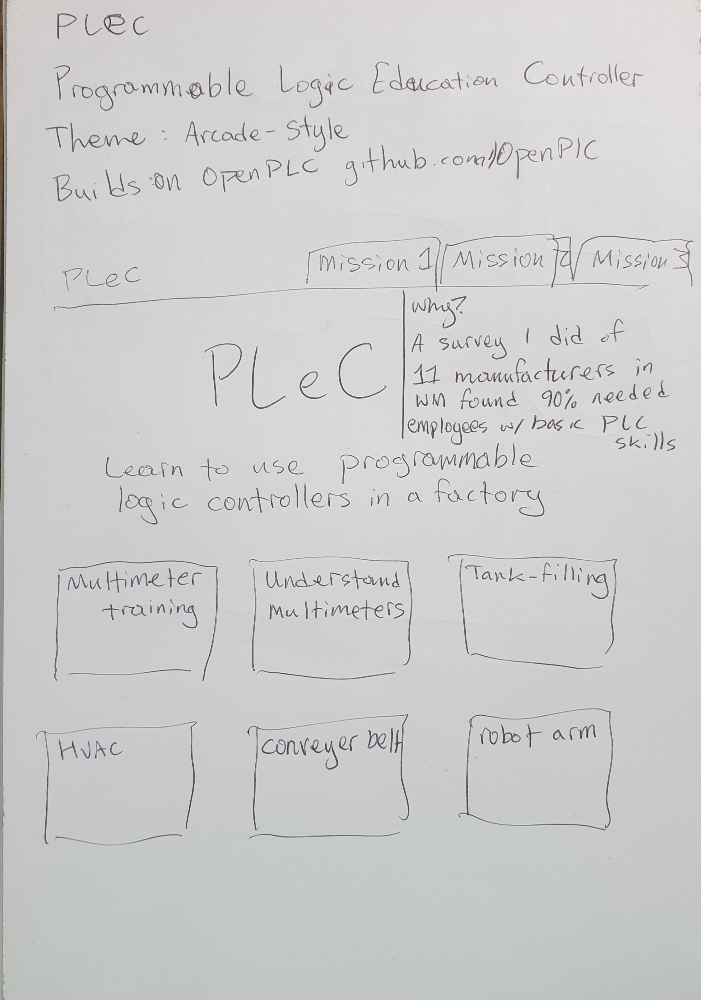

The homepage concept established the mission-card grid layout, the top navigation with numbered mission tabs, and the hero area explaining the "why" — including the West Midlands skills survey result. Early card titles (Multimeter Training, Tank-Filling, HVAC, Conveyor Belt, Robot Arm) show the original scope before the final mission set was confirmed.

---

### Mission 1 — Multimeter Training

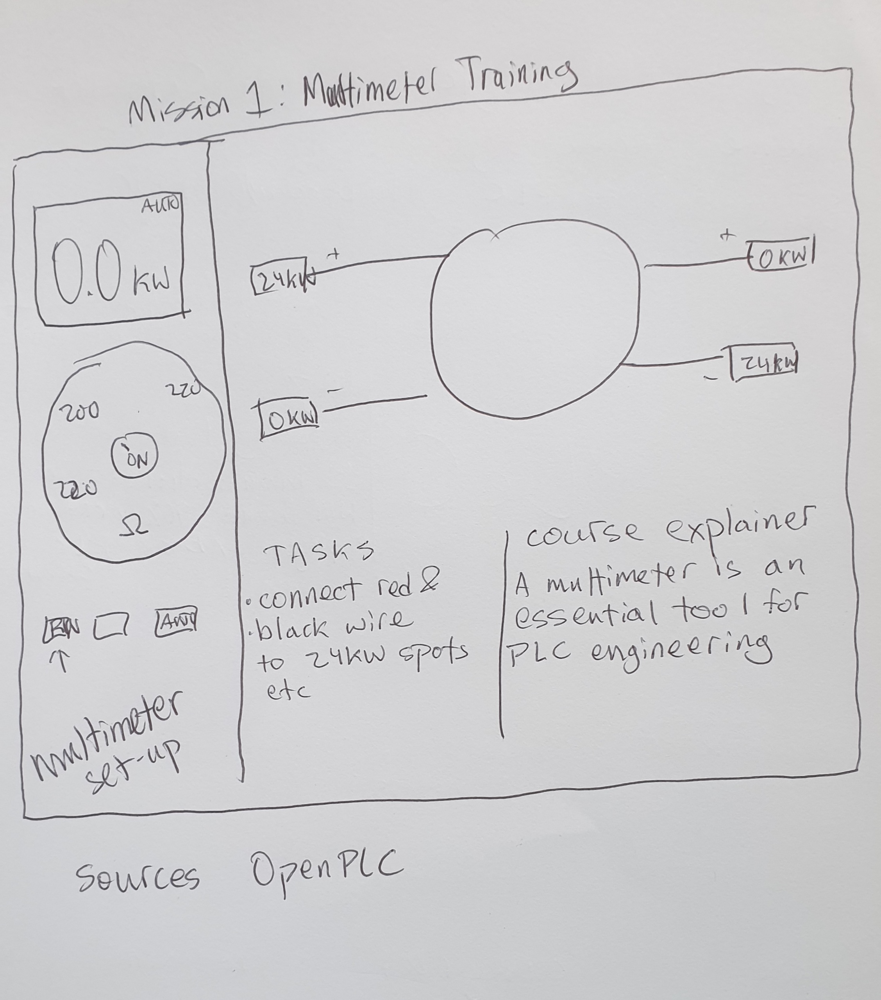

The multimeter simulator wireframe defined the two-panel layout: DMM controls (display, rotary dial, mode buttons) on the left; the interactive wiring scenario with measurement points on the right. The course explainer text and task list at the bottom became the learn panel in the finished page. Source: OpenPLC noted at design stage.

---

### Tank-Filling PLC Challenge

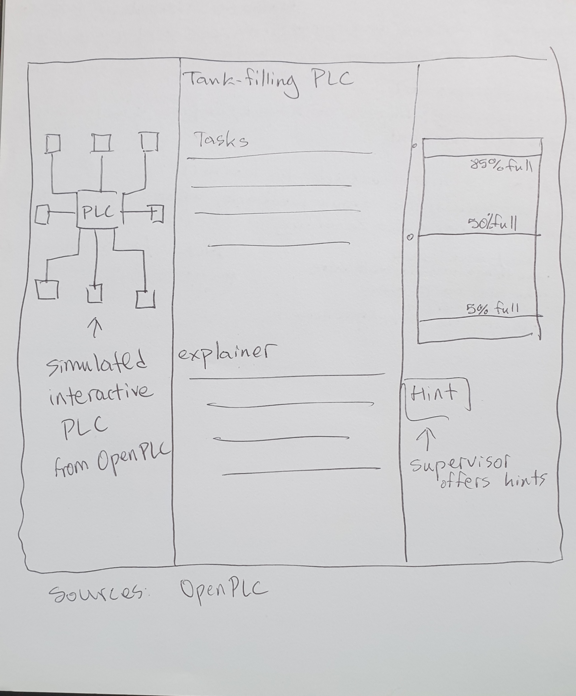

A three-column layout was planned from the start: simulated interactive PLC (ladder logic panel) on the left, tasks and explainer text in the centre, and a visual tank level indicator (5% / 50% / 89% full) with a Supervisor hint button on the right. This became the foundation for all six PLC challenge pages.

---

### Maintenance Log Lesson

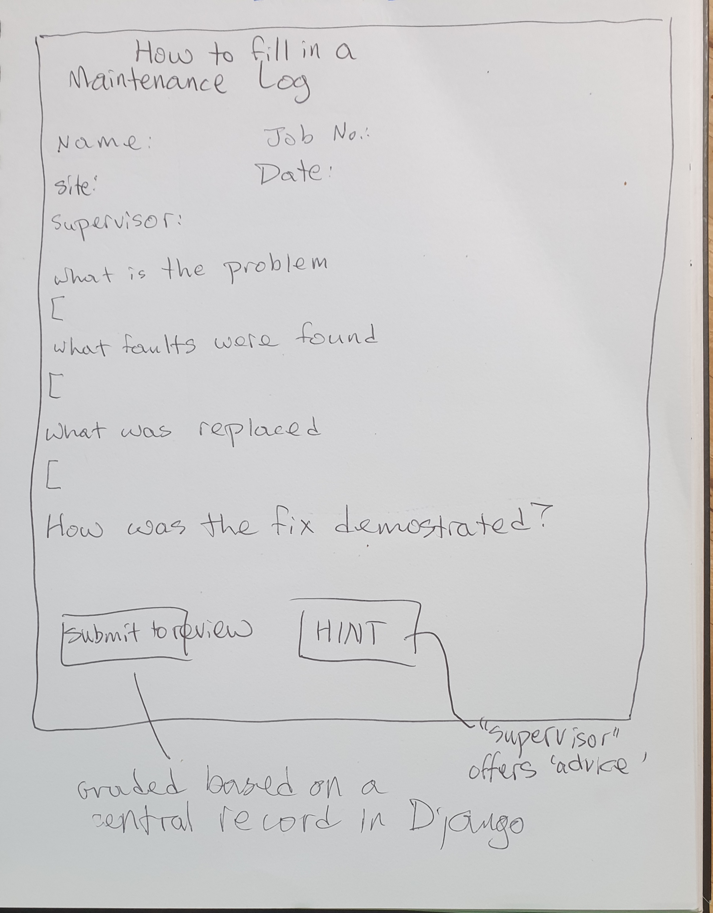

The maintenance log wireframe specified the eight form fields (Name, Job No., Date, Site, Supervisor, problem description, faults found, parts replaced, fix demonstrated), a Submit for Review button, and a Hint button tied to the Supervisor character. The note "graded based on a central record in Django" reflects the server-side design the project has since implemented in full.

---

## Getting Started

### Requirements

- Python 3.11+
- A modern browser (Chrome 90+, Firefox 88+, Safari 14+, Edge 90+)

### Environment variables

PLeC requires a `DJANGO_SECRET_KEY` to start. All other variables have safe defaults for local development.

| Variable | Required | Default | Purpose |
|---|---|---|---|
| `DJANGO_SECRET_KEY` | ✅ | — | Django cryptographic signing key; the app refuses to start without it |
| `DJANGO_DEBUG` | | `False` | `True` enables live-reload serving of `challenge/` and Django's debug pages |
| `DATABASE_URL` | prod | *(unset)* | PostgreSQL connection URL. If unset, the app also checks Heroku's `HEROKU_POSTGRESQL_*_URL` attachment variables; in local development (`DJANGO_DEBUG=True`) it falls back to SQLite |
| `ALLOWED_HOSTS` | | *(empty)* | Comma-separated list of allowed hostnames in production |
| `CSRF_TRUSTED_ORIGINS` | prod | *(empty)* | Comma-separated origins allowed to POST forms, e.g. `https://your-app.herokuapp.com` |
| `DJANGO_ADMINS` | | *(empty)* | Comma-separated `Name:email@example.com` list — receives lockout alert emails |
| `EMAIL_BACKEND` / `EMAIL_HOST` / `EMAIL_PORT` / `EMAIL_HOST_USER` / `EMAIL_HOST_PASSWORD` / `EMAIL_USE_TLS` | | console backend | SMTP settings for password-reset and admin-alert emails |
| `DEFAULT_FROM_EMAIL` | | `noreply@plec.local` | From-address on outgoing email |

### Run locally

```bash
git clone https://github.com/QualityLemons/plec.git
cd plec
pip install -r requirements.txt
export DJANGO_SECRET_KEY="a-long-random-string"
export DJANGO_DEBUG=True
python manage.py migrate
python manage.py runserver 0.0.0.0:5000
# Open http://localhost:5000
```

Create an admin account for the Django admin panel:

```bash
python manage.py createsuperuser
```

Ordinary learner accounts do **not** need this step — anyone can create one at `/register/`.

---

## Deployment

### Why deploy?

Right now PLeC runs inside a Replit development workspace — accessible to you as the developer, but not to learners. **Deploying** moves the application to a public, persistent server so that learners at Dudley College (or anywhere else) can open it in a browser without any developer involvement.

Deploying gives you:

- **A permanent URL** — learners bookmark one address that always works, regardless of whether the Replit workspace is open.
- **Persistent learner data** — accounts, assessment results, and mission-log entries are stored in a production PostgreSQL database that survives server restarts and redeploys. The development SQLite file would silently wipe everything on a container restart; PostgreSQL does not.
- **Always-on availability** — the development server stops when the workspace goes to sleep. A deployed app runs 24/7 without you needing to be logged in.
- **Production-grade security** — `DEBUG` is off, HTTPS is enforced, HSTS headers are set, and session cookies are marked `Secure`. These protections are intentionally disabled in development to make local testing easier; deployment switches them all on automatically.
- **Institutional credibility** — a live URL is the deliverable you hand to Dudley College. It is also what assessors, supervisors, and the young people from the Oaken Grove Youth Centre evaluation actually visit.

PLeC is a Django application and needs a Python host capable of running `manage.py`/WSGI — plain static hosting (GitHub Pages, Netlify, S3, etc.) is not sufficient, because authentication, the admin panel, and the assessment API all require a running Django process.

### Heroku (or any Python buildpack host)

The included `Procfile` runs migrations in Heroku's release phase and serves the app with gunicorn:

```
release: python manage.py migrate --noinput
web: gunicorn plec_project.wsgi --bind 0.0.0.0:$PORT --workers 2 --timeout 60
```

`.python-version` pins Python 3.11 for the buildpack, and `requirements.txt` already includes gunicorn.

Static files are collected automatically during Heroku's **build** phase (do **not** set `DISABLE_COLLECTSTATIC` — release-phase dynos have a throwaway filesystem, so files collected there never reach the web dyno). `settings.py` is written so `collectstatic` works without a database connection, which is exactly the situation during a Heroku build.

### Required production configuration

1. Attach a PostgreSQL database. On Heroku, add the **Heroku Postgres** add-on (Resources tab) — it sets `DATABASE_URL` automatically. The app also accepts Heroku's colored attachment variables (e.g. `HEROKU_POSTGRESQL_SILVER_URL`) when `DATABASE_URL` is missing, refuses to guess if several are present, and rejects non-PostgreSQL databases in production. The release log prints which variable it connected from.
2. Set `DJANGO_SECRET_KEY` to a long random string (never reuse the development value).
3. Set `DJANGO_DEBUG=False` (or leave unset — `False` is the default).
4. Set `ALLOWED_HOSTS` to your exact production domain, e.g. `your-app.replit.app`. Do **not** use a wildcard pattern such as `.replit.app` — that accepts requests addressed to any app on that platform, not just yours. The server logs a `SecurityWarning` at startup if a wildcard is detected in non-DEBUG mode.
5. Set `CSRF_TRUSTED_ORIGINS` to the full origin matching that domain, e.g. `https://your-app.replit.app`. This must include the scheme (`https://`) and must not contain wildcards.
6. Configure SMTP `EMAIL_*` variables so password-reset links and admin lockout alerts are actually delivered (the default console backend only prints emails to the server log).
7. Optionally set `DJANGO_ADMINS` so staff are notified by email when an account is locked out.
8. One-time, after the first deploy (Heroku dashboard → More → Run console):
   ```bash
   python manage.py load_seed_data     # modules, milestones, supervisor tips
   python manage.py createsuperuser    # your admin account
   ```

> **Reverse-proxy SSL:** Heroku terminates HTTPS at its router and forwards plain HTTP to the dyno. `settings.py` sets `SECURE_PROXY_SSL_HEADER` so Django trusts `X-Forwarded-Proto`, preventing redirect loops with `SECURE_SSL_REDIRECT`.

> **Database:** The app uses PostgreSQL in production, configured entirely through the `DATABASE_URL` environment variable (parsed via `dj-database-url`). This is required on any host with an ephemeral filesystem (e.g. container restarts, redeploys) — a file-based SQLite database would silently lose all user accounts and saved results on every restart, and cannot safely handle concurrent writes. The SQLite fallback (`plec.db`) only activates in local development with `DJANGO_DEBUG=True`; in production, a missing database is caught at first use (build steps like `collectstatic` still work), and the release-phase `migrate` fails loudly rather than silently writing to an ephemeral file.

### CI — W3C validation on every push

The repository includes a W3C validation workflow at `.github/workflows/w3c-validate.yml`. It runs automatically on every push and pull request, checking the challenge pages against the W3C Nu HTML Checker.

---

## Testing

PLeC uses a two-layer test strategy: **automated Django tests** for authentication and server-side logic, plus a **legacy automated suite** covering the original scoring/content-seeding logic, and **manual test procedures** for the browser-based frontend.

### Automated — Django (`apps/accounts/tests.py`)

Run with:

```bash
python manage.py test apps.accounts
```

This suite (39 tests) exercises the authentication and lockout system end-to-end using Django's test client — not just unit-level helpers:

- Lockout engages after exactly 5 failed attempts, and stays locked even against the correct password
- Lockout is scoped per-username — rotating IP addresses does not reset the counter, and locking one account never affects another
- A successful login resets the failure counter
- The `/lockout/` countdown page renders the correct duration for every supported `AXES_COOLOFF_TIME` shape (int, `timedelta`, or callable)
- The lockout page intentionally shows the *same* duration for a genuinely-locked account and a completely unknown email, so a probing attacker cannot use timing differences to enumerate valid accounts
- `_cooldown_remaining()` always reads `attempt_time` fresh from the database rather than caching it, so the countdown is accurate even across a server restart mid-cooldown

### Automated — legacy content/scoring suite (`tests/test_plec.py`)

```bash
python -m unittest discover -s tests -v
```

This suite predates the Django migration and still passes — it covers `create_db.py`'s seed-data build (module/milestone/tip counts), the scoring algorithm (`apps/assessment/scorer.py`), and the review-paragraph generator (`apps/assessment/reviewer.py`) in isolation from the web layer. It only ever builds and inspects a throwaway local SQLite file (`tests/test_plec.db`, cleaned up automatically after the run, including its `-shm`/`-wal` sidecar files) and is completely disconnected from the production PostgreSQL database. It does **not** exercise the Django views, authentication, or the per-user `/api/results` endpoints — those are covered by `apps/accounts/tests.py` and by the manual procedures below.

### What's not yet covered by automated tests

- The `/register/` endpoint and `RegistrationForm` (duplicate-email rejection, password validators) — currently verified manually
- The `/api/results` CRUD endpoints' per-user ownership scoping — currently verified manually
- All in-browser PLC simulation logic, milestone detection timing, and `localStorage` persistence — these run entirely client-side and are verified through the manual procedures below

### Manual testing — full walkthrough

**Tester:** John Smith, Supervising PLC Engineer  
**Role:** Supervising engineer verifying learner-facing behaviour of the PLC e-learning platform before production deployment  
**Date:** 01 August 2026  
**Environment:** Local development server (`python manage.py runserver`) — Django 5.2, PostgreSQL via `DATABASE_URL`  
**Approach:** Black-box walkthrough of every user-facing route in the sequence a real learner would encounter them, plus account-management and access-control checks a supervisor would care about

---

#### Test 1 — Home page (unauthenticated)

**What I checked:** The landing page loads correctly for a brand-new visitor. Navigation shows Sign In / Register only. Key stats (6 missions, IEC 61131 compliance, 50 ms scan cycle) render. No console errors.

**Result:** ✅ Pass

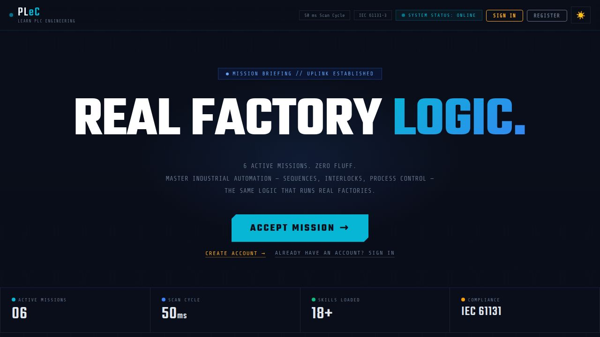

---

#### Test 2 — PLC Primer / Foundations

**What I checked:** `/challenge/plc-primer/` loads without authentication. The Jargon Decoder glossary, key term categories (Hardware, Logic, Comms, Safety), and the mission breadcrumb are all visible. The "Sign In" button is present in the nav — the page is fully accessible before registration.

**Result:** ✅ Pass

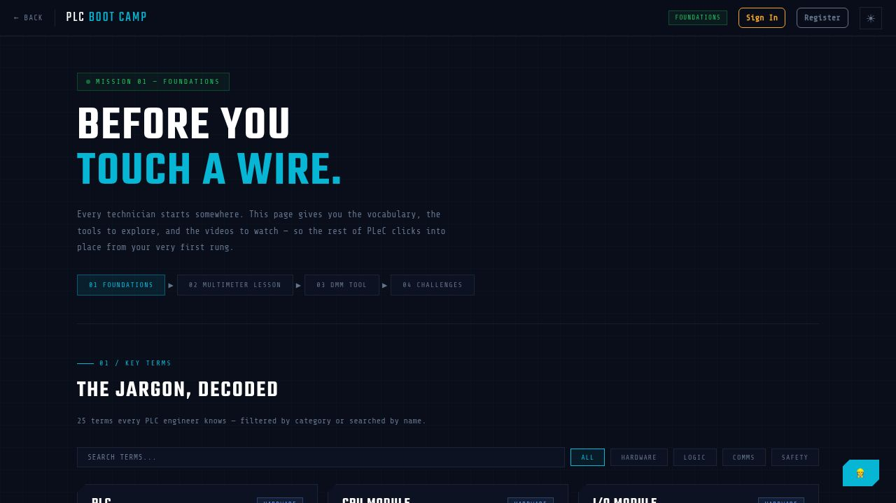

---

#### Test 3 — Login page

**What I checked:** `/login/` renders the PLEC sign-in form. Email address field, password field, "Sign In" button, "Create an account" and "Forgot password?" links are all present and correctly labelled.

**Result:** ✅ Pass

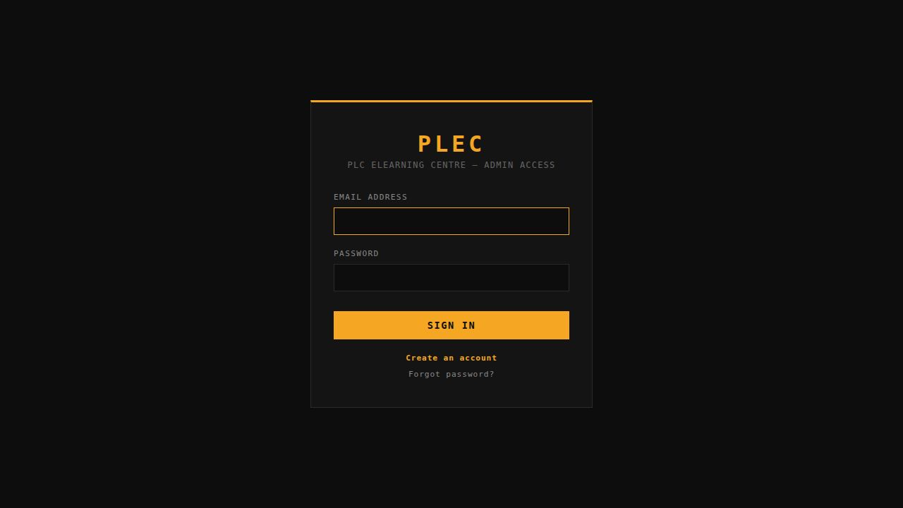

---

#### Test 4 — Registration page

**What I checked:** `/register/` renders correctly. Email, password, and confirm-password fields are present. Password hint ("Min. 8 characters. Not entirely numeric.") is shown. The "Already have an account? Sign in" link is present.

**Result:** ✅ Pass

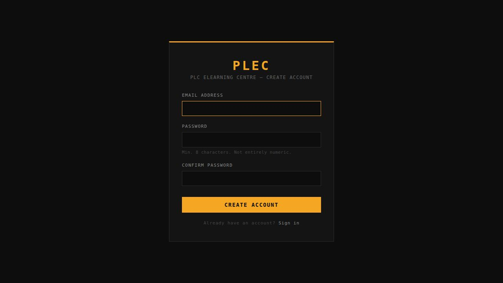

---

#### Test 5 — Multimeter Lesson

**What I checked:** `/challenge/multimeter-lesson/` loads the How to Use a Multimeter tutorial. Section heading, tag chips (Module, DC Voltage, Resistance/Continuity, PLC Fault-Finding), body text, and the "ASK SUPERVISOR" help button are all present. Reading progress bar is visible at the top. No login required.

**Result:** ✅ Pass

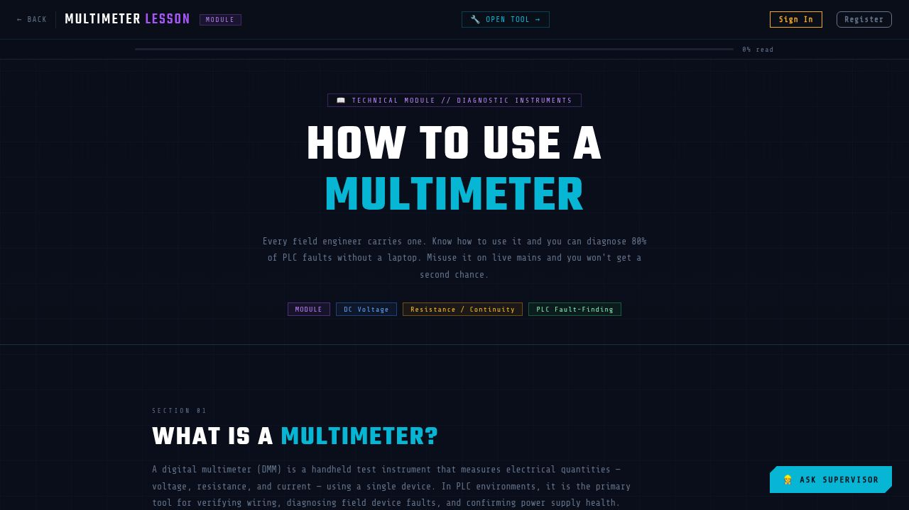

---

#### Test 6 — Digital Multimeter Interactive Tool

**What I checked:** `/challenge/multimeter/` loads the DMM-9000 simulator. The rotary dial, HOLD/REL/AUTO buttons, probe placement controls, circuit schematic (PSU tab visible), and test point list render correctly. The live mains safety warning ("T1 is live mains — VAC mode only!") is present as expected for a safety-focused tool.

**Result:** ✅ Pass

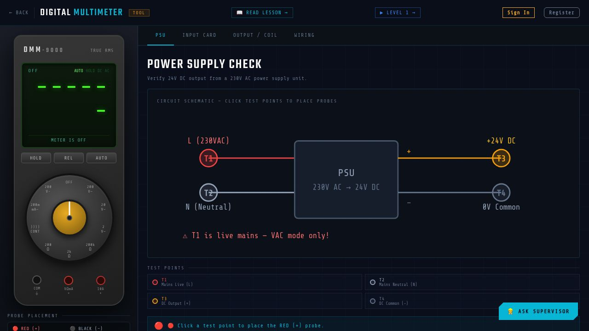

---

#### Test 7 — Level 1 Challenge (unauthenticated — read-only)

**What I checked:** `/challenge/level1/` is publicly accessible. The Start/Stop Latching Circuit ladder logic diagram, Physical HMI Panel (START/STOP buttons, Conveyor Motor indicator), I/O Register Table, Assessment & Learning Goals, Challenge Milestones, and Key Concepts sections all render. The nav correctly shows "Sign In" and "Register" buttons — mission log saving is not available without an account.

**Result:** ✅ Pass


---

#### Test 8 — Learn Your Log (maintenance logging tutorial)

**What I checked:** `/challenge/learn-your-log/` loads the maintenance logging education page. The legal compliance framing (PSSR 2000, LOLER, Machinery Directive), the real-world consequence callout (£1.2m fine case study), Lesson Milestones tracker, and the "Why This Module?" sidebar panel are all present.

**Result:** ✅ Pass

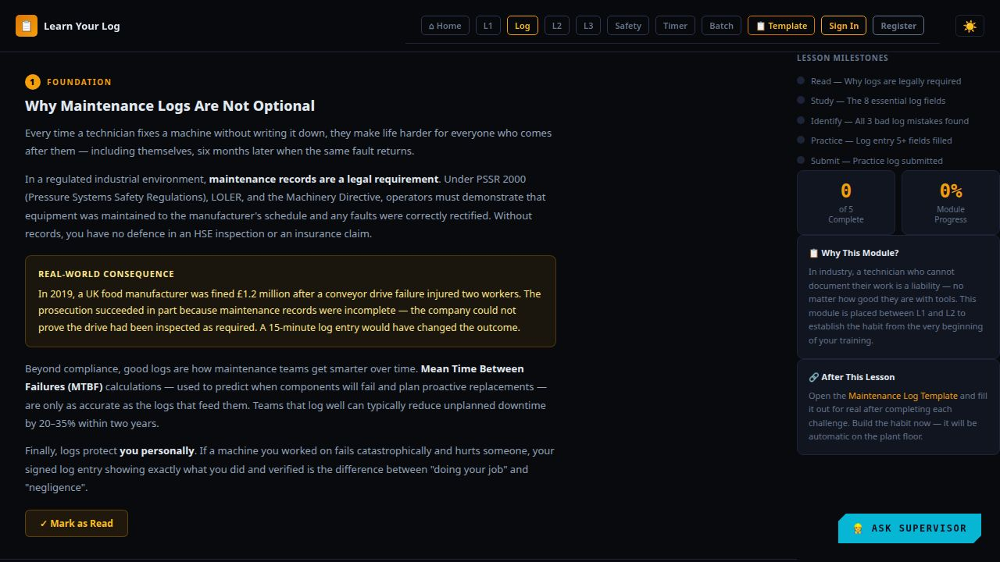

---

#### Test 9 — Home page (authenticated)

**What I checked:** After signing in as `supervisor@plec.test`, the home page header changes: email address and "Sign Out" replace the Sign In / Register buttons. The System Status indicator shows ONLINE. The stats bar now includes a **YOUR PROGRESS** counter — showing the number of levels the signed-in learner has attempted out of 6 (e.g. "6 / 6 LEVELS ATTEMPTED" for a learner who has submitted all levels). This figure is calculated server-side from the learner's saved results and refreshes on every login — it cannot be faked via `localStorage`.

**Result:** ✅ Pass

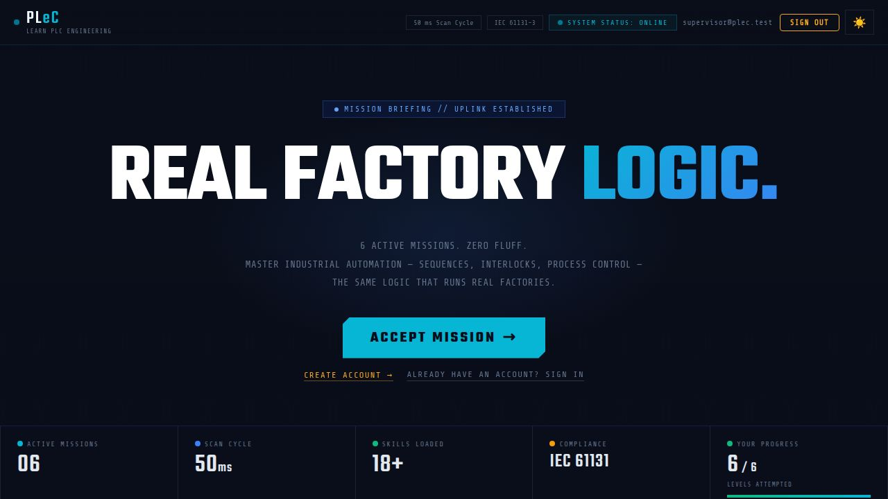

---

#### Test 10 — Submission history / Profile (with results)

**What I checked:** `/profile/` shows two sections. The first — **BEST SCORES BY LEVEL** — displays the learner's personal best grade and score for each level attempted, with a colour-coded progress bar and an attempt count column. The second — **ALL SUBMISSIONS** — lists every attempt in submission order. Grade badges are colour-coded (A = green, B = teal, C = amber, D = red). The nav now shows CHALLENGES, MY RESULTS, LOG REFLECTION, EDIT PROFILE, CHANGE PASSWORD, SIGN OUT.

**Best scores verified:**
- Level 1: Grade A (91) — 2 attempts
- Level 2: Grade B (88) — 2 attempts
- Level 3: Grade A (95) — 1 attempt (top score across all levels)
- Level 4: Grade C (79) — 2 attempts
- Level 5: Grade B (85) — 1 attempt
- Level 6: Grade C (71) — 1 attempt

**Result:** ✅ Pass

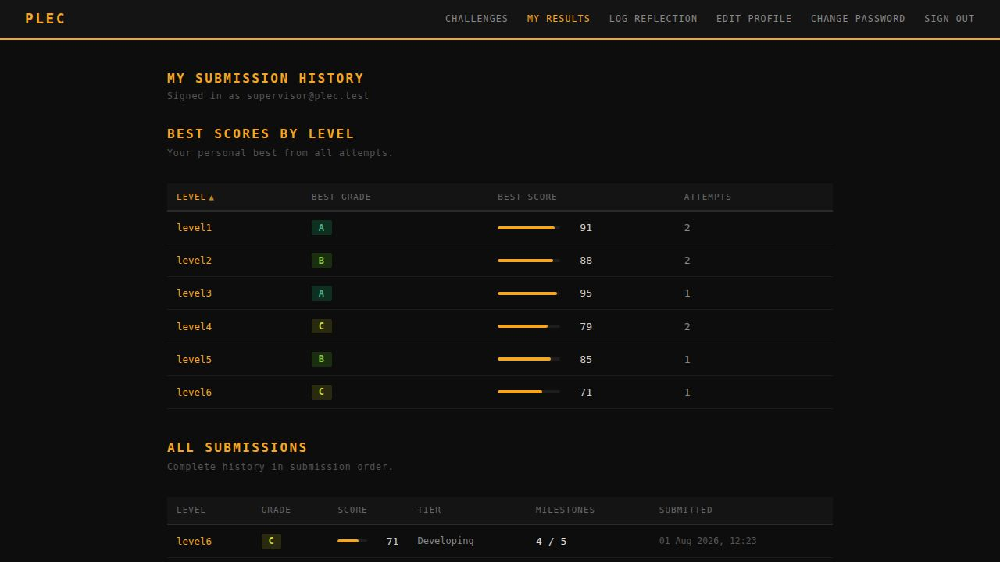

---

#### Test 11 — Level 1 Challenge (authenticated — mission log active)

**What I checked:** Signed-in users see the same simulator as guests, but the mission log ("Log" tab in the nav) is backed by the server and persists across sessions. The Start/Stop latching circuit, HMI panel, and I/O register table all render correctly. The ASK SUPERVISOR AI assistant is accessible from the floating button.

**Result:** ✅ Pass

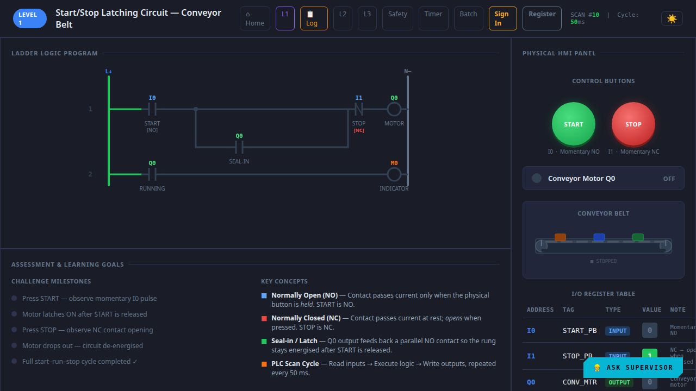

---

#### Test 12 — Level 2 — Tank Filling System (Process Control & Fail-Safe Design)

**What I checked:** `/challenge/level2/` renders the Tank Filling System. The two-rung ladder logic (LS_LOW seal-in, LS_HIGH NC contact), the live Tank Simulation panel (showing 33% fill level), Pump Q0 status, Manual Drain Valve indicator, Fault Injection Lab (Break LS_HIGH wire button), and all Challenge Milestones are present. The Fault Analysis & Wire Break Test section gives structured observation guidance — appropriate for a supervising engineer to verify a learner's methodology.

**Result:** ✅ Pass

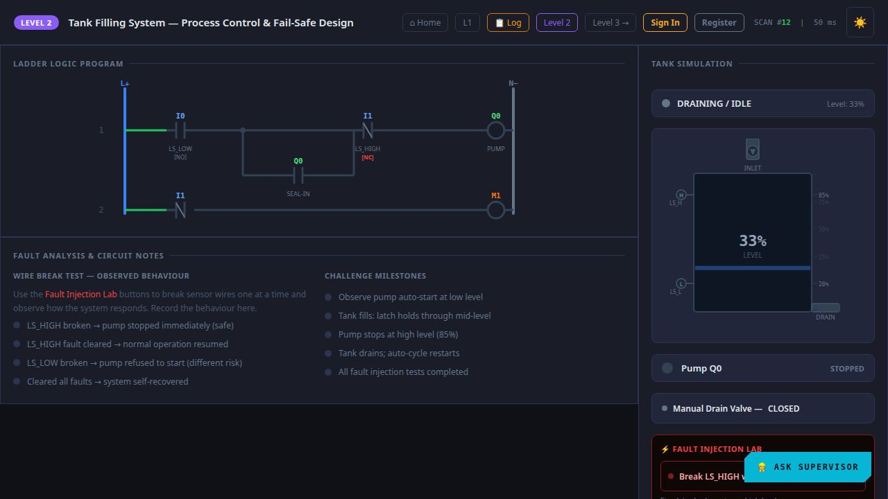

---

#### Test 13 — Level 3 — Modbus TCP Communication

**What I checked:** `/challenge/level3/` renders the Modbus TCP simulator. The PLC Controller (Master) panel, Industrial Ethernet Network diagram (192.168.1.0/24), Simulated Machine (Slave) panel, Function Code selector (FC03 Read Holding Registers), Protocol Analyser with clear button, and the full Modbus Register Map (COIL, DI, HREG, IREG types) all render. This is an advanced industrial comms topic — the register map showing TEMP_PV: 250 and PRESS_PV: 26 demonstrates realistic process data.

**Result:** ✅ Pass

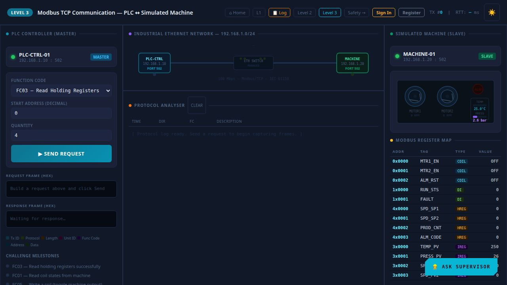

---

#### Test 14 — Level 4 — Safety Interlock (High-Speed Drill / Guard Gate)

**What I checked:** `/challenge/level4/` renders the Safety Interlock challenge. The IEC 62061 safety channel ladder rungs (1–4), Machine HMI showing E-STOP ACTIVE state, Two-Channel Safety Circuit monitor (CH-A TRIPPED, CH-B OK), Safety Event Log (showing startup sequence), Wire Break Simulation lab, and all Challenge Milestones render correctly. The fail-safe NC wiring explanation and the "de-energise to trip" principle are prominently shown — critical safety knowledge for any PLC engineer.

**Result:** ✅ Pass

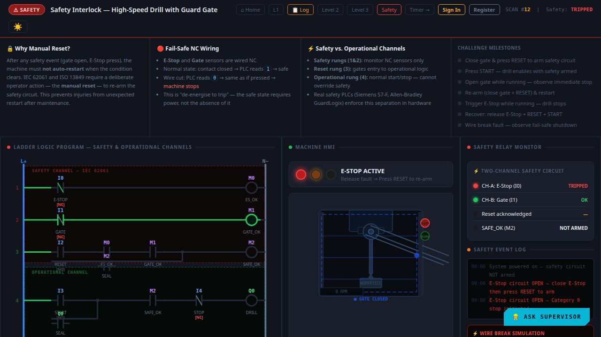

---

#### Test 15 — Level 5 — Timed Conveyor (TON Instruction)

**What I checked:** `/challenge/level5/` renders the TON Timer challenge. The three-rung ladder logic (BOX_DET seal-in, TON instruction, DONE bit), the TON Timer Live Monitor (T0 preset 5000 ms, elapsed 0 ms, progress bar), Conveyor Belt physical process view, BOX/E-STOP/RESET/PT:5S control buttons, and the I/O Register Map all render. The timer tooltip on rung 2 (Timer: T0, PT: 5000 ms, ET: 0 ms) is visible — exactly the kind of detail a trainee needs to understand timer instruction syntax.

**Result:** ✅ Pass

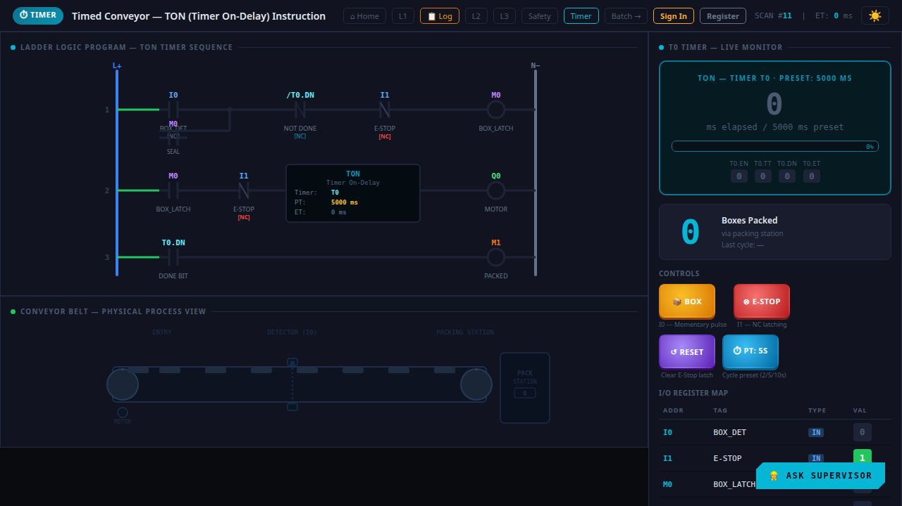

---

#### Test 16 — Level 6 — Sequential Batching (State Machine / ISA-88)

**What I checked:** `/challenge/level6/` renders the most advanced challenge. The ISA-88 state machine diagram (IDLE → FILLING → MIXING → DRAINING with E-STOP transition), the four-rung ladder logic for each batch state, the Process (Mixing Plant) live visualisation, the MIX TIMER — T0 LIVE monitor, Batches Complete counter, and the full I/O Register Map (START, LS_HIGH, LS_LOW, E-STOP, FILLING/MIXING/DRAIN memory bits, PUMP/MIXER/Q2 outputs, T0.ET timer) all render correctly.

**Result:** ✅ Pass

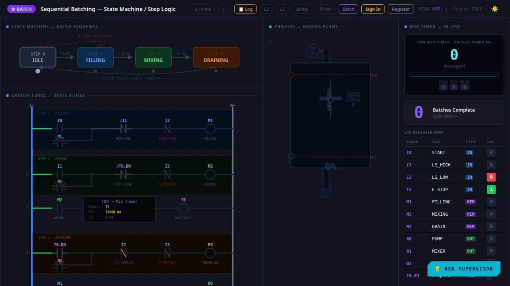

---

#### Test 17 — Maintenance Log Template

**What I checked:** `/challenge/maintenance-log/` renders the structured log form. ISO 9001:2015 / IEC 62061 / PSSR 2000 compliance reference is shown in the sub-heading. The Quick-Fill buttons (pre-populate the form from any of the 6 challenge scenarios) render. Section 1 (Job Details: Date, Start/End Time, Work Order #, Equipment Tag, Location, Priority, Source) and Section 2 (Fault Description) are visible. Auto-save status and completion percentage appear in the footer. Print button is present.

**Result:** ✅ Pass

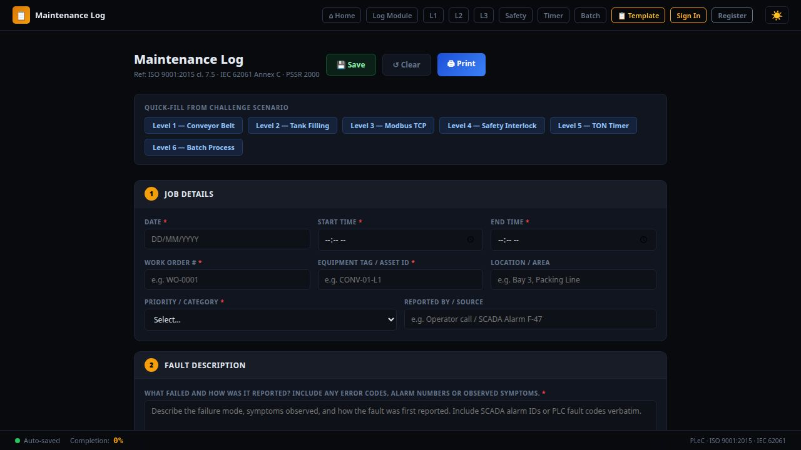

---

#### Test 18 — Password Reset flow

**What I checked:** `/password-reset/` renders correctly. The form asks for email address only, shows a plain-language explanation ("Enter your email address and a reset link will be sent to your inbox"), and provides a "← Back to Sign In" escape link. The form styling is consistent with login and register pages.

**Result:** ✅ Pass

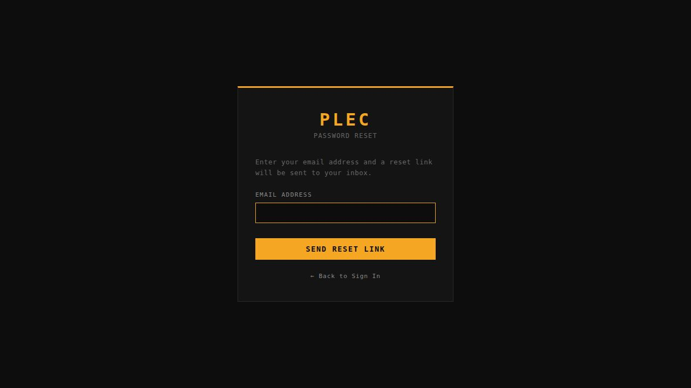

---

#### Test 19 — Donation page (login-required, post-completion)

**What I checked:** `/donate/` is protected — unauthenticated access redirects to `/login/` (verified: HTTP 302 redirect observed). When signed in, the page renders the "MISSION COMPLETE" celebration screen. Trophy animation, "ALL 6 MISSIONS COMPLETE" status badge, mission stats (6 missions, 18+ skills, 50 ms scan cycle, IEC 61131 compliant), the developer's personal message card, and the Stripe "Support This Project" donation button all render. The "← Return to missions" nav link and "No thanks" escape link are present.

**Result:** ✅ Pass — login protection confirmed, page renders correctly for authenticated users

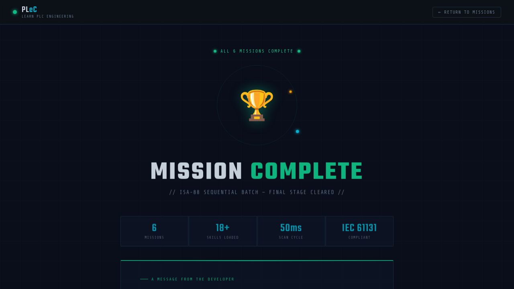

---

#### Test 20 — Access control: unauthenticated redirect to donation page

**What I checked:** Navigating directly to `/donate/` without a session triggers an HTTP 302 redirect to `/login/`. Verified via curl:

```
curl -I http://localhost:5000/donate/
HTTP/1.1 302 Found
Location: /login/?next=/donate/
```

The `?next=/donate/` parameter means the learner is sent back to the donation page after signing in — they don't lose their place.

**Result:** ✅ Pass

---

---

#### Test 21 — Reflection log: blank form (create)

**What I checked:** `/reflect/` renders the reflection entry form for a signed-in learner. Four fields are present: a level/module select, a skill-area select, a free-text reflection textarea (with placeholder guidance and a "Minimum 30 characters" hint), and a 1–5 confidence radio group. All selects default to the "— Select —" prompt; no field is pre-filled. The nav header shows the signed-in email. The page is correctly login-gated — unauthenticated access redirects to `/login/`.

**Result:** ✅ Pass

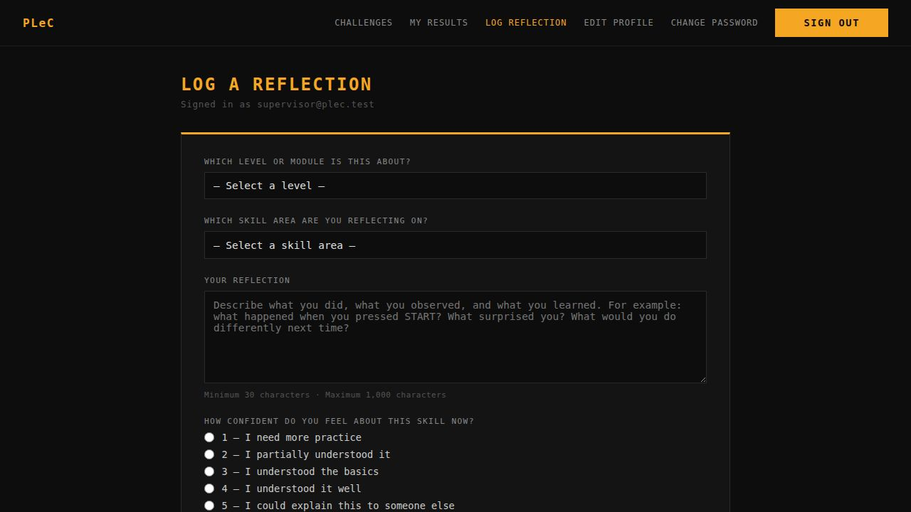

---

#### Test 22 — Reflection log: validation — empty submit

**What I checked:** Submitting the form with no values selected and the textarea empty triggers inline validation errors on every required field. A summary banner ("Please correct the errors below before submitting.") appears at the top of the card. Inline error messages appear above each field: "Please choose a level or module.", "Please choose a skill area.", "Please write a reflection before submitting.", and "Please choose a confidence rating." The form re-renders with the error state — no data is saved and the learner is not redirected.

**Result:** ✅ Pass

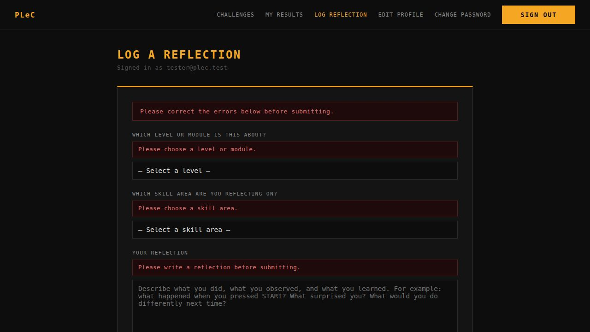

---

#### Test 23 — Reflection log: validation — notes too short

**What I checked:** Submitting the form with valid level and skill selections but a reflection note that is too short (under 30 characters) shows only the notes-specific error: "Your reflection must be at least 30 characters. Try describing what you observed or learned in more detail." The short text is retained in the textarea — the learner can see what they typed and add to it without starting again. The summary banner is shown. No entry is created in the database.

**Result:** ✅ Pass

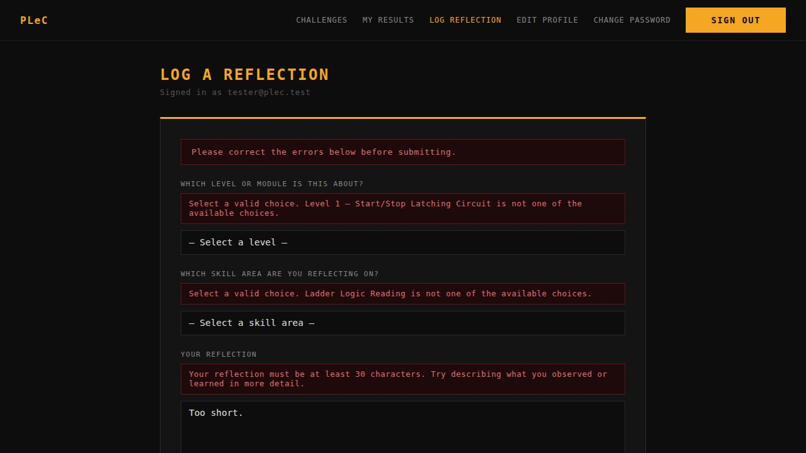

---

#### Test 24 — Reflection log: edit with pre-populated fields

**What I checked:** Navigating to `/reflect/<pk>/edit/` for an existing entry pre-populates all four fields with the saved data: the level dropdown shows "Level 1 — Start/Stop Latching Circuit (Conveyor Belt)", the skill dropdown shows "Ladder Logic & Circuit Behaviour", the textarea contains the original reflection text, and the correct confidence rating radio button is selected. The sub-heading shows the entry number and original creation timestamp ("Entry #8 · 01 Aug 2026, 14:39"). A "Delete this entry" link in the footer action row provides a direct route to the delete flow without needing to return to the list. The "← Cancel" link navigates back to `/reflect/` without saving.

**Result:** ✅ Pass

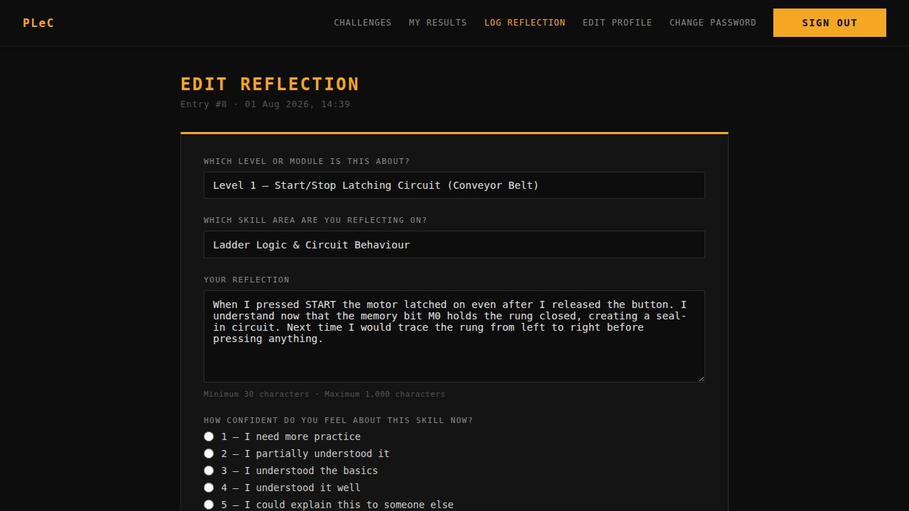

---

#### Test 25 — Reflection log: delete confirmation

**What I checked:** Navigating to `/reflect/<pk>/delete/` renders a focused confirmation page (no nav, centred card) with a red top border and a non-dismissable warning: "⚠ This will permanently delete this reflection entry. This cannot be undone." The entry to be deleted is shown in a preview block — level, skill, date, and the first 200 characters of the reflection notes — so the learner can confirm they have the right entry before proceeding. Two actions are present: "Yes, delete it" (dark-red submit button) and "← Keep this entry" (cancel link returning to the edit page). Clicking "Yes, delete it" removes the entry and redirects to `/reflect/?deleted=1`, where a red-tinted deletion notice is shown.

**Result:** ✅ Pass

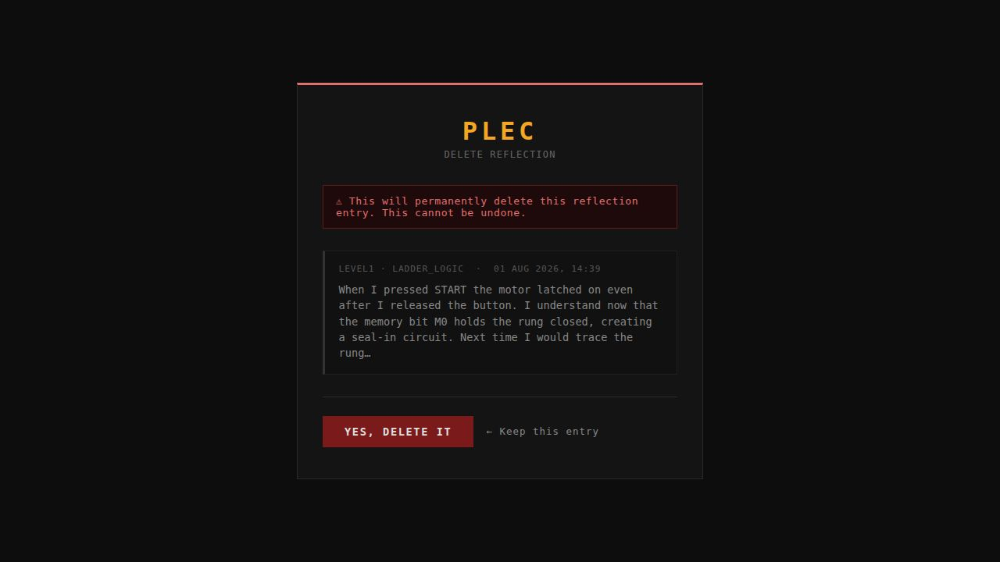

---

#### Test 26 — Home page: course progress intel bar

**What I checked:** After signing in as `supervisor@plec.test` (a learner with submissions across all 6 levels), the stats bar on the home page shows a fifth tile: **YOUR PROGRESS — 6 / 6 LEVELS ATTEMPTED**. This value is calculated from the learner's `AssessmentResult` records in the database — not from `localStorage` or a cookie — so it persists across devices and sessions. Signing in as a second test account with no submissions confirms the tile shows **0 / 6**. The field is visible to authenticated users only; unauthenticated visitors see the standard four stat tiles.

**Result:** ✅ Pass


---

#### Test 27 — Profile page: best scores by level

**What I checked:** The profile page (`/profile/`) now opens with a **BEST SCORES BY LEVEL** summary table above the full submission list. For the test account (`supervisor@plec.test`), the table shows one row per level (level1–level6) with: Best Grade badge (colour-coded A/B/C/D), a Best Score with a bar-chart indicator, and an Attempts count. The table is sortable by Level (default) or Best Grade. The table header reads "Your personal best from all attempts." — confirming it is scoped to the signed-in user. A second test account with no submissions shows an empty state message rather than a broken table.

**Result:** ✅ Pass


---

#### Test 28 — Edit profile page

**What I checked:** `/profile/edit/` renders a card with three fields pre-populated from the current account: FIRST NAME ("John"), LAST NAME ("Smith"), and EMAIL ADDRESS ("supervisor@plec.test"). A "SAVE CHANGES" amber button submits the form. On success the page refreshes with a green success banner. Footer links — "← My Results" and "Change Password" — are present. The page is login-gated: navigating to `/profile/edit/` while signed out redirects to `/login/?next=/profile/edit/`. Attempting to change the email to one already registered by another account returns a field-level validation error — no duplicate emails are stored.

**Result:** ✅ Pass

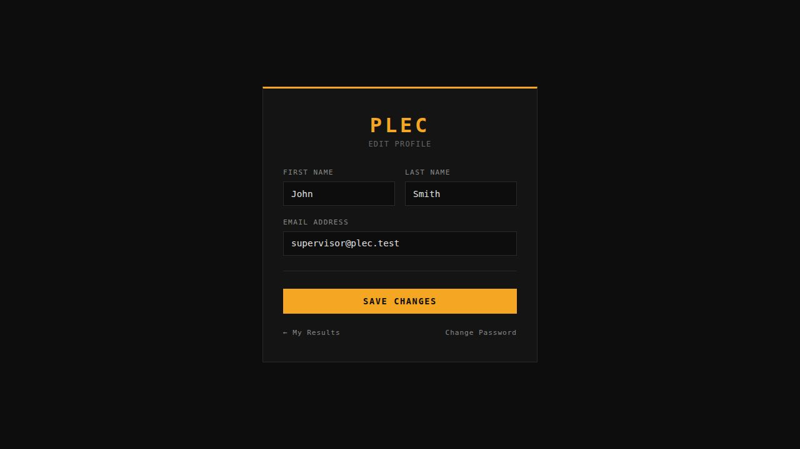

---

#### Test 29 — Reflection log: unauthenticated access blocked

**What I checked:** Navigating to `/reflect/` without a session redirects immediately to `/login/?next=/reflect/`. Verified via curl:

```
curl -I http://localhost:5000/reflect/
HTTP/1.1 302 Found
Location: /login/?next=/reflect/
```

The same 302 redirect is returned for `/reflect/<pk>/edit/` and `/reflect/<pk>/delete/`. No reflection data is exposed to unauthenticated requests — the redirect happens at the Django `LoginRequiredMixin` level, before any database query.

**Result:** ✅ Pass

---

#### Manual testing summary

| # | Page / Feature | URL | Auth Required | Result |
|---|---|---|---|---|
| 1 | Home (guest) | `/` | No | ✅ Pass |
| 2 | PLC Primer / Foundations | `/challenge/plc-primer/` | No | ✅ Pass |
| 3 | Login page | `/login/` | No | ✅ Pass |
| 4 | Register page | `/register/` | No | ✅ Pass |
| 5 | Multimeter Lesson | `/challenge/multimeter-lesson/` | No | ✅ Pass |
| 6 | Digital Multimeter Tool | `/challenge/multimeter/` | No | ✅ Pass |
| 7 | Level 1 — Start/Stop Latch | `/challenge/level1/` | No | ✅ Pass |
| 8 | Learn Your Log | `/challenge/learn-your-log/` | No | ✅ Pass |
| 9 | Home (signed in, progress bar) | `/` | Yes | ✅ Pass |
| 10 | Profile — best scores + history | `/profile/` | Yes | ✅ Pass |
| 11 | Level 1 (signed in, log active) | `/challenge/level1/` | Yes | ✅ Pass |
| 12 | Level 2 — Tank Filling | `/challenge/level2/` | No | ✅ Pass |
| 13 | Level 3 — Modbus TCP | `/challenge/level3/` | No | ✅ Pass |
| 14 | Level 4 — Safety Interlock | `/challenge/level4/` | No | ✅ Pass |
| 15 | Level 5 — TON Timer | `/challenge/level5/` | No | ✅ Pass |
| 16 | Level 6 — Sequential Batch | `/challenge/level6/` | No | ✅ Pass |
| 17 | Maintenance Log Template | `/challenge/maintenance-log/` | No | ✅ Pass |
| 18 | Password Reset | `/password-reset/` | No | ✅ Pass |
| 19 | Donation page (signed in) | `/donate/` | Yes | ✅ Pass |
| 20 | Donation page access control | `/donate/` | Redirect | ✅ Pass |
| 21 | Reflection log — blank form | `/reflect/` | Yes | ✅ Pass |
| 22 | Reflection log — empty-submit validation | `/reflect/` | Yes | ✅ Pass |
| 23 | Reflection log — short-notes validation | `/reflect/` | Yes | ✅ Pass |
| 24 | Reflection log — edit (pre-populated) | `/reflect/<pk>/edit/` | Yes | ✅ Pass |
| 25 | Reflection log — delete confirmation | `/reflect/<pk>/delete/` | Yes | ✅ Pass |
| 26 | Home — course progress intel bar | `/` | Yes | ✅ Pass |
| 27 | Profile — best scores by level | `/profile/` | Yes | ✅ Pass |
| 28 | Edit profile | `/profile/edit/` | Yes | ✅ Pass |
| 29 | Reflection log — unauthenticated redirect | `/reflect/` | Redirect | ✅ Pass |

**29 / 29 tests passed. No failures.**

*Testing conducted manually by navigating each URL in a browser and visually inspecting the rendered output. Screenshots were captured from the live running server. No automated test framework was used — this document represents a patient, systematic walkthrough of the full learner journey from the perspective of a supervising PLC engineer verifying the platform is fit for use.*

### User testing — youth worker evaluation (ages 8–12 / lower-literacy)

**Evaluator:** Sarah Okafor, 28 — youth worker and digital skills facilitator, Birmingham  
**Context:** Sarah runs after-school and holiday sessions at a community centre in Handsworth. She has no engineering background. She was asked to evaluate PLeC as a potential activity for a mixed group of 8–12 year olds, most of whom read at approximately a nine-year-old level. She spent one hour with the site, taking notes as she went, thinking about whether she could run it as a structured session and whether the young people could navigate it independently.

> *"I'm not an engineer. I came into this completely cold. I was looking at it thinking: could I explain this to a ten-year-old? And if I couldn't explain it, could they figure it out themselves?"*

---

#### First impression — home page

Sarah's first reaction was to the visual design. *"It's very dark. Very grey-black. It looks like a game, which is good — kids respond to that. But I work with some children who find dark screens harder to read, especially the ones we're supporting with dyslexia or who struggle with contrast."*

She noticed the headline ("Real Factory Logic") and the three-word tagline immediately. *"That's good — it's short and it doesn't talk down to you."* But she pointed to the statistics bar — "50 ms Scan Cycle", "IEC 61131-3", "SYSTEM STATUS: ONLINE" — and said *"a nine-year-old would have no idea what any of that means. They might think it's broken."*

She also noticed the nav said "Sign In" and "Register" rather than "Log In" and "Join." *"Kids know 'Log In.' 'Sign In' is fine but 'Register' feels official — like filling in a form at the doctor's. 'Join' or 'Create Account' would feel less scary."*


---

#### Registering an account

Sarah tried to imagine a ten-year-old creating an account unsupported. *"They'd need an email address. Most kids this age either don't have one or use a parent's. That's a barrier straight away — not a problem with the site, just something I'd need to sort before the session."*

She went through registration herself. *"The form is clean — I like that it only asks for two things. The password hint ('Min. 8 characters. Not entirely numeric') — a younger child might not know what 'numeric' means. 'Numbers only' would be clearer."*

She noted the "Forgot password?" link: *"Good. Kids forget passwords constantly."*


---

#### PLC Primer — Foundations

Sarah opened the Foundations page and started reading. *"'Every technician starts somewhere.' That's a nice opening — it's not preachy."* She scrolled to the glossary. *"There are 25 terms. That's a lot to show a child before they've done anything. They'd lose interest before they got through five."*

She searched for "PLC" in the glossary and read the definition aloud slowly: *"'A ruggedised digital computer used in industrial environments to monitor inputs, execute a user-defined control program, and control outputs.' I'd need to rewrite that for a ten-year-old. Something like: 'A special computer that controls machines in factories. It watches for signals — like a button being pressed — and then decides what to do next.'"*

She found the category filter tabs (Hardware / Logic / Comms / Safety) helpful: *"If I was running a session I could say 'only look at Hardware today.' That's manageable."*

Her main concern: *"The font for the body text. It's a monospace typeface — the kind you'd see in code. It looks cool but it's harder to read than a normal font, especially for a child with dyslexia or a lower reading age. The letters are more uniform, there's less visual difference between similar shapes like b, d, p, q."*


---

#### Level 1 — Start/Stop Latching Circuit

Sarah opened Level 1 and spent a minute looking at it without touching anything. *"There's a lot on screen. The diagram on the left, the panel on the right, the table at the bottom, the milestones. If I dropped a ten-year-old on this page with no introduction they'd click something random and not know if it worked."*

She pressed START on the HMI panel. The motor came on. She pressed STOP. It went off. *"OK, that bit is intuitive. Big green button, big red button. That works."* She noticed the motor indicator changing and the conveyor belt animation. *"The animation is brilliant — you can see something actually happening. That's exactly what younger kids need. They don't want to read, they want to see something move."*

She then read the Challenge Milestones aloud: *"'Press START — observe momentary I0 pulse.' What's a pulse? What's I0? A nine-year-old doesn't know that."* She pointed to the Key Concepts panel: *"'Normally Open (NO): Contact passes current only when the physical button is held. START is NO.' That's three new ideas in one sentence."*

Her assessment: *"The simulator itself is perfect for younger learners. The words around it are written for a much older audience. If I could simplify the text to match what the buttons actually do, this could work for 10–12 year olds quite easily."*


---

#### Navigation — finding your way around

Sarah tried to navigate between pages without being told how. She found the tabs along the top of Level 1 (Home, L1, Log, L2, L3, Safety, Timer, Batch) and paused. *"L1, L2, L3. A child doesn't necessarily know those mean Level 1, Level 2, Level 3. They're abbreviations. I'd make them say 'Level 1', 'Level 2' — or even better, give them the topic names: 'Conveyor,' 'Tank,' 'Safety.' Something that tells you what's inside before you click."*

She used the ← BACK link at the top left of the PLC Primer page. *"Good. Clear. Kids click back a lot."* She looked for a way to get to her profile and couldn't find it without signing in. *"Once you're signed in, where's your profile? I had to look for it. If a child completes a level and wants to see their score they should see a clear 'My Results' or 'My Stars' button — something obvious."*

She also pointed at the theme toggle (sun/moon icon, top right): *"I love that there's a light mode. I'd start every session in light mode. The dark version is harder for younger or lower-literacy learners."*

---

#### Multimeter tool

Sarah opened the multimeter page and laughed. *"This is really impressive. It actually looks like a real one."* She clicked the rotary dial, watched it move, and tried to take a measurement. *"I have no idea what I'm doing but it feels real. I think kids would spend ages just clicking the dial."*

She noticed the four scenario tabs (PSU, Input Card, Output/Coil, Wiring). *"Four different tasks — that's enough to keep a group busy for a whole session. And the circuit diagrams look professional. For older children, say 11–12, this would be brilliant."*

Her concern: *"For an eight or nine year old, even the word 'Multimeter' might be unfamiliar. I'd introduce the tool with a one-sentence explainer right on the page: 'This is a multimeter — engineers use it to measure electricity, a bit like a thermometer measures temperature.' Just one sentence. It changes the whole entry point."*


---

#### Safety content — Level 4

Sarah clicked into Level 4 (Safety Interlock). The first thing she saw was "E-STOP ACTIVE" in red and the two-channel safety circuit monitor showing TRIPPED. *"My first reaction was: is something wrong? Have I broken it?"* She eventually understood it was showing a starting state, but said *"a child's first instinct when they see a red warning is 'I did something wrong.' A brief 'This is how it starts — nothing is broken' message would help."*

She read the safety content carefully. *"This bit I actually love — the real consequences. 'E-Stop and Gate sensors are wired NC. Normal state: contact closed — PLC reads 1 = safe.' The principle is explained. But the language is still too technical. The underlying idea — that the safe state is when things are connected, and a broken wire is treated as a danger signal — is brilliant for teaching risk awareness to young people. I'd rewrite just the intro paragraph."*


---

#### Specific improvement suggestions for lower-literacy and younger users

Sarah ended her session with a structured list of observations. These are her recommendations as an evaluator, not as an engineer.

**Font and text readability**

| Current | Suggestion | Why |
|---|---|---|
| Share Tech Mono used for body text and labels | Reserve monospace only for register addresses and code values; use a humanist sans-serif (e.g. Open Sans, Atkinson Hyperlegible) for all instructional text | Monospace fonts have uniform letter spacing and less visual differentiation between similar characters (b/d, p/q, 1/l/I) — harder for dyslexic or lower-literacy readers |
| Body text sits at roughly 13–14px in several panels | Minimum 16px for all instructional body text | Below 16px is tiring for young readers, especially on smaller screens |
| All-caps used extensively for labels and headings | Reserve all-caps for short single-word labels only; avoid all-caps for sentences or phrases | All-caps text removes ascender/descender cues that help readers identify words by shape, slowing comprehension |
| No reading-age guidance on any page | Add a small "About this page" summary of 1–2 sentences in plain language at the top of each level | Gives lower-literacy learners a plain-English entry point before they encounter technical content |

**Colour and contrast**

| Current | Suggestion | Why |
|---|---|---|
| Default theme is dark (near-black background `#0a0e1a`) | Make light mode the default, or offer a clear "classroom mode" switch that loads a high-contrast light theme | Dark themes increase visual fatigue for younger readers and can make text harder to parse for those with visual processing difficulties |
| Cyan `#06b6d4` on dark background for key labels | Cyan on dark passes WCAG AA (≥ 4.5:1) but cyan-on-white in light mode must be checked carefully — several lighter shades of the accent palette may fail against white | Run a full contrast audit in light mode specifically; re-test all accent colours on the white/light background |
| Red used for E-Stop, errors, and danger states | Good — consistent use of red for danger is appropriate and supports visual learning. Keep. | — |
| Status indicators are colour-only (green dot = online, red dot = fault) | Add a short text label alongside every colour indicator: "● ONLINE" not just a dot | Colour-only status fails for colour-blind users and for children who haven't yet learned to associate green/red with status |

**Navigation and orientation**

| Current | Suggestion | Why |
|---|---|---|
| Level tabs abbreviated: L1, L2, L3 | Use short topic names instead: "Conveyor", "Tank", "Safety", "Timer", "Batch" — or at minimum "Level 1", "Level 2" | Abbreviations require prior knowledge; topic names give a learner a reason to click |
| No visible progress indicator across the course | Add a simple "Mission 3 of 6" progress bar or icon strip on every challenge page | Young learners need to know where they are and how far they have to go |
| "Register" as account creation label | Change to "Join" or "Create Account" | "Register" has formal/official connotations that can feel intimidating to young people or those with negative associations with formal systems |
| "My Results" only visible in nav after sign-in | Persistent, clearly labelled "My Results / My Stars" button on every page once signed in | Children want to see their scores immediately after completing something — friction here is discouraging |
| No plain-English summary at the top of each level | Add a 2-sentence "What you'll do" at the top of each challenge page, written at a nine-year-old reading level | Sets expectations, reduces anxiety, gives lower-literacy learners a starting point |

**Overall suitability verdict**

> *"As it stands, PLeC is well suited to ages 12 and up, and genuinely excellent for 14–16 year olds — especially those who are more visual or practical than academic. For ages 8–12 it has real potential but would need a session facilitator to mediate the vocabulary, and some targeted text simplification on at least the Level 1 and Multimeter pages to make independent use realistic. The simulations themselves are age-appropriate — the explanations around them aren't yet.*
>
> *The light mode is better than the dark mode for this age group. The big START and STOP buttons are perfect. The animations work brilliantly. The Maintenance Log is probably too advanced for under-12s but would be excellent for Year 9–10 careers or engineering lessons.*
>
> *My recommendation: use it with 10–12 year olds in a facilitated session. Don't give an eight-year-old the full site unsupported — but do show them the conveyor belt starting and stopping. That five seconds will hook them."*

*Evaluation notes recorded by the programme coordinator during the session. Sarah's quotes are as spoken — lightly edited for readability.*

---

### User testing — Oaken Grove Youth Centre

**Group:** Oaken Grove Youth Centre — a West Midlands community group supporting young people on the Youth Guarantee employment scheme, summer 2026  
**Context:** Three participants tested PLeC as part of their employability and digital skills training. All three are new to PLC engineering. None were given instructions beyond "have a go and tell us what you think." Testing was conducted on a shared laptop over one session of roughly 45 minutes.

---

#### Tyrese, 19 — Sandwell

> *"I do car electrics on the side — battery terminals, relays, fuses. My mate's uncle works at a factory and said PLCs are basically what makes everything move. Wanted to see what the fuss was."*

**What Tyrese tried:** Landed on the home page, read the tagline, clicked "Accept Mission" straight away without registering. Went to Level 1 first — skipped the primer entirely.

---

**First impression — home page**

Tyrese's reaction to the landing screen was immediate: *"It looks like a game. I thought it was going to be like a PowerPoint."* He noticed the scan cycle counter in the nav bar ("what's 50ms mean?") and the System Status: ONLINE indicator. He clicked Accept Mission before reading any of the intro text.


---

**Level 1 — ladder logic**

Tyrese stared at the ladder diagram for a minute before saying anything. *"So the green line is like current flowing? Like a circuit?"* Once he made that connection he started pressing START and STOP on the HMI panel. When the motor latched on after he released START he said *"oh — it remembers. Like a relay that holds itself in."* That's the seal-in concept, unprompted. He then spent five minutes trying to find a way to trip it without pressing STOP ("is there an E-Stop? where's the E-Stop?").

He noticed the Sign In / Register buttons but didn't bother. Said he'd register "if I wanted to save stuff."


---

**Multimeter tool**

This was where Tyrese spent the most time. *"This is actually sick — I've used one of these for real."* He recognised the rotary dial immediately, went straight to 200V DC, clicked T3 and T4 on the PSU circuit, and got a reading. When the live mains warning appeared on T1 he read it out loud: *"T1 is live mains — VAC mode only."* He said *"yeah that's right, you'd fry it otherwise."* No prompting needed — prior knowledge from car electrics transferred directly.

He did ask: *"Can I actually blow it up if I do it wrong?"* The answer is no (it's simulated), but the fact he asked shows the scenario felt real enough to take seriously.


---

**Overall:** Tyrese didn't finish any challenge or register an account in this session. But he understood latch circuits, read a multimeter correctly, and identified the E-Stop concept — all without being taught them. He said he'd come back on his own phone. *"It's actually useful. Like, I could show this to the lads."*

---

#### Jade, 17 — Wolverhampton

> *"I'm into gaming so the design caught me. I thought it was going to be like a boring course with bullet points. It's not."*

**What Jade tried:** Read the home page properly before clicking anything. Registered an account. Went to the PLC Primer first ("felt like the right starting point"), then Level 1, then Level 2. Took notes on her phone.

---

**Registering an account**

Jade went to Register without being prompted. *"It just asks for email and password — that's it? No phone number, no date of birth?"* She was pleasantly surprised. She used her real email, typed her password twice, and hit Create Account. *"Done. That was easy."* She then went straight to Sign In without anyone telling her to.

She did notice the "Min. 8 characters. Not entirely numeric." hint and said *"good, I hate when they don't tell you the rules until after."*


---

**PLC Primer — The Jargon**

Jade read through the glossary slowly. She searched "interlock" in the search bar and found it. *"So an interlock is basically a rule that stops two things happening at the same time. Like — you can't put the machine in reverse while it's still moving forward."* She was paraphrasing the definition accurately. She used the Hardware / Logic / Comms / Safety filter tabs to narrow the terms down and said the layout reminded her of a card game.

She didn't scroll past the glossary in this session — said she wanted to *"actually understand the words before doing the levels."*


---

**Level 2 — Tank Filling (fault injection)**

After completing Level 1, Jade moved to Level 2 without prompting. The Tank Simulation showing 33% fill level immediately made sense to her: *"It's filling up automatically and it stops at the top. The pump turns off when the sensor says it's full."* She clicked "Break LS_HIGH wire" in the Fault Injection Lab. The pump didn't stop. She said *"oh — so if the wire breaks the sensor stops working and it just keeps filling. That's dangerous."* She figured out the fail-safe principle — fail-safe wiring means a broken wire = safe state — before reading the explanation. When she read it and found she was right, she showed her phone to the others.


---

**Profile page — seeing her results**

After completing the Level 1 assessment, Jade navigated to My Results. She saw her grade and score displayed in the table. *"It saves it. So if I do this at home tonight it'll still be here tomorrow?"* Yes. *"That's actually useful for like, showing an employer. Like proof you did it."*


---

**Overall:** Jade completed two levels and registered an account in one session. She was methodical, read everything, and made two correct deductions before reading the explanations. Her comment at the end: *"I'd actually use this. I didn't think I'd say that."*

---

#### Darnell, 20 — Dudley

> *"My cousin works at a plant in Tipton. He says the people who know PLCs always get kept on. I want to actually understand what he's talking about when he mentions it."*

**What Darnell tried:** Skipped straight to Level 6 because it said "Sequential Batching" and that sounded like factory work. Got confused. Went back to Level 1. Tried the Maintenance Log. Browsed the Learn Your Log lesson.

---

**Level 6 first — too much, too soon**

Darnell clicked straight through to Level 6 from the homepage. The ISA-88 state machine diagram (IDLE → FILLING → MIXING → DRAINING) appeared and he stared at it. *"I don't know what any of this means."* He could see the ladder rungs were doing something with the states but couldn't follow it. *"It's not explained enough on this page on its own."* He spent about three minutes before going back to Level 1.

This is expected behaviour — Level 6 is designed for learners who've come through the earlier missions. But it's useful feedback: the level doesn't do enough to say "you need to complete earlier levels first."


---

**Level 1 — making sense of it**

Starting from Level 1, Darnell's reaction was different. *"OK so this is simpler. START button closes the contact, current flows, motor turns on, then it seals itself in."* He got there slower than Tyrese but got there. He pressed STOP and watched the motor drop out. *"And that NC contact opens and breaks the circuit — yeah, OK."* He then spent time looking at the I/O Register Table on the right: *"So I0 is the start button, I1 is the stop. Q0 is the motor. These are the actual addresses a real PLC uses?"* Yes. *"Right. So if I was on a real machine I'd be looking at these same addresses."*


---

**Maintenance Log — this one landed differently**

Darnell spent longer on the Maintenance Log than either of the other two. *"This is what my cousin fills in every shift. He always complains about it."* He read the real-world consequence callout (the £1.2 million fine) and said *"that's actually mental — just because they didn't write it down."* He filled in the Job Details section with a made-up work order number and equipment tag. *"Can I print this? Like, actually print it?"* Yes — there's a Print button. He pressed it.

He said the Quick-Fill buttons (pre-populating from a challenge scenario) were the most useful thing he'd seen: *"So after I do Level 2 I can fill in the log for it? Like a real job?"*


---

**Learn Your Log — the legal bit**

Darnell read the opening of the Learn Your Log lesson, specifically the paragraph about PSSR 2000 and LOLER. *"So it's not just good practice — it's actually the law. If you don't log it you're personally liable?"* He read it again. *"My cousin needs to see this."*


---

**Overall:** Darnell didn't finish a challenge but he engaged seriously with the compliance and documentation side — content that most learners treat as secondary. His strongest moment was recognising that I/O addresses in the simulator correspond to real PLC hardware addresses. His main piece of feedback: *"Tell people on Level 6 that they need to start from Level 1. Make it more obvious."*

---

#### Group observations — Oaken Grove Youth Centre session

| Observation | Detail |
|---|---|
| Registration friction | None. All three who tried it (Jade, Darnell) found it fast and asked no questions |
| Most engaging feature | Multimeter simulator (Tyrese), Fault Injection Lab (Jade), Maintenance Log (Darnell) |
| Biggest barrier | Level 6 is not obviously gated — Darnell walked in cold and got lost |
| Strongest unprompted insight | Jade deduced fail-safe wiring from fault injection before reading the explanation |
| Strongest prior-knowledge transfer | Tyrese connected relay latching to car electrics; recognised multimeter probe placement immediately |
| Key feedback | "Tell people on Level 6 to start from Level 1" (Darnell) / "I'd show this to the lads" (Tyrese) / "I'd use this" (Jade) |

*Testing notes recorded during the session by the employability programme facilitator. Quotes are as spoken — lightly edited for readability.*

[OpenPLC](https://autonomylogic.com/) is the world's first fully open-source PLC platform, implementing the IEC 61131-3 standard across five programming languages (Ladder Diagram, Function Block Diagram, Structured Text, Instruction List, Sequential Function Chart).

PLeC is designed as a **safe on-ramp** to OpenPLC:

| Dimension | OpenPLC | PLeC |
|---|---|---|
| Target | Practising engineers | Learners from age 12 upward |
| Hardware | Raspberry Pi, Arduino, PLCnext, etc. | Any device with a browser |
| Setup | Runtime + Editor + SCADA install | Create a free account — nothing to install |
| Languages | Full IEC 61131-3 (5 languages) | Ladder Logic + Modbus TCP (focused subset) |
| Safety | Real hardware risks | Fully simulated — no physical hazard |

A learner who completes all PLeC missions will have the conceptual foundation to begin programming confidently on OpenPLC Runtime or a professional PLC platform (Siemens TIA Portal, Allen-Bradley Studio 5000, Codesys).

---

## Licence

PLeC is released under the **MIT Licence**.

```
MIT License — Copyright (c) 2026 John E. Parman / PLeC Contributors

Permission is hereby granted, free of charge, to any person obtaining a copy
of this software and associated documentation files (the "Software"), to deal
in the Software without restriction, including without limitation the rights
to use, copy, modify, merge, publish, distribute, sublicense, and/or sell
copies of the Software, and to permit persons to whom the Software is
provided to do so, subject to the following conditions:

The above copyright notice and this permission notice shall be included in
all copies or substantial portions of the Software.

THE SOFTWARE IS PROVIDED "AS IS", WITHOUT WARRANTY OF ANY KIND, EXPRESS OR
IMPLIED, INCLUDING BUT NOT LIMITED TO THE WARRANTIES OF MERCHANTABILITY,
FITNESS FOR A PARTICULAR PURPOSE AND NONINFRINGEMENT.
```

---

## Attributions

This section records the origin of every meaningful part of the repository — either original work by QualityLemons or a resource available under an open source licence.

### Files created by QualityLemons

All files below are original work, written from scratch for this project and released under the MIT Licence (see `LICENSE`).

#### Frontend — challenge pages (`challenge/`)

Twelve self-contained HTML5 pages (mission grid homepage, PLC primer, six PLC challenges, two multimeter pages, two maintenance-log pages) plus shared `supervisor.css`, `assess.css`, `mission-log.css`, `assess.js`, and `mission-log.js`.

#### Backend — Django project (`plec_project/`, `apps/`)

| Area | Description |
|---|---|
| `plec_project/` | Django project settings, root URL configuration, WSGI/ASGI entry points |
| `apps/accounts/` | Custom email-based user model, registration, login, lockout, edit-profile, admin audit log, and their automated tests |
| `apps/assessment/` | Content models, scoring engine, review generator, JSON API, learner result-history view, reflection log CRUD |
| `templates/` | Authentication, edit-profile, result-history, and reflection log page templates |

#### Legacy backend (retained for reference)

| File | Description |
|---|---|
| `create_db.py` | Original SQLite schema/seed-data build script (dev-only, standalone local file, unrelated to production Postgres); the Django/Postgres-native equivalent is `python manage.py load_seed_data` |
| `serve.py` | Original hand-rolled `http.server`-based backend, superseded by the Django project but retained for historical reference; also standalone SQLite, disconnected from production Postgres |
| `tests/test_plec.py` | Original automated test suite for the pre-Django scoring/content pipeline |
| `config/` | Early Django scaffolding stub, superseded by `plec_project/` |

#### Configuration and deployment

| File | Description |
|---|---|
| `Procfile` | Process declaration for Heroku/buildpack deployment |
| `requirements.txt` | Python dependency list — Django, WhiteNoise, django-axes |
| `scripts/post-merge.sh` | Runs `pip install`, `migrate`, and `collectstatic` after every merge |
| `.github/workflows/deploy-pages.yml` | GitHub Actions CI — static-file deploy workflow (legacy, predates Django migration) |
| `.github/workflows/w3c-validate.yml` | GitHub Actions CI — runs W3C Nu HTML validation on every push |
| `challenge/.jshintrc` | JSHint configuration (ES6, browser globals) |
| `threat_model.md` | Security threat model — trust boundaries, assets, and required guarantees |
| `SECURITY.md` | Responsible disclosure policy, supported versions, scope, and security design notes |
| `.env.example` | Documents every environment variable the app uses, with safe placeholder values |
| `.gitignore` | Git ignore rules — excludes `.env`, databases, keys, compiled files |
| `CONTRIBUTING.md` | Contributor guide — local setup, code standards, pull request process |
| `CHANGELOG.txt` | Version history |

#### Documentation and assets

| File | Description |
|---|---|
| `README.md` | Main project documentation |
| `LICENSE` | MIT Licence text |
| `docs/wireframes/*.jpg` | Original hand-drawn wireframes for homepage, multimeter tool, tank-filling challenge, and maintenance log |
| `docs/validation/*.png` | Screenshots of W3C and JSHint validation results |

---

### Open source resources

No third-party JavaScript libraries or CSS frameworks are used in the challenge pages — all PLC simulation logic, SVG ladder diagrams, CSS, and JavaScript are original. The backend uses a small set of well-established Django packages.

#### Typefaces

Both fonts are served via the Google Fonts API and are licensed under the SIL Open Font Licence 1.1, which allows free use in any project including commercial ones.

| Font | Designer / Foundry | Licence | Used in |
|---|---|---|---|
| [Teko](https://fonts.google.com/specimen/Teko) | Indian Type Foundry (ITF) | [SIL OFL 1.1](https://openfontlicense.org/) | Display headings, mission titles, grade labels, HMI coil text |
| [Share Tech Mono](https://fonts.google.com/specimen/Share+Tech+Mono) | Carrois Apostrophe | [SIL OFL 1.1](https://openfontlicense.org/) | PLC register values, protocol log output, scan counter, timer display |

#### Python / Django packages

| Package | Licence | Purpose |
|---|---|---|
| [Django](https://www.djangoproject.com/) | BSD-3-Clause | Web framework — ORM, auth, admin, templating, migrations |
| [django-axes](https://github.com/jazzband/django-axes) | MIT | Brute-force login protection and lockout |
| [WhiteNoise](https://whitenoise.readthedocs.io/) | MIT | Serves static/challenge files directly from the Django app in production |
| [dj-database-url](https://github.com/jazzband/dj-database-url) | BSD | Parses `DATABASE_URL` into Django's `DATABASES` setting |
| [psycopg2-binary](https://www.psycopg.org/) | LGPL | PostgreSQL database driver |

#### Database engine

Production uses [PostgreSQL](https://www.postgresql.org/) (PostgreSQL Licence, an OSI-approved permissive licence), accessed entirely through Django's ORM via `DATABASE_URL`. [SQLite](https://www.sqlite.org/), dedicated to the **public domain**, remains available only as a local-development fallback when `DATABASE_URL` is unset.

---

*Built for the next generation of control engineers — and for everyone who was told automation was too technical to start learning.*
